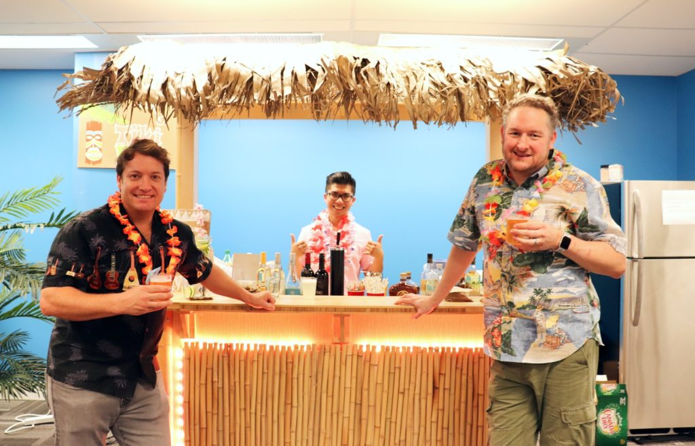
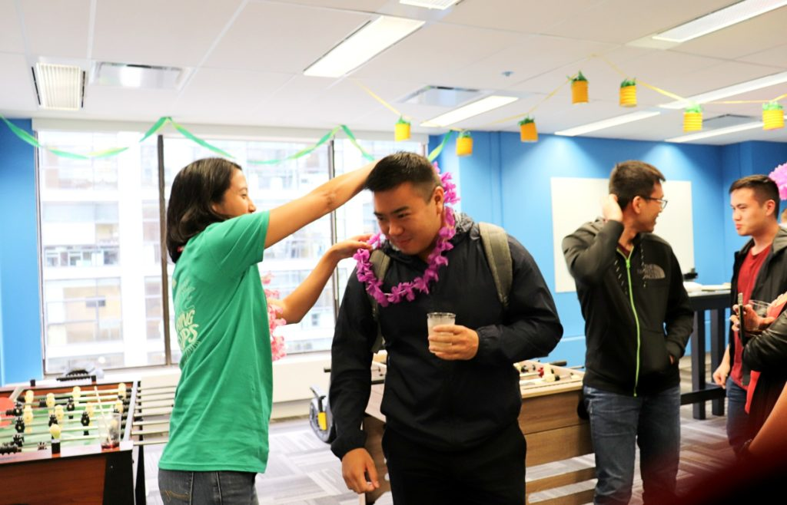
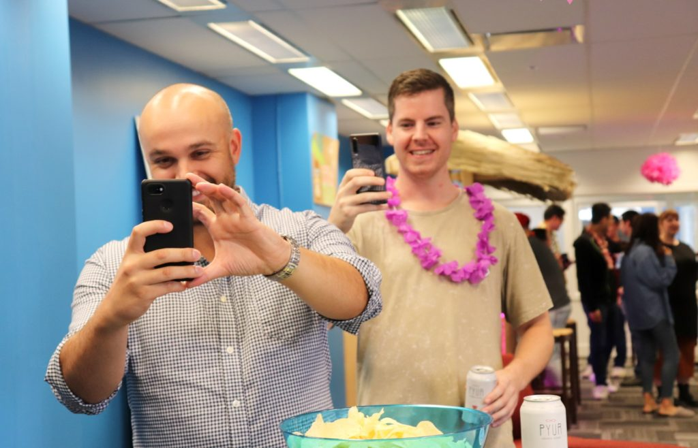
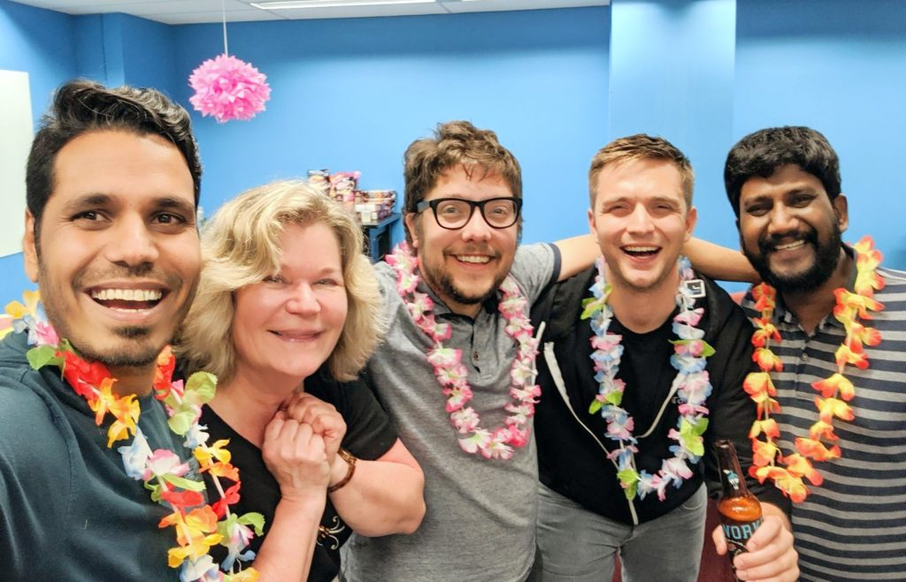

Last week, we had a great time participating in Vancouver Startup Week's Community Crawl. 

The Community Crawl is like a pub crawl except you hop from startup offices to startup offices. It’s an engaging open house event where guests can check out different startups. Over a dozen startups opened their doors, so **thanks to everyone who took the time to check us out!** 

Those who attended immediately noticed our new spacious office space, complete with a custom-made tiki bar! Because, why not, right?

To celebrate our move and christen our new space and tiki bar, we hosted a tiki party, replete with festive Hawaiian leis and shirts. 

_LoginRadius co-founders, Rakesh Soni, CEO, and Deepak Gupta, CTO, enjoying our new custom-made tiki bar._ 

Our “Tiki Tech” party was a great way to bring our team together and mingle with the Vancouver Startup community. Want to know how to throw a tiki party? Here’s an easy guide…

## Create a tiki-tastic atmosphere

What’s a tiki-tastic atmosphere? You’ll know it when it feels like summer at your office despite the Raincouver weather. Here are some fun motifs you can buy for _cheap!_

### Start with fun decorations

Being a startup with a modest budget, we had to be creative with the DIY decor. 

We painted colourful signs on cardboard and made little pineapple lanterns which we strung across the room. Then, to brighten the room, we added flamingo-pink dangling paper tissue balls from the ceiling. Hanging decorations from the ceiling are better than sticking them on walls. It makes a room look full and festive with very little material.

_We bought yellow lanterns and turned them into pineapples._ 

_We placed hand-painted signs, including our drinks menu, all over the room._

### Provide ambiance with music

Another easy way to add more tiki into a room is by playing music. We found a pre-made tiki playlist on a streaming app and let it loop throughout the night. There wasn’t any official dancing at our party, but we had lots of people bobbing their heads or tapping their feet to the beat. 

_Our team members and guests having fun at our tiki tech party._ 

## Decorate your glorious tiki bar

The tiki bar was made by a local carpenter. He came by our office to look at the space where the tiki bar will be housed, take measurements, and listen to vision for this piece of resistance. 

What he built was better than what we expected! The frame is made of durable wood and lined with the bamboo-like exterior. On the inside, we have a fridge for the keg and another fridge for other drinks. On the surface of the bar is the tap for the beer. The front was lined with LED lights that changed colours. Everything is covered by a thatched roof, completing the tiki look. 

_To the left is Mark from Torlay, our local carpenter, who designed and built our lovely tiki bar!_

## Provide delicious tropical cocktails 

No tiki party is complete without tropical cocktails…especially on a Friday afternoon after a long workweek. Luckily for us, we had an impressive tiki bar where we served endless drinks to our team members and guests. 

So that you’re prepared for guests, it’s wise to plan a drink menu a few days or weeks ahead of time. This gives you time to get cool ingredients or tiki-themed cups, umbrellas—whatever moves you!

To ensure a fun relaxing night for everyone, we hired a bartender. His lime margaritas were to die for—and the sound of a cocktail in a shaker just adds to the festive vibe.

The tap beer on the tiki bar was also a celebration on its own. Plus, right before the event, one of our team members whipped up some killer tropical sangria.

_Our bartender, Sam, making amazing tropical drinks for us all night long._ 

Whether you do or don’t have a tiki bar, you can create the vibe around your cocktail table. Just use festive decorations or painted signs, plus fun tropical cups. And of course, use some tropical beverage ingredients, if you can! Then lean back and watch your guests get into tiki mood. 

## Lei on a warm welcome to your guests

The first impression is everything. Each guest who came through our doors received a flower lei over their heads. It’s a great way to create that instant tiki environment. We went a step further and created little tags for each lei with our company logo and a QR code that took them to our [Careers page](https://www.loginradius.com/careers/) for those who are interested in joining us for more than just a tiki party. 

_Lovely volunteers from Vancouver Startup Week helped us give leis to our guests._ 

## Include an engaging tech activity

On our TV, we displayed a one-minute online survey that can be taken on mobile phones. Since LoginRadius secures digital identities, we asked our guests to check all the different digital identities they used in the past week. This included emails, online banking, various video games, social media, and more. 

_Individuals scanned the QR code on our TV to take our one-minute digital identity survey._ 

We had close to 90 guests and team member join our party. Based on our study, the most popular digital identity was work and personal emails. Nearly 100% of respondents used these two digital identities in the past week! 

Work and personal emails are closely followed by LinkedIn. Our survey states that 91.3% of respondents used LinkedIn in the past week. This is interesting because according to Hootsuite, Facebook is the most popular social media website. Yet, Facebook/Instagram fell behind LinkedIn at 82.6%. This data may be influenced by Vancouver Startup Week. In preparing for this networking event, individuals might have recently checked and updated their professional profile on LinkedIn. 

On average, respondents used about 13 different digital identities that week. This not only raised awareness for our guests as consumers, but it also encouraged us as an identity management platform to continue creating stronger security and easier login authentication methods that organizations can use for their customers. 

## Be open to a spontaneous after party

On a weekend night, what better way to end a party than with an after-party? We had a group of people who were interested in continuing the fun after the predestined party time. This included both the CEO and CTO. Originally, they were going to move locations. However, since our office space was available for further into the night, everyone decided to stay there. Instead, we ordered pizza and took advantage of the overabundant storage of drinks supplied for the original party. 

Planning fun parties can be exhausting. Allowing spontaneous after parties can help you feel free and serve as a reminder that an enjoyable event doesn’t always have to be stringently planned. 

_The after-party selfie—no party is complete without it!_

### Final Thoughts

Sharing our tiki bar with the community led to lots of memorable meetings. Thanks to everyone who enjoyed our tropical drinks, embraced our leis, basked in our tiki atmosphere, and participated in our survey. We loved having the Vancouver Startup Community visit our office and we hope to see you at our future tiki events!
