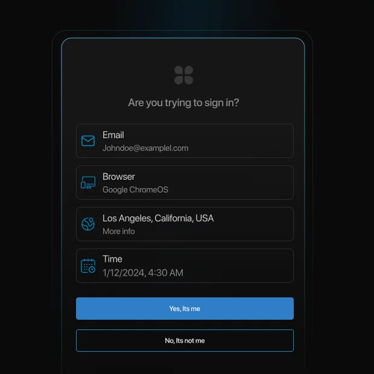
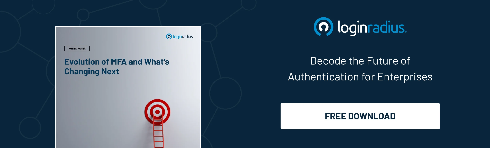
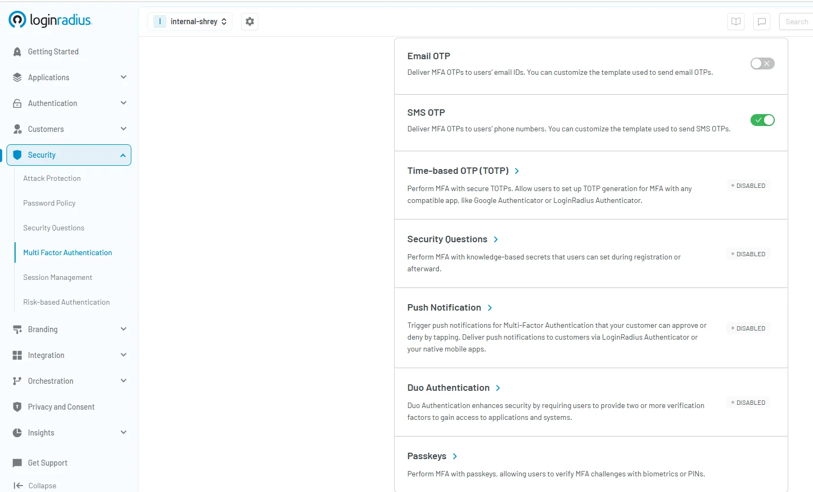
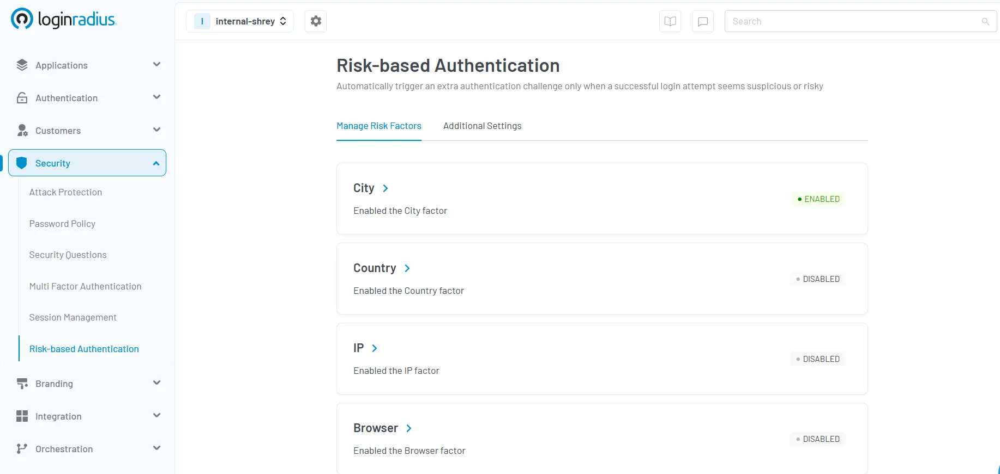

## Introduction 

In today’s digital world, securing online accounts is more critical than ever. With cyber threats on the rise, understanding authentication methods can help you protect sensitive data from unauthorized access. 

This guide will walk you through Single-factor Authentication (SFA), Two-factor Authentication (2FA), and Multi-factor Authentication (MFA) - their differences, security levels, and why MFA is the best defense against cyber threats.

## What is Single-factor Authentication (SFA)?

Single-factor authentication (SFA), also known as one-factor authentication (1FA), is the most basic security method. It requires just one credential to verify user identity, such as:

* **A password or PIN** (Knowledge factor)
* **A swipe card or ID badge** (Possession factor)
* **A fingerprint or facial recognition** (Inherence factor)

While [single factor authentication alone isn’t potent](https://www.loginradius.com/blog/identity/advanced-identity-security-based-attacks/) to safeguard against emerging identity thefts, combining it with other authentication methods exponentially increases its effectiveness. 

### Example of Single-factor Authentication:

* Logging into an email account using only a password.
* Unlocking a smartphone with a PIN code.
* Swiping an access card to enter a building.

### What Are the Risks of Single-factor Authentication?

While one-factor authentication is easy to use, it has significant security drawbacks, including but not limited to:

* **Weak passwords** can be easily guessed or hacked.
* **Phishing attacks** can trick users into revealing their credentials.
* **Credential stuffing** exploits reused passwords across multiple sites.
* **Brute-force attacks** allow attackers to crack weak passwords quickly.

For instance, a hacker can use brute-force software to crack a weak password in seconds, gaining access to critical systems. This is why single-factor authentication security is no longer considered sufficient for sensitive accounts.

Because of these risks, businesses and individuals are encouraged to adopt stronger authentication methods.

## What is Two-factor Authentication (2FA)?

Two-factor authentication (2FA) is a security method that requires two different authentication factors to verify a user’s identity. Unlike SFA, 2FA authentication makes it harder for attackers to gain access because it combines two of the following:

* **Something you know** (password, PIN)
* **Something you have** (smartphone, security key, OTP)
* **Something you are** (fingerprint, facial recognition)

## Two-factor Authentication Methods

Two-factor authentication (2FA) has evolved significantly over the years, with various methods emerging to enhance security. Below is an exhaustive list of 2FA methods arranged in chronological order of their prominence:

### SMS-Based 2FA (Early 2000s - Present)

One-time passwords (OTPs) are sent via SMS when logging in. Though widely used, SMS-based 2FA has security vulnerabilities, such as SIM swapping.

It became prominent in the early 2000s as online banking and financial institutions started adopting it to reduce fraud and unauthorized access. 

### Time-based One-time Password (TOTP) (2005 - Present)

Developed as part of the OATH standard, TOTP generates time-sensitive codes via authenticator apps like Google Authenticator and Microsoft Authenticator.

With its [numerous benefits](https://www.loginradius.com/blog/identity/one-time-passwords-security-benefits/), TOTP gained widespread adoption after the launch of the Google Authenticator app in 2010, quickly becoming a preferred choice for developers and enterprises looking for stronger authentication. 

### Email OTP (Late 2000s - Present)

A unique code is sent to the user’s registered email for verification, commonly used as a secondary authentication method. \
Email-based authentication became widely used with the rise of cloud-based services, offering an additional layer of security for account access and password resets. 

### Biometric Authentication (2010s - Present)

Includes fingerprint scans, facial recognition, and retina scans. Apple introduced Touch ID in 2013, followed by Face ID in 2017, making biometric 2FA mainstream. 

Biometric authentication started gaining traction after mobile device manufacturers integrated fingerprint and facial recognition, providing a convenient and secure authentication method. 

### Push Notification Authentication (2013 - Present)

Introduced with mobile apps, this method sends a real-time push notification prompting users to approve or deny login attempts. 

[Push notification authentication](https://www.loginradius.com/blog/identity/push-notification-authentication/) method gained popularity as smartphones became ubiquitous, offering a seamless and user-friendly alternative to traditional OTP-based authentication. 

### Security Key-based 2FA (2014 - Present)

Physical security keys like YubiKey and Google's Titan Security Key offer phishing-resistant authentication. \
Security keys gained prominence in 2018 when Google enforced their use internally, reducing phishing attacks to zero among its employees. 

### QR Code-based 2FA (2015 - Present)

Users scan a QR code using an authenticator app to verify identity. This is commonly used in enterprise login systems. 

The use of QR code-based authentication expanded with the increasing demand for contactless security measures, particularly in corporate environments. 

### Passkeys (2022 - Present)

A modern, passwordless approach using cryptographic keys stored on devices. Developed by FIDO Alliance, [passkeys ](https://www.loginradius.com/products/passkeys)are gaining traction for their resistance to phishing and credential theft. 

Passkeys became mainstream in 2022 when major tech companies like Apple, Google, and Microsoft adopted them as part of their push for a passwordless future. 

2FA continues to evolve, incorporating new technologies to provide more secure and seamless authentication experiences.

## Single-factor vs Multi-factor Authentication

<table>
  <tr>
   <td><strong>Authentication Type</strong>
   </td>
   <td><strong>Security Level</strong>
   </td>
   <td><strong>Example</strong>
   </td>
  </tr>
  <tr>
   <td><strong>Single-factor (1FA)</strong>
   </td>
   <td>Low
   </td>
   <td>Password-only login
   </td>
  </tr>
  <tr>
   <td><strong>Two-factor (2FA)</strong>
   </td>
   <td>Medium
   </td>
   <td>Password + OTP
   </td>
  </tr>
  <tr>
   <td><strong>Multi-factor (MFA)</strong>
   </td>
   <td>High
   </td>
   <td>Password + OTP + Biometric
   </td>
  </tr>
</table>

While single-factor authentication is the weakest, multi-factor authentication (MFA) offers the highest level of security. 

In fact, the Cybersecurity and Infrastructure Security Agency (CISA) has officially recognized single-factor authentication as a bad practice due to its vulnerability to cyber threats.[ CISA warns](https://www.cisa.gov/news-events/alerts/2021/08/30/cisa-adds-single-factor-authentication-list-bad-practices) that relying solely on a single authentication factor leaves systems exposed to phishing, credential stuffing, and brute-force attacks.

## What is Multi-factor Authentication (MFA)?

**[Multi-factor authentication (MFA)](https://www.loginradius.com/blog/identity/what-is-multi-factor-authentication/)** is a security framework that requires two or more authentication factors. It provides stronger security than 2FA by adding additional layers of protection.

## Multi-factor Authentication Types:

Multi-factor authentication comes in various forms, from biometrics and hardware keys to software-based OTPs and behavioral analysis, ensuring robust security. Here’s a closer look at some MFA examples, their history, and how these authentication methods work in practice.

### Security Questions (1990s)

Users answer preset questions for authentication. Useful for account recovery but less secure than other methods. Security questions were commonly implemented in early online banking and email services but are now considered weak due to social engineering risks.

### SMS OTP (Early 2000s)

Users receive an OTP via SMS to verify their identity. Helps secure accounts even if email access is compromised. First used by financial institutions, SMS OTPs became a common two-factor authentication method but later faced criticism due to SIM swap vulnerabilities.

### Email OTP (Late 2000s)

A one-time password is sent to the user’s email for authentication. Email OTPs became widely used as digital communication expanded, offering a simple way to verify user identity. 

### Time-Based OTP (TOTP) (2005)

A time-sensitive OTP is generated via an authenticator app. Works offline and is resistant to phishing. Developed as part of the OATH standard, TOTP provided an alternative to SMS-based authentication with improved security.

### Duo Authentication (2010s)

Requires two or more factors like OTPs, biometrics, or push notifications. Ideal for high-security environments. Duo Security, now part of Cisco, popularized this approach, offering businesses a flexible and secure authentication framework.

### Push Notification Authentication (2013)

Sends a login request via push notifications. Users can approve or deny access with a tap. First introduced by Duo Security, this method enhances security by preventing phishing attempts and reducing reliance on SMS OTPs.

### Passkeys (2022)

Uses biometrics or PIN-based authentication instead of passwords. Improves security and user experience while resisting phishing. Introduced by Apple, Google, and Microsoft as part of FIDO2 standards, passkeys aim to eliminate password reliance entirely.

Here’s how you can easily[ set up MFA in the LoginRadius console](https://accounts.loginradius.com/auth.aspx?return_url=https://console.loginradius.com/login&action=register) with your preferred authentication method and enhance security in just a few clicks. Get started now!

## What is the Difference Between Two-factor vs Multi-factor Authentication?

<table>
  <tr>
   <td><strong>Feature</strong>
   </td>
   <td><strong>2FA</strong>
   </td>
   <td><strong>MFA</strong>
   </td>
  </tr>
  <tr>
   <td>Number of Factors
   </td>
   <td>2
   </td>
   <td>2 or more
   </td>
  </tr>
  <tr>
   <td>Security Level
   </td>
   <td>High
   </td>
   <td>Very High
   </td>
  </tr>
  <tr>
   <td>Example
   </td>
   <td>Password + OTP
   </td>
   <td>Password + OTP + Biometric
   </td>
  </tr>
</table>

While two-factor authentication (2FA) is a subset of multi-factor authentication (MFA), MFA provides stronger protection by using more than two authentication layers.

For example, a company that stores sensitive customer data may implement MFA requiring employees to log in with a password, confirm via an OTP, and scan a fingerprint to ensure no unauthorized person can access sensitive business information.

## Is MFA More Secure Than 2FA?

Yes, MFA is more secure than 2FA because it includes multiple authentication layers. 2FA relies on just two factors, whereas MFA can combine various authentication methods to enhance security, making it harder for attackers to breach accounts.

For instance, if an attacker gains access to an OTP code through a phishing attack, an MFA system requiring biometric authentication would still prevent unauthorized access.

## The Importance of 2FA and MFA

With increasing cyber threats, enterprises need to choose either 2FA or MFA is crucial. Benefits include:

* **Stronger security**: Reduces risks of unauthorized access.
* **Compliance requirements**: Meets regulatory standards like GDPR, HIPAA.
* **Protection against phishing and credential theft**.
* **Reduced account takeover risk**: Even if one factor is compromised, others remain secure.

To learn more about choosing between 2FA and MFA, here’s a [quick guide](https://www.loginradius.com/blog/identity/2fa-mfa-key-differences/). 

## How LoginRadius Revolutionized MFA with Risk-Based Authentication

LoginRadius takes multi-factor authentication (MFA) a step further with[ risk-based MFA](https://www.loginradius.com/blog/identity/adaptive-authentication/), adding an extra layer of intelligence to security. Unlike traditional MFA, which requires authentication factors regardless of context, risk-based MFA dynamically adapts based on user location, IP, device, and other risk signals. 

If a login attempt appears suspicious—such as an unusual location or an unrecognized device—the system automatically enforces additional authentication steps. Conversely, if the activity seems low-risk, users can log in with minimal friction. 

This approach not only strengthens security but also enhances user experience by reducing unnecessary authentication prompts, making LoginRadius' MFA solution more secure, adaptive, and user-friendly.

## Final Thoughts

Single-factor authentication (SFA) is outdated and vulnerable, while 2FA and MFA significantly enhance security. Whether you use 2FA or MFA, adopting strong authentication measures can protect your digital assets from cyber threats.

However,[ implementing multi-factor authentication (MFA)](https://www.loginradius.com/docs/security/customer-security/multi-factor-authentication/overview/?q=multi+factor+) is the best way to ensure robust security in today’s digital landscape.

## **FAQs**

**What are the different categories of authentication factors?**

Authentication factors include Knowledge (password, security question), Possession (OTP, security key), Inherence (biometrics), Location (geographical verification), and Behavior (typing patterns, keystroke dynamics).

**What is multi-factor authentication, and how do I set it up?**

MFA requires multiple authentication factors for login. Set it up by[ creating an account on the LoginRadius platform](https://accounts.loginradius.com/auth.aspx?return_url=https://console.loginradius.com/login&action=register), going to account settings, enabling MFA, choosing factors (OTP, biometrics, security keys), and verifying your setup.

**Is multifactor authentication secure?**

Yes, MFA is highly secure as it requires multiple factors, reducing the chances of unauthorized access.

**Do two-factor authentication codes expire?**

Yes, 2FA codes typically expire within 30–60 seconds, ensuring they can’t be reused by attackers.

