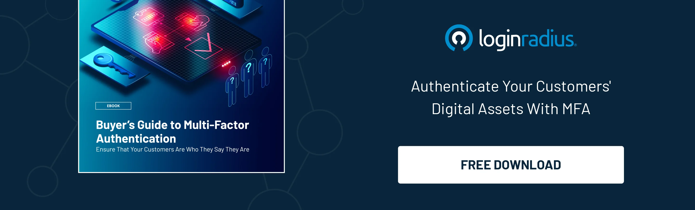
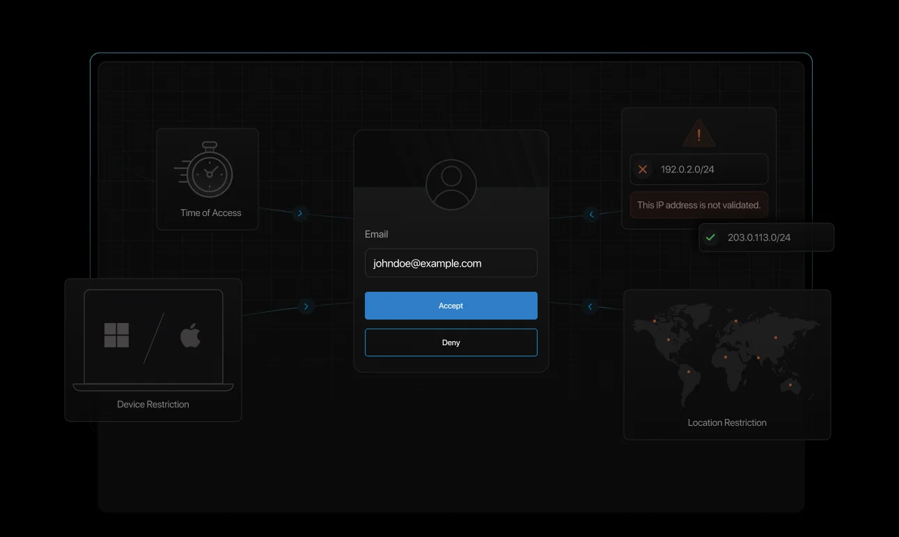
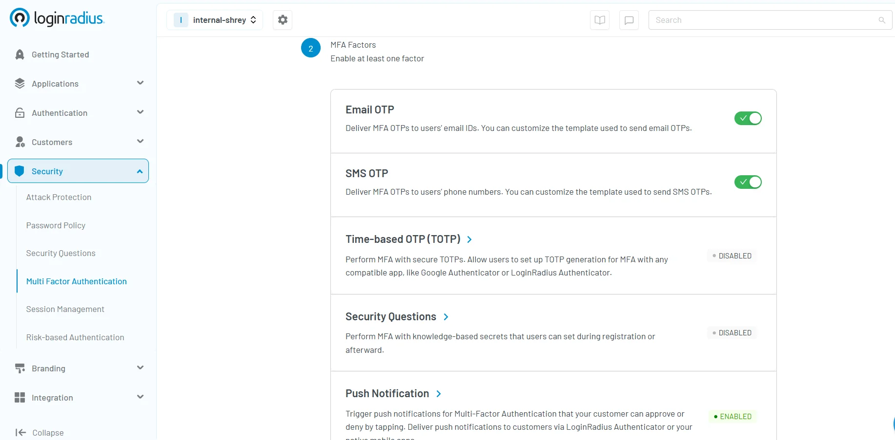

## Introduction 

In a [2023 survey](https://www.statista.com/statistics/1454057/top-authentication-priorities-worldwide/#:~:text=During%20a%202023%20survey%2C%20more,security%20as%20their%20main%20priority.), over 40% of developers worldwide prioritized increasing two-factor authentication adoption, while another one-third emphasized stronger password security. 

This underscores growing business pressure to strengthen authentication systems against evolving cyber threats. Implementing additional authentication factors, such as two-factor authentication—which requires two separate verification steps—significantly reduces the risks of data breaches and phishing attacks. 

Multi-factor authentication, on the other hand, can add three or more security layers. Each new authentication step creates another obstacle that hackers must break through. Hence, businesses need to know the key differences between 2FA and MFA when picking security options. These solutions bring their advantages to the table. 

The evolving dialogue about 2FA vs MFA continues to guide developers' key authentication decisions. While 2FA may seem a lot easier and quicker to implement, MFA gives you more room to customize and adapt robust security to your organization's specific needs. 

This blog will help you pick the right authentication method that fits your business needs. Let's dive in and explore these crucial security measures together, clearly and conversationally.

## What is Authentication?

Before we move towards [steps on picking the right authentication method](https://www.loginradius.com/blog/identity/authentication-option-for-your-product/), let’s quickly understand the basics of authentication. 

Authentication has come a long way since the 1980s when businesses relied only on passwords. It is at the heart of digital security—it’s all about confirming that people accessing your systems are who they say they are. 

Think of it like hosting an exclusive business event: security doesn't just open the door to anyone who walks up. They check invites (passwords), verify IDs (additional checks), and sometimes even scan faces (biometric verification). Technically, authentication involves matching user credentials against securely stored data to validate identity.

## What is Two Factor Authentication?

Two-Factor Authentication (2FA) originated as a security concept in the late 1980s when banks introduced ATM cards—requiring both the card (something you have) and a PIN (something you know). Initially designed for financial institutions, 2FA gradually gained popularity across various industries as cyber threats increased.

Today, 2FA provides an essential additional layer of protection beyond basic username-password combinations. To better understand what 2FA authentication really means, think about withdrawing cash from an ATM: without both your physical card and your PIN, access is denied.

This concept has since been widely adopted by email providers, social media platforms, banking services, and businesses worldwide to significantly enhance account security and reduce risks associated with data breaches and unauthorized access.

Popular types of 2FA include:

* **Something you know:** Passwords, PINs, or answers to security questions.
* **Something you have:** Phone or email address based OTPs (One-Time Passwords), security tokens.

Everyday two-factor authentication examples include receiving a unique SMS code when logging into your banking app or email. The benefits of 2 factor authentication are substantial—it dramatically reduces the risk of unauthorized access even if passwords are compromised.

## What is Multi Factor Authentication?

[Multi factor authentication (MFA)](https://www.loginradius.com/blog/identity/what-is-multi-factor-authentication/) evolved significantly from its simpler predecessor, two-factor authentication, gaining traction during the rise of advanced cyber threats in the early 2000s. 

Originally implemented in high-security environments like government institutions and large enterprises, MFA quickly expanded into widespread adoption due to growing cyber risks and compliance demands.

MFA elevates security by combining multiple independent verification methods, typically including:

* **Something you know:** Passwords or PINs.
* **Something you have:** [Passkeys,](https://www.loginradius.com/blog/identity/online-security-passkeys/) security tokens, smartphones, [push notifications](https://www.loginradius.com/blog/identity/push-notification-authentication/).
* **Something you are:** Biometric elements such as fingerprints, facial or voice recognition.

To visualize MFA authentication clearly, imagine entering a highly secure office building. First, you swipe your security badge (something you have), enter a unique PIN (something you know), and finally scan your fingerprint (something you are). 

This multi-layer authentication strategy dramatically reduces unauthorized access by making it nearly impossible for attackers to breach all security layers simultaneously. 

Today, MFA is widely adopted by companies of all sizes to safeguard sensitive data and protect their users against sophisticated cyberattacks. 

## Multi factor vs Two Factor Authentication

Understanding the difference between Multi-Factor Authentication (MFA) and Two-Factor Authentication (2FA) doesn't need to be complicated—think of it simply as the number of layers protecting your digital identity.

Two-Factor Authentication, or 2FA, does exactly what it says—it uses precisely two separate verification methods. For instance, entering a password (something you know) and then confirming your identity with a text message code sent to your phone (something you have). It’s straightforward, easy to implement, and offers robust protection, making it perfect for routine business operations and daily security needs.

Multi-Factor Authentication, or MFA, steps up the security game by incorporating two or more verification factors. This approach offers enhanced flexibility and significantly stronger protection. 

In short, 2FA provides solid, user-friendly security suitable for everyday use, while MFA offers greater versatility and heightened security—perfect for scenarios where added layers of protection are essential.

## 2FA vs MFA Comparison Table

<table>
  <tr>
   <td><strong>Comparison Factor</strong>
   </td>
   <td><strong>Two-Factor Authentication (2FA)</strong>
   </td>
   <td><strong>Multi-Factor Authentication (MFA)</strong>
   </td>
  </tr>
  <tr>
   <td>Number of Factors
   </td>
   <td>Exactly two authentication factors
   </td>
   <td>Two or more authentication factors
   </td>
  </tr>
  <tr>
   <td>Security Components
   </td>
   <td>- Something you know (password/PIN)

- Something you have (device)

- Something you are (biometrics)
   </td>
   <td>- Knowledge factors

- Possession factors

- Inherence factors

- Location factors

- Time factors
   </td>
  </tr>
  <tr>
   <td>Security Strength
   </td>
   <td>Simple security beyond passwords
   </td>
   <td>Blocks over 99.9% of account compromise attacks
   </td>
  </tr>
  <tr>
   <td>Implementation Complexity
   </td>
   <td>Simple setup with minimal infrastructure changes
   </td>
   <td>Simple setup without infrastructure changes
   </td>
  </tr>
  <tr>
   <td>Cost Considerations
   </td>
   <td>Lower setup costs
   </td>
   <td>Slightly higher costs from additional hardware/ software needs
   </td>
  </tr>
  <tr>
   <td>User Experience
   </td>
   <td>Smoother login process but limited security
   </td>
   <td>Can lead to "MFA fatigue" with multiple verification steps
   </td>
  </tr>
  <tr>
   <td>Adaptability
   </td>
   <td>Fixed verification process
   </td>
   <td>Adapts based on context (location, time, network), especially in adaptive MFA
   </td>
  </tr>
  <tr>
   <td>Relationship
   </td>
   <td>Part of MFA
   </td>
   <td>Covers all multi-factor methods, including 2FA
   </td>
  </tr>
  <tr>
   <td>Common Use Cases
   </td>
   <td>Simple security boost for standard business operations
   </td>
   <td>Regulated industries, high-security environments, compliance requirements
   </td>
  </tr>
  <tr>
   <td>Compliance Support
   </td>
   <td>Simple regulatory compliance
   </td>
   <td>Detailed compliance with HIPAA, CCPA, GDPR, etc.
   </td>
  </tr>
</table>

## Is Multi-Factor Authentication better than Two-Factor Authentication?

When comparing MFA vs 2FA, MFA generally provides superior protection due to additional layers of security. However, it’s important to remember that the most advanced solution isn't always the best choice for every business.

For smaller companies or less sensitive information, a comprehensive MFA may be more cumbersome than beneficial. Here, two-factor authentication offers a smart, practical balance—good security without unnecessary complexity. 

Larger businesses dealing with sensitive information or stringent compliance requirements will find MFA’s comprehensive protection vital since the list of [MFA benefits](https://www.loginradius.com/blog/identity/benefits-of-mfa/) is endless. 

## The Importance of 2FA and MFA

Why use 2FA or MFA? Cyber threats are rapidly increasing, and relying solely on passwords can leave businesses vulnerable. The importance of 2FA lies in offering an extra barrier of security, significantly reducing unauthorized access, and easing your worries about data breaches.

Similarly, MFA provides deeper security assurance by employing multiple verification methods. Whether it’s protecting customer data, financial transactions, or confidential business records, multi-layer authentication delivers comprehensive protection. 

Adopting 2FA or MFA is more than just good security—it's about building trust, confidence, and credibility with your employees and clients.

## Enters LoginRadius' Advanced Adaptive MFA (Risk-based Authentication)

While MFA already packs a powerful punch against cyber threats, [LoginRadius’ Adaptive MFA](https://www.loginradius.com/products/adaptive-mfa) takes your security to a whole new level. Think of it as MFA—but smarter, more intuitive, and adaptable to your business's unique security needs.

Adaptive MFA doesn't just add extra layers—it continuously evaluates login attempts based on intelligent risk factors like user behavior patterns, geolocation, IP address monitoring, device reputation, and even impossible travel detection (when a user logs in from two locations impossibly far apart in a short span. 

In simpler words: it gets to know your users and automatically steps up security measures only when something seems off.

For instance, if your team member/user logs in at the usual time, Adaptive MFA recognizes this as a low-risk activity, allowing seamless access with minimal interruption. But suppose that same team/user member suddenly attempts a login from a new location or unusual device at midnight—Adaptive MFA instantly recognizes this anomaly and enforces additional verification steps, keeping unauthorized access at bay.

This dynamic approach doesn't just bolster security—it balances protection and convenience effortlessly. Your users get a frictionless experience, while your sensitive data stays protected round the clock. 

Curious to see how LoginRadius Adaptive MFA can make your authentication smarter, simpler, and safer? Read the [developer documentation](https://www.loginradius.com/docs/security/customer-security/risk-based-auth/?q=adaptive) and effortlessly add adaptive MFA to your apps. 

Still unsure about MFA vs RBA?[ Get answers here](https://www.loginradius.com/blog/identity/mfa-vs-rba/).

## How to Choose the Correct Authentication Method for Your Company?

Deciding between two factor vs multi factor authentication requires careful thought. Consider these factors:

### Risk Assessment

Evaluate the sensitivity of the data your business handles. Highly confidential information—financial records, healthcare data, personal client information—necessitates MFA. Less sensitive information might be securely protected by 2FA.

### User Experience

Excessively complex authentication processes can frustrate users. Aim to balance robust security with ease of use. Choose 2FA for simpler processes or MFA where the security benefits outweigh the potential inconvenience.

For instance, [setting up the LoginRadius MFA](https://www.loginradius.com/docs/security/customer-security/multi-factor-authentication/overview/) is a breeze. You can quickly add MFA to your applications in minutes and turn on your desired authentication method. Here’s how it works: 

### Compliance

Businesses in industries with strict regulations, such as finance, healthcare, or government sectors, typically require MFA authentication to meet compliance standards. Adhering to these standards can greatly influence your authentication choice.

## Wrap-Up: 2FA vs MFA—Which One Fits Your Needs?

Choosing between two-factor authentication and multi-factor authentication is crucial for your business’s security strategy. Understanding the difference between 2FA and MFA helps you choose the most suitable protection for your organization's specific needs, balancing security requirements, convenience, and compliance.

Whether your business selects 2FA for simplicity and solid protection or MFA for advanced, comprehensive security, remember that you're not just safeguarding data—you're securing trust, confidence, and long-term success.

To incorporate MFA or advanced adaptive MFA from LoginRadius, you can [reach us for a free trial ](https://accounts.loginradius.com/auth.aspx?return_url=https://console.loginradius.com/login&action=register)and see how our cutting-edge CIAM solution works for your business. 

## FAQs

**Is 2 factor authentication the same as multi-factor authentication?**

No, they're slightly different. 2FA involves exactly two security checks, while MFA can include two or more, offering potentially stronger protection.

**Is OTP considered as MFA?**

Not by itself. An OTP (One-Time Password) represents just one factor (something you have). It must be combined with other factors, like passwords or biometric verification, to qualify as MFA.

**How does MFA work?**

MFA requires users to verify their identities using multiple independent methods. This significantly reduces risk, ensuring unauthorized users cannot easily access protected resources, even if one factor is compromised.

**Is 2FA secure?**

Absolutely. Two-factor authentication significantly enhances security compared to just using passwords, effectively reducing common cyber threats.

