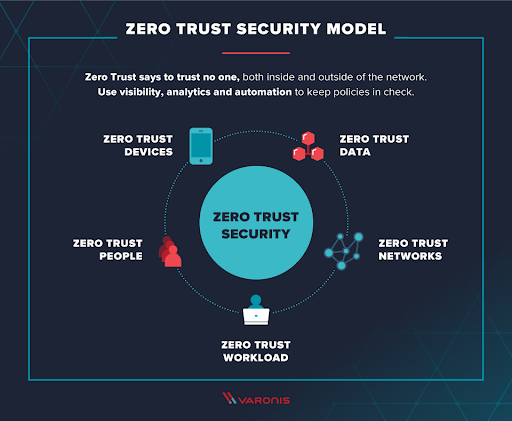

## Introduction

When you set up privacy policies for customers, you’re making a promise. You’re ensuring to people who trust you with their sensitive information that you’ll do everything in your power to protect it. 

But business data has never been in greater danger than it is today. Cybercriminals have become more advanced, digitally pillaging companies, endangering customers, and stealing billions in revenue. In 2021, businesses suffered <a rel="nofollow" href="https://www.darkreading.com/attacks-breaches/corporate-networks-saw-50-more-attacks-per-week-in-2021-?utm_campaign=meetedgar&utm_medium=social&utm_source=meetedgar.com"> 50% more cyber attacks per week </a> than in 2020. This was the same year that cybercriminals managed to steal $6.9 billion.

But there is an effective way you can fight back against cybercriminals. Access management allows you to police your access points by increasing security around how users and employees alike access systems. 

So what are some of the ways in which you can create an airtight access management plan? What can you do to ensure that cybercriminals can’t worm their way into your system? 

That’s what we’re going to address in this article. We’ll walk you through five access management best practices to help you keep your systems reserved for valid users only.

## When Do You Need Access Management? 

Before we jump into our best practices, let’s talk about why some businesses and industries need to tighten digital security. 

### 1. Customer access

Access management measures are essential for high-risk industries. They can help you protect your customers by limiting how they can access their accounts. 

Let’s say you’ve developed a personal finance software solution, and a customer calls in asking how to link their bank account to your budgeting app. 

You’re going to need to authenticate that user’s identity before giving them access to the account. Anyone can call in claiming to be anyone. But if you have access management measures in place, they won’t be able to break in. This could be something like [multi-factor authentication](https://www.loginradius.com/multi-factor-authentication/) or asking them to provide additional information before assisting them.

### 2. Protect company secrets

If you use a CRM platform for [managing customer relationships](https://www.loginradius.com/blog/growth/improve-customer-relation-brand-identity/), you’re going to be keeping a lot of confidential information online that’s vital to your organization. That’s why you have to make sure that the only people accessing your CRM are current team members. If you let a sales associate go and don’t have an access management protocol in place that immediately revokes their account, they could log in remotely and make off with a ton of company data. 

Central platforms like [LoginRadius](https://www.loginradius.com/) let companies access all of their tools from one platform — with just one login. But if you don’t have access management protocols in place for a centralizing system like this, a cybercriminal could gain access to every tool your organization uses with just one attack. 

### 3. Provide a secure, user-friendly login experience

Access management needs to be both effective and easy to manage for the people who need access to your systems. 

Take the grant systems that many institutions use as an example. They often have pristine access management protocols in place. If accessing this system were too easy in an unprotected environment, malicious actors could gain access to their systems and make off with precious information. But if that system wasn’t also user-friendly for authorized users, something as simple as asking “[how do student grants work](https://www.mos.com/blog/do-you-have-to-pay-back-grants/)” could be a nightmare time sucker.  

## Best Practices for Access Management 

The following best practices will help you improve your access management, enabling maximum protection against cybercrime and creating a more secure business environment. 

### 1. Implement a zero-trust policy

One of the best ways to protect your company’s digital assets is to implement a zero-trust policy. 

[Zero trust](https://www.loginradius.com/blog/identity/beginners-guide-zero-trust-security/) is exactly what it sounds like. Every member of your organization is forced to authenticate their identities before being able to access any resources. This includes employees who are already active inside a company network. 

([Image Source](https://www.infusedinnovations.com/blog/secure-intelligent-workplace/pros-and-cons-of-the-zero-trust-model))

This methodology means that every person and every device is treated as though it’s a potential threat. When working under zero trust, the system will be able to identify any abnormal behaviors while tracking both activities and risk levels. 

### 2. Adopt the principle of least privilege

When assigning privileges to accounts, it’s best to err on the side of caution. That’s where the Principle of Least Privilege comes into play. Also sometimes known as the Principle of Least Authority, it’s when you provide the minimum level of access to all users. This includes permissions granted to consumers. 

You’re basically giving everyone the bare minimum level of access they need to accomplish what they need to while using your system. Obviously, some roles within your organization will need more access than others — an accountant requires different access than a sales agent, so they would have completely different access levels. 

When you restrict users from any non-essential access, you effectively cut off opportunities for cybercriminals to access your entire system. 

### 3. Utilize multi-factor authentication

A lot of people believe that a strong password is all they really need to have a secure online experience. However, password misuse often leads to cybercrime breaches and data attacks. It all boils down to the actual security behind the password — the person and their habits. If a staff member opens malware and gets a keylogger, it doesn’t matter if you mandate 12 characters, symbols, and numbers. Your business information is still ripe for the picking. 

That’s why multi-factor authentication has become an essential access management practice. It adds an additional security layer to the login process. 

When you use MFA, anyone logging in will be asked to provide an additional method of verification once they enter their password. This could be entering a code sent to their email or via text message. It could also be a biometric scan on a mobile device like a fingerprint or facial recognition. 

### 4. Get rid of high-risk systems

If your business hasn’t yet upgraded its systems to the cloud, then you have a glaring access management vulnerability. 

Many believed for a long time that in-house servers were safer than cloud-based systems, but cloud platforms encrypt all data while providing enhanced security features like patch management, integrations, and segmentation, to name a few. Plus, your on-site servers are vulnerable to physical access from unauthorized users who could break into your facility.  

Anyone looking to protect on-site servers from hackers will have to make a great investment in both time and money. 

### 5. Remove orphaned accounts

Personnel changes represent a huge vulnerability from an access management standpoint. Offboarding needs to be done right away when a member of your team quits or is let go. 

Failure to revoke access to your systems in a timely manner could leave you open to attack. Say your sales director is moving to a new position with a rival company. If they still have access to customer data, they could take it with them, delete it entirely off your platform, or try to steal your leads. 

You also never want to leave orphaned accounts in play. These are accounts that have no assigned user but still contain all of the information and permissions associated with your former team member. 

Hackers love orphaned accounts because they’re relatively easy to gain access to. A hacker could then easily crack the credentials of your former employee and weasel their way into that account. 

Once inside, they have access to everything that specific team member could once see and do. If they had access to customer information, then you officially have a data breach on your hands. 

That’s why it’s a good idea to automate the onboarding and offboarding processes. This will save your IT department time and ensure that new team members and vendors get the right permissions right away and have them taken away the moment they’re no longer with you. 

## Wrap Up 

You need to implement access management protocols within your organization. It’s the only way to protect yourself from the ongoing threat represented by cybercriminals. 

These cyber-threats are not going away anytime soon, and they’re not going to become any easier to fight off. Malicious actors are constantly looking for new ways to break into your systems and take off with your sensitive and valuable data. They’re also always on the cutting edge of technology, creating new and inventive ways to get past your security and gain access. 

This list isn’t a “pick one, and you’re done” guide. You can create an airtight access management plan by implementing all five of these tips. That means adopting a zero-trust policy, using the Principle of Least Privilege, having everyone use MFA, getting rid of high-risk systems, and removing orphaned accounts to [prevent hackers from gaining access](https://www.loginradius.com/blog/identity/corporate-account-takeover-attacks/). 

Use these best practices to manage access to your systems and ensure that all data within your organization is safe from malicious cybercriminals.
 

