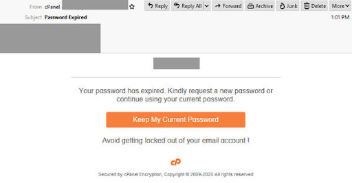

## Introduction

The current COVID-19 times have given rise to extensive phishing scams all around the world. According to the [IBM study](https://newsroom.ibm.com/2021-07-28-IBM-Report-Cost-of-a-Data-Breach-Hits-Record-High-During-Pandemic), the costs for data breaches were found to be $4.24 million per incident.  Also, credential phishing was the most common method used by attackers.

Credential [phishing scammers](https://www.loginradius.com/blog/start-with-identity/phishing-for-identity/) are now targeting corporate businesses to carry out their attacks. Many businesses around the world lose millions to direct and indirect costs of credential phishing attacks every year. 

In this blog, we will understand more about credential phishing and debunk five myths about credential phishing.

## What Is Credential Phishing?

In today's digital workplace, businesses are leveraging technology and innovation to improve their business processes, work operations, and culture. 

Business operations are simplified by innovative software to deliver the best to customers as well as employees. 

For example, using employee engagement software and digital signatures to deliver an excellent employee experience, using email marketing software to deliver the right messages to customers, or using a [digital adoption platform](https://www.walkme.com/glossary/digital-adoption-platform/) to help your customers with product walk-throughs.

Registering for the software by creating an account is the first step towards building a successful workplace. Having a secure login system thus becomes the need of the hour. 

Attackers usually send targeted emails, often impersonating a trusted individual to engage with the victim while having a sense of urgency. They convince the victim to provide credentials or extract their login details via digital manipulation. 

Credential phishing attacks are usually targeted attacks that are backed by extensive research about the target. It always contains a link to a fake login page hosted on a spoof domain or disguised URLs. Once the victims click on the link, they are directed to the phishing website for stealing the credentials.

The victims' credentials are then used to carry out secondary attacks like fraudulent funds transfer, stealing company data, identity fraud, and other fraudulent activities.

## Top 5 Myths About Credential Phishing You Should Know

Most of us think that we can easily spot a phishing email and would not fall prey to fraudulent activities. However, it is not true. Let us have a look at the five myths about credential phishing.

### 1. Tech-savvy individuals do not fall prey to credential phishing.

One of the biggest misconceptions of phishing attacks is tech-savvy individuals do not fall prey to credential phishing. All phishing emails are very similar to the normal emails you would receive from your colleagues. That is why it is difficult for anyone to ascertain at the first glance if the email received is genuine or not.

Attackers are fine-tuning their messages based on the data available on social media and other platforms, thereby increasing the chances of the victims clicking on their links. 

The best approach would be to make the employees [aware of the phishing emails](https://www.loginradius.com/blog/start-with-identity/stop-scammers-getting-email-address/) and use security awareness solutions to perform analysis of emails on a timely basis. 

### 2. Customers are easy targets for phishing.

Phishing is generally regarded as a consumer-based threat. However, reports suggest that attackers are also targeting organizations to gain access to financial systems and commit fraud. 

For example, attackers commit insurance fraud by stealing employee information from the database of the organization. 

Corporate email accounts are an excellent target for credential phishing because attackers can use just one account as a foothold to carry out more phishing operations. 

For example, eBay was once [attacked by phishers](https://news.netcraft.com/archives/2015/09/23/ebay-phishing-sites-hosted-by-ebay.html) who managed to display a malicious web page within eBay's website. This invasion was not noticed by any of the users as it came out to look legitimate. The attackers have complete access to users' accounts, credit card information, and other details.

Another instance of phishing is Epsilon. Epsilon, one of the largest corporate email providers, was a victim of phishing in the year 2011. The attackers had obtained the customer data via this attack.

Phishing is not just restricted to sending messages via email. Communicating via SMS and social media are also targeted to gather personal information. 

### 3. Phishing emails can be easily identified.

Attackers go the extra mile to design and compile a message that looks genuine by 

copying the same messaging format, logo, and signature. They project urgency in their messages to push the victims into taking immediate action.

For example, this is a new email intercepted by MailGuard that seems like an auto-generated notification about password expiry. 

[Source](https://www.mailguard.com.au/blog/phishing-email-employing-cpanel-branding-claims-your-password-has-expired) 

Here are some [tips to recognize phishing](https://www.loginradius.com/blog/start-with-identity/phishing-for-identity/) emails.

* Check the sender's email address. If it is not from an official site, there are chances that the email is from an attacker.
* Check if the domain name in the sender's email is misspelled. Attackers today are spoofing domain names for sending phishing messages.
* The quality of email messages also plays a major role. If the message is poorly written with spelling and grammar mistakes, the email is likely coming from an unauthorized source.
* Check if the email contains a genuine signature. Digital signatures also guarantee the authenticity of the message.
* Check if your email contains suspicious links redirecting to some bogus websites.  

### 4. Users should stop clicking on foreign links and unknown emails.

Most of the time, a phishing attack aims to get the victim to click on a link. Attackers mask malicious links to make them look like genuine ones.

Users can refrain from clicking on the links in the emails thus minimizing the 

risks of giving out information. Hovering over the hyperlink will help you see the URL and know whether it is a legitimate website or not. 

For example, some links could be misspelled domain names or subdomains. 

Furthermore, you can train your employees to identify such links and report the same to the respective team accordingly. This will help in the early detection of spammy emails.

### 5. Antivirus software helps in detecting all phishing messages.

Antivirus software does help in detecting phishing messages but they can not completely stop them from coming altogether. You can set up filters in your email inbox to filter out spam messages. 

Investing in an anti-phishing tool can help in detecting phishing attempts and blocking 

them before they land in your email inbox. 

## Some More Security Measures You Can Follow

* Implement stringent security measures across the entire organization using the [consumer IAM](https://www.loginradius.com/blog/start-with-identity/customer-identity-and-access-management/) system. 
* Set up a single sign-on to unify all your applications and enhance security.
* Use multi-factor authentication to authenticate login attempts.

## Conclusion

Regardless of [how secure your email systems](https://www.loginradius.com/blog/start-with-identity/secure-email-address-website/) are or how well you train your employees, credential phishing can happen in any organization. Understanding the impact of phishing on your organization and adopting the required technology is necessary to combat these attacks. It can help you defend your organization against phishing, malware, and other malware threats.

We are sure the information shared in this post will help keep your organization safe from such attacks. 
 

