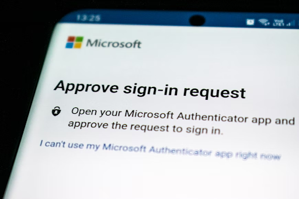

## Introduction

Many marketing campaigns focus on ways to engage customers and make them stick around. But there's a thing lurking behind cyber criminals.

With the rise of eCommerce, [crypto wallets](https://breadnbeyond.com/blockchain/crypto-wallets/), and the time people have to spend on the internet, it’s more important than ever for businesses to focus on security. One way to do this is by implementing foolproof [authentication methods](https://www.loginradius.com/blog/identity/authentication-option-for-your-product/) for online customers.

Providing alternative authentication methods will not only make your site more secure but will also give your customers peace of mind knowing that their information is well-protected. 

This blog will break down popular authentication methods to consider.

## Alternative Authentications: Why Do You Need Them?

Before we get into the nitty-gritty details, it's crucial to understand why you should start offering alternative authentication methods in the first place. Here are some reasons why you should consider implementing them:

### 1. Improve the overall security of your online presence.

Passwords are indeed the most common means of user authentication. But, now the technology has progressed to a point where passwords are no longer considered the safest option. 

They have become quite easy to crack and are often the weak link in an otherwise strong security system. 

### 2. Reduce the chances of data breaches.

A recent study by Juniper Research found that cybercriminals will steal [33 billion](https://www.juniperresearch.com/press/cybersecurity-breaches-to-result-in-over-146-bn) records in 2023 alone. Clearly, data breaches are becoming more and more common, and they're also becoming more expensive.

### 3. Prevent fraud and deter malicious actors.

Fraudsters could reach as high as [$68 billion](https://www.infosecurity-magazine.com/news/digital-ad-fraud-set-to-hit-68bn/) globally in 2022. This is a huge problem that businesses need to be aware of so that they can [earn digital trust](https://www.loginradius.com/blog/growth/digital-trust-business-invest-2022/). 

Alternative authentication methods can help prevent fraud by deterring malicious actors and making it more difficult for them to access sensitive information.

### 4. Comply with industry regulations.

If you're in a regulated industry, then you likely already know that you need to comply with certain security standards. For example, the Payment Card Industry Data Security Standard (PCI DSS) is a set of requirements for businesses that process, store, or transmit credit card information. 

Similarly, the Health Insurance Portability and Accountability Act (HIPAA) is a set of regulations for businesses that handle protected health information (PHI). If you're in the healthcare industry, then you need to take steps to ensure that your systems are HIPAA-compliant. 

While alternative authentication methods may not be required by these regulations, they can certainly help you comply with them.

## 6 Top Alternatives Authentication Methods for Your Online Customers

Now that we’ve established the importance of offering alternative authentication methods, let’s take a look at some of the most popular options.

### #1. Multi-factor authentication

One of the most common and effective authentication methods is multi-factor authentication (MFA). 

MFA essentially adds an extra layer of security by requiring users to provide more than one piece of evidence, or “factor,” to verify their identity. 

This could include a password, as well as a code that’s sent to the user’s mobile phone or email address. 

### #2. SMS-based authentication

Another popular authentication method is SMS-based authentication, which uses text messages to verify a user’s identity. This type of authentication is often used in conjunction with other methods, such as MFA. 

### #3. Biometric authentication

[Biometric authentication](https://www.loginradius.com/blog/identity/biometric-authentication-mobile-apps/) is another great option for businesses looking to add an extra layer of security. 

This type of authentication uses physical or behavioral characteristics, such as a fingerprint, face, or iris scan, to verify a user’s identity.

### #4. Mobile Tokens

Mobile tokens are another effective authentication method that uses a physical device, such as a phone, to generate a one-time code that’s used for logging in to an account. 

This type of authentication is often used by businesses that require a high level of security, such as banks, eCommerce sites, and cloud storage providers.

### #5. Social Authentication

Social authentication is a relatively new method of authentication that uses social media platforms, such as Facebook and Twitter to verify a user’s identity. 

So, when you see the option to “log in with Facebook” on a website, that’s social authentication in action. Just like SMS-based authentication, social authentication is also often used in conjunction with other methods, such as MFA. 

### #6. Fast Identity Online (FIDO) Authentication

Compared to other authentication methods, FIDO authentication is a bit more technical. It uses public-key cryptography to verify a user’s identity and doesn’t require the use of passwords. Instead, users authenticate themselves using a physical device, such as a USB key or security token. 

What the user needs to do is simply plug the device into their computer and enter their PIN. This type of authentication is more secure than traditional passwords and is quickly becoming the new standard in user authentication. 

## Bottom Line: Which Alternative Authentication Method Is Right for Your Business?

Now that you’re familiar with some of the most popular alternative authentication methods, it’s time to decide which one is right for your business. 

The best way to do this is to consider your business’s needs and objectives. For example, if you’re looking for a more secure authentication method, you might want to consider MFA, biometric authentication, or FIDO authentication.

On the other hand, if you’re looking for a simpler and more user-friendly authentication method, SMS-based authentication or social authentication might be a better fit. 

Ultimately, the decision comes down to what you feel is best for your business. Whichever authentication method you choose, just make sure it’s one that will give your customers the peace of mind and security they deserve.

It’s also important to keep in mind that no single authentication method is perfect. The best way to keep your site secure is to use a combination of methods. This will make it more difficult for hackers to gain access to your site and ensure that your customers’ data is safe. 
 

