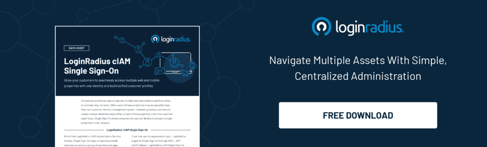

---
title: "Single Sign-On- A Beginner’s Guide"
date: "2021-03-23"
coverImage: "sso-loginradius.jpg"
tags: ["LoginRadius"]
featured: false 
author: "Ashish Kumar Yadav"
description: "The beauty of single sign-on lies in its simplicity. The feature authenticates you on a one-on-one designated platform, allowing you to utilize tons of available services without having to login and logout every time. Consumers can think of this as similar to the social sign-in via Google, Facebook, Twitter, etc."
metatitle: "Single Sign-On- A Beginner’s Guide"
metadescription: "What is single sign-on. Learn the benefits of SSO for your business, how it works and how to implement SSO on your website."

---

Before we hop into the technical definitions and complex examples of Single Sign-on, answer me a straightforward question.

  

What is the most valuable and vital part of your website?

  

Is it the algorithm that shortlists the consumers or the highly dynamic and interactive nature of your login page? Or is it the feedback given by some of your **[happy consumers](https://www.loginradius.com/customers/)**?

  

Whatever it may be but from a hacker's point of view, none of that matters.

  

The only thing they are always on the hunt for is **[personal consumer data](https://www.loginradius.com/blog/identity/2020/06/consumer-data-privacy-security/)**. Data like your consumers' names, email addresses, phone numbers, credit card details, passwords, etc., every entity that a consumer provides.

  

With all the business going online in this digital era, where everything is on the internet, there is a possibility that probably there is not even a single person on this planet who enjoys filling out registration forms.

  

Today, a single consumer interacts with various apps/websites which require them to log in or register before allowing them to use their services. There are relatively high chances of forgetting the username and the associated password while trying to log in.

  

Unfortunately, when it comes to the protection of such data, 100% prevention is never possible. However, there are various methods to reduce this breach possibility to a bare minimum. One such way is Single Sign-On.

## What is Single Sign-On

**[Single Sign-On (SSO)](https://www.loginradius.com/single-sign-on/)** refers to the authentication process that allows your consumers to access various applications with a single set of login ID and password and an active login session. The following are the two examples of the Single Sign-On environments:

  

-   Consumers  access multiple applications of the same provider. Consumers don't need to create and remember separate credentials for each application; they log in once and access the provider's various applications. Example: Google, Youtube, Gmail, etc.
    
-   Employees access numerous applications daily. They don't need to create and remember separate credentials for each application; they can log in once and access various applications from the same organization. Example: HR Portal, Resource Portal, Organizational Account, etc.
    

  

The beauty of single sign-on lies in its simplicity. The feature authenticates you on a one-on-one designated platform, allowing you to utilize tons of available services without having to login and logout every time. Consumers can think of this as similar to the **[social login](https://www.loginradius.com/social-login/)** via Google, Facebook, Twitter, etc.

## Why Should Businesses Use SSO

Being simple and convenient to the consumers, SSO is also widely considered to be more secure. This might raise some confusion and sound counter-iterative to what I've just mentioned above as one might think that how on earth it is more secure logging in once with one password instead of multiple passwords.

  

The reasons below will clear your confusion:

  

-   Stronger passwords: SSO enables the user to create and remember strong passwords because now users have to use only one password instead of using multiple passwords.
    

  

-   Less repeated passwords: Creating different passwords for every other website leads the user to "Password Fatigue," which leads them to repeat the same password multiple times. But after using SSO, all these scenarios are eliminated as it requires a one-time login.
    

  

-   More effortless multi-factor authentication: A multi-factor authentication provides much more security than just relying on a single password. But suppose a consumer has implemented MFA on multiple sites, then it will become a hectic task to the first login and then validate MFA at each site. SSO eliminates this issue because it requires only one-time login and one-time MFA validation.
    

  

-   Less time consumed in the password recovery process: Apart from the security benefits mentioned above, **[Best SSO tool](https://www.loginradius.com/blog/identity/2019/11/benefits-single-sign-on-sso/)** also reduces the time wastage of internal teams. Often, users forget their password, and a lot of time is wasted in recovering passwords for dozens of apps. If appropriately implemented, this has the potential to increase business productivity.
    

## How To Implement SSO

If learning about SSO was interesting, then, believe me, the implementation part is even more impressive. There are multiple ways to implement SSO. Let's get to them one by one.

  

-   Web SSO: This is implemented when a single sign-on is required between two or more web applications. Web SSO is a browser-based session management method that utilizes browser storage mechanisms like sessionStorage, localStorage, cookies to maintain the user's session across your applications.
    

-   Mobile SSO: This is implemented when a single sign-on is required between two or more mobile apps. The mobile SSO flow is similar to the Web SSO that we have covered above. The critical difference is that it allows you to have a single login across multiple apps once logged into an app for **[web and mobile SSO](https://www.loginradius.com/web-and-mobile-sso/)**.
    

-   Federated SSO: This is implemented when a single sign-on is required between two or more web applications. The federated SSO comes in handy while implementing SSO with third-party applications. For interaction with third-party web applications, common standards and protocols are used to manage and map user identities via trust relationships.
    

-   Cross-Device SSO: Cross-Device SSO is a feature that provides SSO between two different applications running on two different devices, i.e., mobile application and web application. Cross-Device SSO is used to set up SSO between a mobile device and a web application.
    

-   Custom IDPs: This can be understood as Social Login. You can use it to configure a designed Social Login provider for your web application(s).
    

## Conclusion

In this article, we talked about applying a simple approach of using Single Sign-On on the websites and how it will enhance businesses. Finally, before implementing any functionality on your website, analyze and consider the pros and cons from every possible angle.

  

Cheers!

