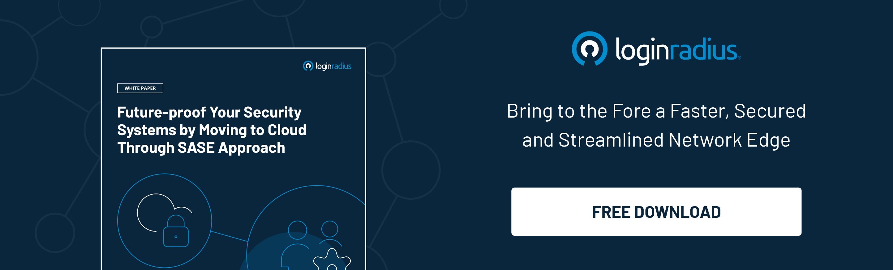

---
title: "Top 10 Cybersecurity Predictions for 2021 That SMBs Must Know"
date: "2021-03-19"
coverImage: "cybersecurity-loginradius.jpg"
tags: ["security"]
featured: false 
author: "Rakesh Soni"
description: "Targeted phishing attacks are one of the leading cybersecurity threats that SMBs should prepare to encounter this year. Also, data breaches in the healthcare sector peaked in 2020 and are expected to continue in the future."
metatitle: "Top 10 Cybersecurity Predictions for 2021 That SMBs Must Know"
metadescription: "Top ten cybersecurity predictions for SMBs in 2021. Companies must evaluate their security infrastructure and amplify the adoption of data protection laws"
---

The global pandemic has forced business executives to reconsider their cybersecurity strategies. According to an IDC report, business spending on security solutions is expected to touch $175 billion by 2024. At the same time, [71% of security professionals](https://www.darkreading.com/vulnerabilities---threats/71--of-security-pros-see-threats-jump-since-covid-19-outbreak/d/d-id/1337498) have reported an increase in online threats since the start of the global lockdown in 2020.

  

So, how should corporations, including **[small-to-medium businesses (SMBs)](https://www.loginradius.com/startups/)**, respond to this existential threat? What should be the key focus areas that the IT and security teams should focus on?

  

To answer these questions, let's discuss the top ten cybersecurity predictions for SMBs in 2021.

### 1. User awareness

Driven by the COVID-19 pandemic, organizations are rushing towards remote work  or the “work from home” model. As a result, cybercriminals will be targeting home-based networks and infrastructure to exploit any security vulnerability. This prediction could lead to an increase in ransomware and phishing attacks designed to extract sensitive information.

  

Enhanced user awareness about cybersecurity is the best preventive measure to stop such attacks. Apart from effective security policies, organizations must train remote-working employees on the best cybersecurity practices.

### 2. Targeted phishing attacks

According to [Security Boulevard](https://securityboulevard.com/2020/12/staggering-phishing-statistics-in-2020/#:~:text=More%20than%2060%2C000%20phishing%20websites,of%20all%20spear%20phishing%20attacks.), more than 60,000 phishing websites were created in the year 2020 alone. One in every eight corporate employees has shared sensitive information on phishing websites. In recent years, phishing attacks have become more personalized and targeted, making them a potent threat to any business.

  

Targeted phishing attacks are one of the leading cybersecurity threats that SMBs should prepare to encounter this year.

### 3. Cyberattacks on the healthcare sector

Last year, despite the pandemic, hackers actively targeted **[healthcare](https://www.loginradius.com/industry-healthcare/)** and pharma companies and spread fake news about vaccine development. Data breaches in the healthcare sector peaked in 2020 and are expected to continue in the short-term future.

  

[**McKinsey**](https://www.mckinsey.com/business-functions/risk/our-insights/covid-19-crisis-shifts-cybersecurity-priorities-and-budgets) predicts that the healthcare industry will be among the top four spenders in cybersecurity solutions in the coming decade. Apart from increasing their spending, SME players in the healthcare sector also need to evaluate their security infrastructure to counter these cyber threats.

### 4. Machine Learning

Going ahead, the increased adoption of **[AI and machine-learning tools](https://www.loginradius.com/blog/engineering/Full_data_science_pipeline_implementation/)** will be among the leading cybersecurity predictions for SMBs and other enterprises. The sheer complexity of cyberthreats will require advanced technologies like machine learning to detect and correct the most severe issues.

  

SMBs can use advanced ML algorithms to analyze incoming threats and take preventive actions. According to [Alan Braithwaite of Ivanti](https://www.linkedin.com/in/alan-braithwaite-1046104), “AI and ML technologies allow connected devices to heal and secure themselves by as much as 80%.”

### 5. Cloud security

Among the top trends in cybersecurity predictions for SMBs, [Thycotic](https://thycotic.com/company/blog/2020/12/10/cyber-security-predictions-and-trends-for-2021/) predicts that cloud security will emerge as a critical security standard in 2021. With more organizations moving to the cloud infrastructure, there have been growing security concerns caused due to misconfiguration, outages, and bugs.

  

To counter such threats, organizations are adopting predictive security that can detect threats in advance. The last three years have seen a [261% ROI](https://www.carbonblack.com/press-releases/new-total-economic-impact-study-finds-cb-predictive-security-cloud-delivers-261-return-on-investment-roi/) for the predictive security market.

### 6. GDPR compliance

As one of the key developments in data privacy, the General Data Protection Regulation (GDPR) has been enacted across the European Union. It requires businesses to protect EU citizens' personal data and privacy while doing business within the EU.

  

Compliance with GDPR or similar data protection laws like the CCPA will be one key cybersecurity trend to watch out for in the next decade.

### 7. Online education

In addition to remote working, online education has been among the significant beneficiaries of the global pandemic. With schools and universities switching to online or e-learning platforms, this industry witnessed a [**30% increase in cyberattacks**](https://www.news18.com/news/tech/online-education-due-to-covid-19-is-causing-massive-spike-in-cyber-attacks-on-schools-colleges-3024551.html) in August 2020. Primarily aimed at stealing student or research data, **[cybersecurity attacks](https://docs.google.com/document/d/1zg8lUUjyMQ2OpEyNKXYkRGBLcTlLuUYyzwZccCmSeWI/edit)** in the online education space will disrupt learning activities over the next decade.

  

Players in the online education sector need to implement a robust security architecture that includes cloud access and end-to-end protection.

### 8. Internet of Things (IoT)

The rollout of 5G connectivity is boosting the number of smart devices  or IoT technologies. Global spending on IoT technologies reached [$742 billion in 2020](https://www.helpnetsecurity.com/2020/06/22/2020-iot-spending/#:~:text=IoT%20spending%20is%20growing%208.2,the%202020%2D2024%20forecast%20period.).

  

The prevalence of connected IoT devices is also a prime target for hackers as they look for any prevailing vulnerability in IoT networks. SMBs need to have complete visibility into their connected IoT devices to detect and fix any security flaw.

### 9. Mobile devices and platforms

A 2019 cybercrime whitepaper revealed that [70% of fraud transactions](https://www.rsa.com/content/dam/en/white-paper/2019-current-state-of-cybercrime.pdf) occurred on mobile devices and platforms and resulted in data losses, data tampering, and malware infections. Due to the influx of mobile apps, most users share their data, such as their contact details and messages with the concerning mobile companies.

  

As mobile devices become more prevalent, mobile users being targeted by hackers are among the top cybersecurity predictions for SMBs.

### 10. Cyberattacks on financial services

According to a 2019 report, banking and financial services are 300 times more prone to cyberattacks than any other industry. Even during the COVID-19 pandemic, cyberattacks on financial institutions spiked by [238%](https://www.infosecurity-magazine.com/news/attacks-on-banks-spike-238-during/).

  

Some of the common threats faced by the financial services industry include phishing attacks, **[data breaches](https://www.loginradius.com/blog/identity/marriott-data-breach-2020/)**, and malware threats.

## Conclusion

For SMBs, the global market for cybersecurity solutions is expected to touch [$80 billion](https://www.infosecurity-magazine.com/news/attacks-on-banks-spike-238-during/) in the future. This article has highlighted ten of the biggest cybersecurity predictions for SMBs in the coming decade.

