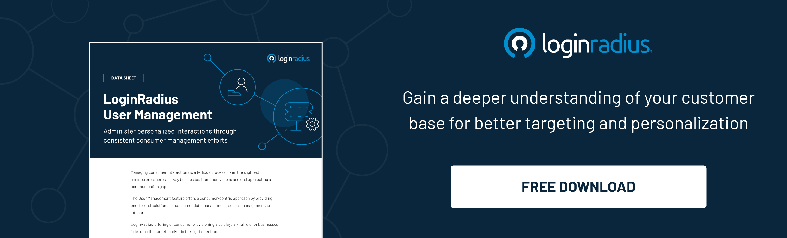

---
title: "What Is User Management and Why Is It Important?"
date: "2021-03-16"
coverImage: "user-mngmnt.jpg"
tags: ["user management","cx","identity access management","idaas"]
author: "Rakesh Soni"
description: "Though user management has been around for a long time now, especially within the IAM and ITAM space, it has assumed new importance with introducing cloud-based subscriptions. Recent trends show that there is a sure shift to cloud-based IAM, granting administrators greater access and control over digital assets management."
metatitle: "What Is User Management and Why Is It Important?"
metadescription: "Find what user management is, its importance for businesses and organizations, and the best practices for implementing effective user management strategies."
---

## Introduction
User management (UM) is defined as the effective management of users and their accounts, giving them access to various IT resources like devices, applications, systems, networks, SaaS services, storage systems, and more.
  
**[User management](https://www.loginradius.com/user-management/)** enables administrators to grant access and manage user access and control user accounts. A user management system forms an integral part of identity and access management (IAM) and serves as a basic form of security.

Any solution designed to serve multiple users utilizes a UM system that establishes authorizations and provides secure access to various resources.

Authorization platforms, in turn, maintain an active directory of users, serving essential functions such as service management, HR, or security.

Deployment of UM helps monitor users better, enhances user experience, and provides access to essential resources to anyone that requires access.

## The Big Shift to the Cloud

Though user management has been around for a long time now, especially within the IAM and ITAM space, it has assumed new importance with introducing cloud-based subscriptions.  

Recent trends show that there is a sure shift to cloud-based IAM, granting administrators greater access and control over digital assets management.
  

**[Cloud services](https://www.loginradius.com/multi-tenant-cloud/)** extend user accounts management to cloud infrastructure, web applications, and non-Windows devices as well.

## What Are The Benefits Of User Management?

Now that we know user management, it is now easier to understand how user management applications solve the riddle of managing multiple user access to various resources.

Through UM, IT administrators can manage resources and access based on need, thereby keeping digital assets more secure. This also ensures a frictionless experience for the end-user, significantly improving the user experience.
  
The advent of cloud-only served to improve user management by opening up access to more web applications. Users now have many more digital resources available to them, making cloud-based user management quickly the most preferable system. Furthermore, the effective management of user identities lays the basis for improved **[identity access management](https://www.loginradius.com/blog/identity/2021/01/what-is-iam/)**, an essential aspect of security.

Effective user management enables organizations to properly maintain their user-based licence compliancy so that various softwares are being used to their full potential. UM can also help companies save money on various software licenses by listing out the number of installations/activations remaining on a piece of software and removing the need for repeated purchases.

User management can help organizations plan their budgets by identifying areas of potential software spends. Through UM, companies can discover which areas or users require new licenses and when.  

This also helps companies know when users are no longer in need of a certain piece of software and thereby mark it for recycling or for leasing it to other users in need.

## Key Elements in User Management

User management is a critical aspect of maintaining a secure and organized system for any organization that deals with user data. There are several key elements that make up user management, including user authentication, authorization, and access control.

[User authentication](https://www.loginradius.com/blog/identity/what-is-authentication/) involves the process of verifying the identity of a user who is attempting to access a system. This can be done through several methods such as passwords, biometrics, or two-factor authentication. 

Once a user's identity has been confirmed, authorization determines what actions the user is allowed to perform within the system.

Access control is the process of defining and managing user access to specific resources and data within the system. This includes managing permissions for different levels of users, such as administrators, employees, or customers.

Other key elements of user management include [user provisioning](https://www.loginradius.com/provisioning/) and deprovisioning, which involves creating and removing user accounts as needed, and user activity monitoring, which helps to detect and prevent unauthorized access or suspicious behavior. 

## How To Automate User Management?

Automating user management can greatly simplify and streamline the process of managing user accounts, especially for organizations with a large number of users. There are several user management tools and technologies available that can help automate various aspects of user management.

One such technology is identity and access management (IAM) software, which can help automate the process of provisioning and deprovisioning user accounts, as well as managing user access to specific resources and data within the system.

Another tool for automating user management is user provisioning software, which can help automate the process of creating and managing user accounts, as well as assigning permissions and roles to users. 

This can help reduce the workload on IT administrators and ensure that user accounts are created and managed consistently and accurately.

Overall, automating user management can save time, reduce errors, and improve security by ensuring that user accounts are created, managed, and accessed appropriately. However, it's important to choose the right user management tools and technologies to meet the specific needs of the organization and ensure that the automated processes align with best practices for user management.

## User Management Software

It is important to note that some Software Asset Management (SAM) and IT Software Management (ITSM) solutions offer user management systems. And though it is generally agreed upon that ITSM solutions offer better functions than SAM solutions, they sometimes cannot recognize the difference between software licenses and user accounts.

However, for those organizations looking for suitable user management solutions, there are a variety of options. These options vary from identity management solutions to simple user governance software that helps companies with user management with a license management solution or in conjunction with SAM.

Usually, vendors that provide license management solutions also offer options for managing licenses for their software as well as user accounts in the form of regular reports or online portals. These reports can act as sources of data for organizations to analyze installations and entitlements within their companies.

## User Management Requirements

Though traditional identity and user management solutions featured a central user identity that can access all of a user’s IT resources, the move to the cloud and new platforms' arrival has pushed for decentralization.

There are a few requirements to be considered for organizations now seeking to leverage cloud systems and web-based applications for a centralized user management solution.

### 1. Delivered from the cloud

Even as most organizations continue to move away from on-premises infrastructure, a centralized user management system needs to be delivered from the cloud and connect users to resources both on-premises and in the cloud.

User management solutions of the next generation, often termed **[Identity-as-a-service (IDaaS)](https://www.loginradius.com/blog/identity/2019/12/identity-as-a-service-for-business/)**, are fully capable of functioning in any environment, on-premises, in the cloud, and even in between.  

### 2. Multiprotocol

There are currently many varying systems that leverage different products ranging from LDAP to SAML, SSH, and RADIUS, among others. For a UM system in a modern network, it should be capable enough to handle various protocols to connect users to resources.

### 3. High security

As digital identities turn into valuable technological assets, a centralized UM system becomes a high-value target. Therefore, central UM systems must employ the latest security measures to keep out unwanted users.

User management systems are central to organizations' effective functioning and form the core of identity management as well. A thorough analysis of organizational requirements is always beneficial to assess the kind of solutions required.
## Three Generations of User Management Solutions 

Three generations of user management solutions have evolved over time, each addressing the needs of organizations at different stages of their growth and technology adoption.

The first generation of user management solutions focused on manual processes, with IT administrators manually creating and managing user accounts and access control. This approach was time-consuming, error-prone, and limited the scalability of user management.

The second generation of user management solutions addressed the limitations of manual processes by introducing automation and self-service capabilities. This allowed users to manage their own accounts and access control, freeing up IT administrators from repetitive and time-consuming tasks. 

However, this approach was still largely based on on-premises solutions and did not support cloud-based applications and services.

The third generation of user management solutions is designed for the cloud-first, mobile-first era, providing a centralized platform for managing user identities, access control, and authentication across multiple cloud and on-premises applications. 

These solutions support a wide range of authentication methods, including [social login](https://www.loginradius.com/social-login/) and multi-factor authentication, and can integrate with existing identity and access management systems. They also provide advanced analytics and monitoring capabilities to detect and prevent security threats.

## Why Should Businesses Use LoginRadius’ Effective User Management? 

LoginRadius’ user management system is a highly efficient and secure piece of software that enables organizations to manage customers without hassle. A flexible **[set up of dashboard](https://www.loginradius.com/docs/developer/howto/dashboard-setup/)** of your entire customer database allows team members to browse through and view individual profiles as well, where you can perform manual actions on behalf of your customers.

What sets LoginRadius’ user management apart from the others is the ability to manage user profiles from one central database that hosts a range of tools for admins. All the data pertaining to a user, including their profile information, preferences, purchase history and interactions with your brand, is made available in a single location.

You can instantly search for any customer, no matter how big the database; view and edit user profiles, change usernames and update email addresses with just a click from the admin console.

LoginRadius seeks to revolutionize the future of **[CIAM](https://www.loginradius.com/blog/identity/2019/06/customer-identity-and-access-management/)** by empowering customer support teams to effectively control and manage users and ensure a seamless experience for the end user.

What’s more, you can integrate LoginRadius with third party analytics like Google or Adobe analytics to make better business decisions driven by reliable data. All this and more, from the convenience of the central admin console.

## Conclusion

In this post, we have explained what user management is, its benefits, user management software, the requirements for effective user management and why there is a shift to cloud based user management services. To talk to an expert, please click on Book a Demo. 

## Frequently Asked Questions (FAQs)

**1. What are the common challenges in User Management?**

Some common challenges in user management include maintaining the security of user data, managing a large number of user accounts and permissions, and ensuring that users have access to the resources they need without compromising security.

**2. What is the purpose of the user management module?**

The purpose of the user management module is to manage user accounts, access control, and authentication in a centralized and secure way. 

**3. How do you ensure security through user management?**

Security can be ensured through user management by implementing strong authentication methods, such as multi-factor authentication, and by carefully managing user access to resources and data. 

**4. How can User Management help with security and access control?**

User management can help with security and access control by providing a centralized platform for managing user accounts and access permissions. 

**5. What is User Authentication and User Authorization?**

User authentication is the process of verifying the identity of a user who is attempting to access a system. User authorization determines what actions the user is allowed to perform within the system based on their role and permissions.

