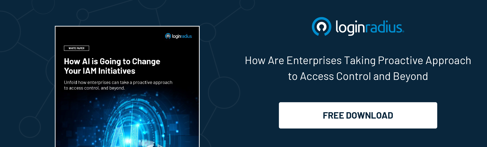

## Introduction

Cyber threats have grown not only in volume but also in sophistication. From simple viruses and worms, we've moved to complex malware, ransomware, and highly targeted phishing attacks. These threats can cause significant financial loss, data breaches, and damage to reputation.

Traditional cybersecurity systems, which rely heavily on predefined rules and signatures, struggle to keep up with these dynamic and innovative threats. This is where AI-enabled cybersecurity solutions enter as a revolutionary approach to fortifying [digital security](https://www.loginradius.com/security/).

These advanced systems are designed to predict, detect, and neutralize threats with unprecedented speed and accuracy. In this blog, we'll explore the rise of AI in cybersecurity, its benefits, and key applications.

## Why is AI a Game Changer?

AI brings several transformative capabilities to cybersecurity:

1.  **Advanced threat detection:** AI systems can analyze vast amounts of data in real time, identifying patterns and anomalies that might indicate a [cyber threat](https://www.loginradius.com/blog/identity/ai-enterprise-security-threats/).
    
2.  **Predictive analysis:** Using machine learning, AI can predict potential threats before they occur. By analyzing historical data and identifying trends, AI systems can forecast where and how attacks might happen.
    
3.  **Automated response:** AI can respond to threats in real time, automating the mitigation process. This reduces the time taken to neutralize threats, minimizing potential damage.
    
4.  **Adaptability:** As new threats emerge, AI algorithms evolve, continuously improving their detection and response capabilities. For example, AI-enabled voice chatbots adapt by learning from user interactions and evolving to better identify suspicious behavior.
    

## Key Applications of AI in Cybersecurity

AI is redefining cybersecurity, becoming the backbone of digital defense. Let’s explore how:

### 1. Bug management

AI-driven bug management tools don’t just find bugs; they analyze the potential impact of each one. By predicting how a bug could affect your system, AI helps prioritize which bugs need immediate attention and which can wait.

But that’s not all—AI can also suggest the best course of action to fix the bug, and in some cases, it can even automate the fixing process. This means your team can focus on more critical tasks while AI handles the smaller, more repetitive fixes.

The result? A more secure, stable system with fewer vulnerabilities left open for attackers to exploit.

### 2. Endpoint protection

Every device connected to your network is a potential entry point for cyber threats. AI-powered Endpoint Protection Platforms (EPP) use advanced algorithms to monitor each device in real-time, looking for signs of suspicious activity.

For example, if a device starts communicating with an unknown server or downloading unusual files, the AI can quickly detect this anomaly and take action—either by alerting your security team or automatically isolating the device from the network.

This proactive defense is crucial in today’s environment, where threats can come from anywhere, and every second counts.

### 3. Customer Identity and Access Management (CIAM)

[AI-powered CIAM systems](https://www.loginradius.com/) analyze user behavior to create comprehensive profiles, monitoring factors like login times, device usage, and typing patterns. When deviations occur—such as an unusually large transaction or a login attempt at an odd hour—the system flags it as suspicious and takes action, requiring additional verification.

For example, the credit union knowledge base includes large volumes of sensitive customer data. AI-enhanced CIAM systems not only protect customer information but also streamline access to it, ensuring that only authorized individuals can retrieve or modify data.

This dual focus on security and efficiency helps credit unions maintain the trust of their members while navigating the complexities of modern digital threats.

### 4. Fraud detection and prevention

Fraud is a constant threat in sectors like banking, e-commerce, and even social media. Traditional fraud detection methods often struggle to keep up with fraudsters' evolving tactics.

However, AI systems excel at pattern recognition and anomaly detection. They continuously analyze transaction data and user behaviors, learning what normal activity looks like for each user.

The moment something suspicious happens—like a transaction that doesn’t fit the usual pattern—AI flags it for further investigation. This real-time detection means potential fraud is stopped in its tracks, saving businesses and customers from financial loss.

For instance, an AI-based contract management system can detect unusual contract clauses that could indicate fraudulent activity. This provides an additional layer of security in sectors relying heavily on digital agreements.

### 5. Threat intelligence

Threat intelligence is all about staying one step ahead of cyber threats. But with the sheer volume of data out there, it’s a daunting task. AI steps in to turn this ocean of data into actionable insights.

By aggregating data from countless sources—think dark web forums, threat feeds, social media, and more—AI can identify emerging threats and trends that human analysts might miss. It doesn’t just collect information; it processes and prioritizes it, providing you with a clear picture of what’s happening in the threat landscape and how to prepare.

With AI-driven threat intelligence, you’re not just reacting to attacks—you’re strategically defending against them before they strike.

## The Future of Cybersecurity and AI

The future of cybersecurity is set to soar with AI. AI tech evolves, it boosts our defenses, making it faster and more accurate in spotting and stopping cyber threats. Big tech companies are already on board, using AI to protect their digital assets.

CIAM gets a major upgrade with AI, which secures customer identities, streamlines access, and ensures only the right people get in while keeping it user-friendly.

But we can't just set it and forget it. Continuous updates and smart management are key. As cyber threats change, AI must adapt to stay ahead. This dynamic approach ensures that our digital world remains safe and sound.
