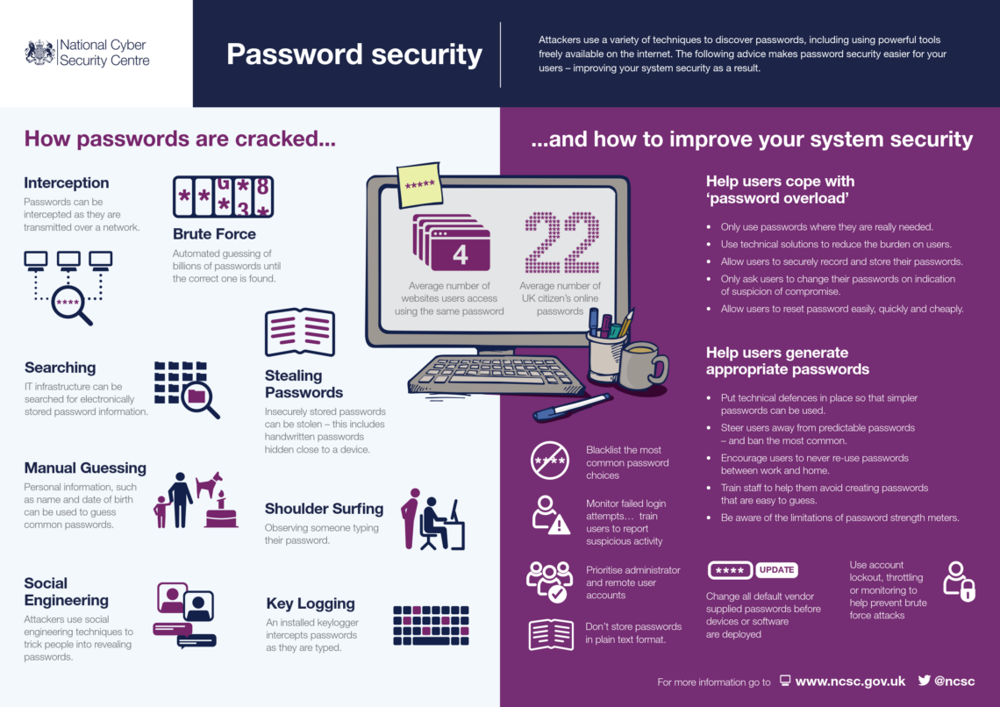
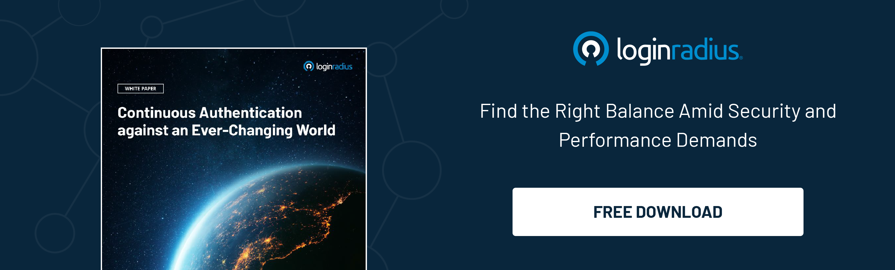

## Introduction 

Authentication is very important when individuals want to access online services and platforms or secure sensitive information. Passwords, two-factor authentication (2FA), and biometrics are the most common methods. However, contemporary demands for cyber security increase with the appearance of more sophisticated threats. 

According to [Forbes](https://www.forbes.com/advisor/education/it-and-tech/cybersecurity-statistics/), data breaches have increased 72% since 2021, costing an average of about 4.45 million dollars, and in 2023, over 343 million victims were affected.

Artificial Intelligence (AI), with its ability to analyze huge amounts of data, recognize patterns, and learn continuously, has the powerful potential to enhance security measures. 

This blog explores how AI can revolutionize [authentication](https://www.loginradius.com/authentication/), from addressing the limitations of traditional methods to utilizing innovative techniques that use machine learning algorithms. If you want to know the advantages of AI-powered authentication and how it works, continue reading.

## Traditional Methods of User Authentication

Source: [safety4sea.com](https://safety4sea.com/wp-content/uploads/2019/01/NCSC-Password-Security-1140x806.png)
 
[Password-based authentication](https://www.loginradius.com/blog/identity/common-vulnerabilities-password-based-login/) is the oldest and most widely used method. A user is required to enter a username and password and nothing else. However, this way of accessing the account is pretty vulnerable to phishing and brute-force attacks. Hackers can use automated tools to try different password combinations until they find the correct one or just send fraudulent emails or website links to compromise security. If a user utilizes the same password across multiple accounts, the threat of a security breach grows.

2FA provides an extra layer of security because it requires two different forms of user identification, including a one-time code via SMS, email, or authenticator apps. Nevertheless, such a method has its limitations. They depend on additional devices and network connectivity, as well as vulnerability to SIM swapping attacks, where hackers hijack a user's phone number and intercept authentication messages.

[Biometric authentication](https://www.loginradius.com/blog/identity/biometric-multi-factor-authentication/) uses fingerprints, facial recognition, or voice patterns to verify a user's identity. However, it increases the risks of spoofing, privacy concerns, and inaccuracy. Biometric systems can be tricked by high-quality replicas because of biometric data, for instance, fake fingerprints or facial images. Storing and processing biometric data can be subject to misusing or accessing without authorization. Sometimes, inaccurate responses from biometric systems can prevent access to accounts.

## The Role of AI in User Authentication                                

AI-powered authentication involves the use of machine learning algorithms to analyze user behavior, detect anomalies, and verify identities in real-time. It can adapt to dynamic patterns and learn from user interactions. It means that AI provides continuous authentication. Such an approach can detect suspicious activities or authorized access attempts in real-time.

AI algorithms can evaluate the risks related to each authentication attempt. They use device characteristics, location, and behavioral patterns to adjust authentication requirements. Moreover, AI-powered authentication systems can identify unusual or suspicious behavior that may indicate fraud or cyber-attacks. They can flag potential security threats before they escalate.

Using AI algorithms for authentication provides impeccable advantages. Due to behavioral biometrics, they can analyze user behavior patterns, such as typing cadence, mouse movements, and navigation patterns, to create and recognize unique biometric profiles. That creates an additional security layer because behavioral biometrics are more difficult for hackers to replicate or spoof.

In addition, AI uses anomaly detection algorithms that can notice identity deviations from user behavior patterns, for example, unusual log-in times, access from unfamiliar locations, or atypical transactions. That allows for preventing unauthorized access and fraudulent activities.

## AI-Powered Authentication Techniques

The techniques based on AI include: 

* behavioral biometrics; 
* contextual authentication;
* continuous authentication. 

Let's consider how they work in more detail.

### Behavioral Biometrics

As we have already mentioned, behavioral biometrics uses AI algorithms to analyze unique patterns of users' behavior, such as mouse movements, navigation habits, or even typing rhythm. This can be implemented continuously in real-time and is pretty beneficial for financial institutions, e-commerce platforms, and the healthcare industry.

Financial institutions can use behavioral biometrics to detect fraudulent activities. AI-powered systems can identify anomalies in log-in times, transaction history, and navigation to detect fraud and implement additional authentication measures. This option is quite beneficial for e-commerce companies that strive to enhance fraud prevention, <a rel="nofollow" href="http://hiveage.com">manage finances</a>, and improve user experience. AI-based systems can distinguish between true shoppers and fraudulent actors by analyzing mouse movements, scrolling patterns, and keystroke dynamics.

The healthcare industry can benefit from behavioral biometrics, too. They strengthen access control and protect patients' data. AI systems work very well for analyzing patterns in healthcare professionals' interactions with electronic health records (EHRs). That can prevent unauthorized access to sensitive medical information and ensure compliance with all regulatory requirements and medical ethics.

### Contextual Authentication

This technique is beneficial for financial institutions, e-commerce, education, healthcare, and other types of companies and services. It takes into account such contextual factors as device characteristics, location, and environmental variables to detect each authentication attempt. All this contextual data is analyzed in real-time so that this system can make more accurate authentication decisions. For example, the banking sector can utilize AI-powered authentication to assess the risk of each log-in attempt based on factors like device type, geolocation, and log-in history. If you attempt to log in from a new device or an unfamiliar location, the system requires additional verification steps, such as one-time passcodes or biometric authentication.

The ability of AI-based systems to analyze device fingerprinting, IP geolocation, and browsing history allows [e-commerce companies](https://www.loginradius.com/industry-retail-and-ecommerce/) to detect and prevent fraudulent transactions while considering the device type, location, and user role can enforce access controls for sensitive patients' information in the healthcare industry.

### Continuous Authentication

This type of authentication is an important technique for monitoring user behavior throughout the entire session to verify identities and detect anomalies in real-time. The AI-based system can detect suspicious activities or unauthorized access attempts and proactively diminish security risks. For example, if a user attempts to access sensitive information outside of regular business hours or initiates banking transactions that are significantly larger than usual, the system may prompt [additional authentication checks](https://www.loginradius.com/blog/identity/what-is-passwordless-login/). 

E-commerce platforms using AI-powered systems can see anomalies in browsing behavior, shopping cart activity, and payment transactions to implement biometric verification or two-factor authentication. 

In the healthcare industry, continuous authentication helps detect unauthorized attempts or suspicious activities, such as sudden changes to patient records or assessing restricted information. It can prevent data breaches and make healthcare services more compliant with regulatory requirements in this field.

## Future Trends and Implications

In the future, AI will be utilized more widely for user authentication in different industries because of the need for reliable security measures and increasing cyber threats. Most companies will recognize the advantages of AI-powered authentication that can protect the clients' sensitive information and improve their user experience. AI technologies will become more accessible, so new AI-powered authentication solutions will appear.

However, there will be some potential challenges and concerns related to AI in user authentication. Hackers will also develop their techniques using AI, so AI-powered authentication systems may become vulnerable to their adversarial attacks.

Since machine learning algorithms collect and analyze sensitive user data, there might be privacy concerns regarding the storage, use, or misuse of such information. Companies will need to think about more transparent data practices and security measures related to data privacy. In addition, AI algorithms used in authentication systems may produce biases or discrimination based on race, gender, or socioeconomic status. That can result in unfair treatment or exclusion of some groups of people.

Ethical considerations will play a more significant role in developing and deploying AI-based authentication systems. That is why companies will have to continuously monitor how algorithms are trained, the data used, and users' privacy and security are protected. They will need to take responsibility for the decisions made by AI algorithms and prevent risks of harming their clients. 

Simultaneously, it will become more important for users to be able to provide informed consent for the collection and use of their sensitive data in AI-powered authentication systems. Addressing concerns and potential risks of using such systems will become a priority for all companies and institutions in the future.

## Final Thoughts

Overall, the integration of AI into user authentication can enhance digital security and improve user experience. Companies and organizations can strengthen access control and detect anomalies in real time with such AI-powered systems.

The future for AI in user authentication is promising, though more potential challenges and security concerns may appear since AI technologies will continue to develop. That is why it is important to stay updated with the latest developments in AI to employ user authentication properly. Institutions and companies must invest in ongoing research, training, and collaboration to make sure they can use the full potential of AI-powered authentication.

Although AI is changing the game in user authentication, everyone must be aware of its potential benefits and drawbacks to protect sensitive information and reduce security risks. In this way, organizations and companies will be able to secure important data and build trust with users. 

