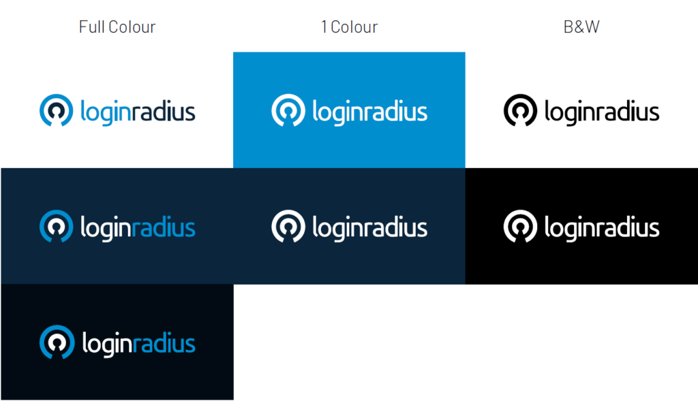

LoginRadius is happy to announce that we have a new logo now. 

Yes! We loved the old one, but we decided to upgrade it as part of our ever-evolving branding metrics. After all, progress is impossible without change. 

So, here’s our new look.

As a leader in cloud-based Customer Identity and Access Management (CIAM) solution that the following two core principles are reflected in the branding:

**Putting users at the center**

Our platform is all about consumer-brand relationships and to strengthen the relationship we believe we need to put the consumer at the center. So, everything we design and develop, we keep the very end-users i.e. your consumers at the centre. 

Our first priority is to benefit them -- giving them peace of mind by protecting their data, account and privacy; and offering them a delightful experience.

**Security is the foundation of our business**

Security is not a feature but the foundation of our business. Protecting consumers’ data, account and privacy is the most important function of our business and platform. We and our customers never compromise on security. Period.

## Intend Behind The Change

Over the years, LoginRadius has exponentially grown from a simple social login provider to an industry-leading customer identity and access management (CIAM) platform. 

Therefore, it is important that we align our designing goals to reflect how we serve our customers, what our milestones are and most importantly, symbolize our future on what more do we intend to achieve.

Keeping designing and user experience at the core of innovation, our creative thinkers came up with a logo that is crisp, smart, minimalistic and feels connected.

Needless to say, they got exactly what we intended to project out to the world – user-centric CIAM platform with a strong security foundation.

## What Has Changed?

First, we would like to take a moment to highlight the retirement of our current logo. After all, it had been serving the spirit of LoginRadius since our inception. 

Fast-forward to the present day, the new logo marks a crucial milestone towards representing our brand-building process.

- **Brandmark**:  It comprises two concentric circles. Most obvious is the negative space showing a keyhole which is also a literal radius from the centre to the outer edge. The keyhole represents robust security foundation of our platform. It can also be seen as a user icon, protected by white arms implied by the negative space and by the light blue circle. This demonstrates our philosophy of putting the user at the centre of everything. Both of these ideas speak to the concept of protecting identity.

- **Typeface:** Our creative team made a unanimous decision to create a modern typeface that embodies our vision and is strong enough to sustain on its own. Therefore, we thickened the font with solid letters to give more presence to the brand. 

- **Color**: Colors are an important aspect of our brand personality. Our core colour palette consists of two primary colours viz. tarren blue and cosmic blue. They help to reinforce feelings of safety and confidence towards customer identity.

Letting go of our core designing heritage was never our objective. Our color palette is the testimony of what we have been for our customers and promotes authenticity in every form.

## Logo Color Combinations

## A Final Word

The new logo is an attempt at modernizing our brand and helping it connect more with our customers. 

Amidst the huge chunk of workload that rebranding brings along, we are super thrilled to share this news and would like to take a moment to thank our loyal customer base. Do share your comments about the change.

