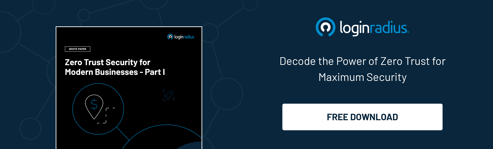

## Introduction

The global tech giant Apple has recently announced a new “lockdown mode” for their iPhone, iPad, and Mac computers to enhance protection against spyware launched by state-sponsored attacks. 

The ‘lockdown mode’ is considered a giant leap as a part of their information security for protecting operating systems of iPhone, iPad, and Mac against various threats, including spyware. 

As per the officials from Apple, the ‘lockdown mode, when enabled, reinforces the overall security system and restricts certain functions to protect users. 

Let’s understand what a state-sponsored attack is and how this new feature in Apple devices would work to protect critical customer information. 

## What are State-Sponsored Attacks?

State-sponsored cyberattacks (SSA) are attacks directly linked to a particular nation or state. The goal is to exploit national infrastructure vulnerabilities, exploit systems, or gather intelligence. 

These attacks usually target a specific group of people that can be spied on to gather critical information regarding a nation’s strategies or other sensitive information that can be exploited for financial benefit. 

Various states employ hackers through their government authorities or militaries, making it easier to deny any state involvement even if an attack is detected. 

## How Does Apple’s ‘Lockdown Mode’ Work?

The ‘[lockdown mode](https://www.apple.com/newsroom/2022/07/apple-expands-commitment-to-protect-users-from-mercenary-spyware/)’ will eventually protect Apple users, regardless of their device, against spyware that state-backed cybercriminals can launch on various devices. 

As per the company’s representatives, the ‘lockdown mode’ will serve as an emergency button that a small number would require of users. It will be the last resort for users that can be targeted by spyware, as this feature would disable many other features. 

However, the users can quickly turn on and off the ‘lockdown mode’ whenever they wish to. 

Currently, the feature is available in the beta version of the operating system so that the company can work on fixing bugs and weaknesses. 

Apart from this, Apple has claimed that it will add more new features and more robust protections to the newly-launched ‘lockdown mode’ in upcoming months. 

## In Conclusion 

With the increasing number of spyware and state-sponsored attacks affecting users and a nation's overall security and privacy, the ‘lockdown mode’ would surely help secure devices and users to a great extent. 

However, the underlying risks associated with state-sponsored attacks can’t be overlooked. Hence, users must understand the underlying security risks and take necessary precautions while using different devices. 

