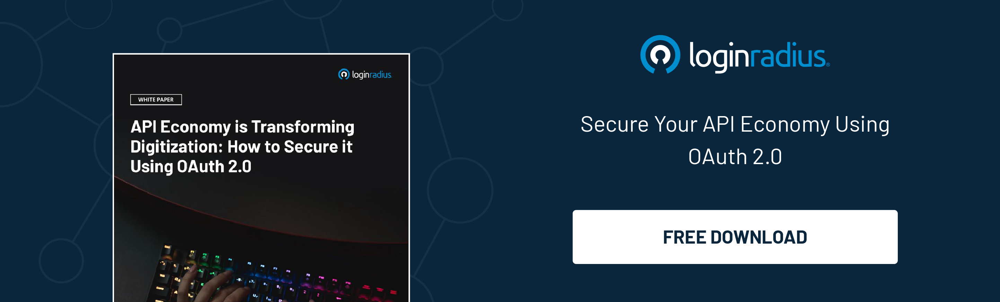

---
title: "How to Evaluate the Quality of Your User Authentication System"
date: "2021-11-18"
coverImage: "verification.jpg"
tags: ["user authentication","authorization","compliance"]
author: "Arpita Garg"
description: "Whether we talk about data leaks or identity thefts, businesses that become victims of security breaches compromise their brand reputation and lose millions of dollars every year. Hence, robust authentication and authorization mechanisms become a necessity and not just a luxury. Let’s understand how businesses can evaluate the quality of a user authentication system."
metatitle: "How to Assess and Improve Your User Authentication System"
metadescription: "User authentication is crucial for every business in the modern digital world. Let’s understand how businesses can evaluate the best authentication system."
---
The digitally advanced business landscape has offered enormous opportunities to enterprises striving for business success in the most competitive environments. 

Businesses leverage cutting-edge technologies to accelerate their growth by offering seamless experiences to their consumers whenever and wherever they want. 

However, security is still one of the most common bottlenecks of every industry, which can’t be overlooked, especially when the number of [data breaches is soaring](https://www.loginradius.com/blog/identity/how-to-handle-data-breaches/) day by day. 

Whether we talk about data leaks or identity thefts, businesses that become victims of security breaches are compromising their brand reputation and losing millions of dollars every year. 

Hence, robust authentication and authorization mechanism becomes a necessity and not just a luxury. 

So does it means that businesses that are using an [authentication system](https://www.loginradius.com/authentication/) on their website or mobile application are protected against every security breach? 

Unfortunately, this isn’t the case!

With cybercriminals finding new ways to sneak into a business network, enterprises should consider relying on an authentication mechanism that offers stringent security layers and not just those that validate a user based on specific criteria. 

Let’s dig deeper into this and understand how enterprises can evaluate the quality of a user authentication system before making a decision. 

## Authentication and Authorization

Before we inch towards understanding the aspects of a robust [authentication and authorization](https://www.loginradius.com/blog/identity/authentication-vs-authorization-infographic/) mechanism, let’s quickly understand the difference between authentication and authorization. 

### What is Authentication

Authentication is the process of identifying users and validating who they claim to be. One of the most common and apparent factors to authenticate identity is a password. If the user name matches the password credential, the essence is valid, and the system grants access to the user.

Interestingly, with enterprises going passwordless, many use modern authentication techniques like one-time passcodes (OTP) via SMS, or email, single sign-on (SSO), multi-factor authentication (MFA) and biometrics, etc. authenticate users and deploy security beyond what passwords usually provide.

### What is Authorization

Authorization happens after a user’s identity has been successfully authenticated. It is about offering full or partial access rights to resources like databases, funds, and other critical information to get the job done.

For example, in an organization, after an employee is verified and confirmed via ID and password authentication, the next step would be defining what resources the employee would have access to.

## Difference between Authentication and Authorization

Let’s understand the core of utilizing authentication and authorization and how one differentiates from the other.

For instance, an organization will allow all its employees to access their workplace systems (that’s authentication). But then, not everyone will have the right to access its gated data and resources (that’s authorization).

Implementing authentication with the proper authorization techniques [through a CIAM](https://www.loginradius.com/blog/identity/customer-identity-and-access-management/) (consumer identity and access management) solution can protect organizations, while streamlined access will enable its workforce to be more productive.

A CIAM solution uses authentication and authorization technologies like JWT, SAML, OpenID Authorization, and OAuth.

### Different Ways of User Authentication

* **Password-based Authentication:** It is a simple method of authentication that requires a password to verify the user's identity. 
* **Passwordless Authentication:** In this method, a user is verified through [OTP or a magic link](https://www.loginradius.com/blog/identity/loginradius-launches-passwordless-login-with-magic-link-or-otp/) delivered to the registered email or phone number.
* **2FA/MFA** **(Multi-factor Authentication):** It requires more than one security level, like an additional PIN or security question, to identify a user and grant access to a system. 
* **Single sign-on (SSO):** It allows users to access multiple applications with a single set of credentials. 
* **Social Authentication:** It verifies and authenticates users with existing credentials from social networking platforms.

### Different Ways of User Authorization 

* **Role-based Access Controls (RBAC):** It can be implemented for system-to-system and user-to-system privilege management.
* **JSON web token (JWT):** It is an open standard for securely transmitting data between parties, and users are authorized using a public/private key pair.
* **SAML:** It is a standard Single Sign-On format (SSO) where authentication information is exchanged through XML documents that are digitally signed.
* **OpenID Authorization:** It verifies user identity based on an authorization server's authentication.
* **OAuth:** It allows the API to authenticate and access the requested system or resource.

Since we’ve got a fair understanding of the authentication and authorization system, let’s just quickly jump to the aspects that define the quality of the authentication system.

## 8 Characteristics to Evaluate the Quality of Authentication System 

### #1. Functional Stability

One of the essential characteristics of a robust authentication system is functional stability. The authentication system, or in other words, a CIAM solution, must strictly adhere to functional completeness, correctness, and appropriateness. 

Considering the new security challenges, the CIAM solution must adapt to the diverse security environment and offer stringent security in every situation.For instance, the LoginRadius CIAM offers [Risk-based Authentication](https://www.loginradius.com/blog/identity/risk-based-authentication/) (RBA) that automatically kicks in and adds another layer of authentication in a hazardous environment. 

### #2. Reliability

A CIAM solution offering authentication and authorization must be reliable enough to meet the ever-expanding security and infrastructure requirements. 

For instance, if the number of users signing up or logging in suddenly surges, the CIAM should be capable of handling peak loads without posing a threat to crucial consumer and business information. 

Here’s where LoginRadius CIAM plays a vital role. The [LoginRadius CIAM](https://www.loginradius.com/) delivers a flawless performance coupled with the auto-scalable infrastructure that automatically scales according to the business requirements in real-time.

Whether the number of users is hundreds of millions, LoginRadius handles consumers like a breeze and ensures data is securely stored. 

### #3. Performance Efficiency

Enterprises should strictly consider relying on a CIAM solution that not only ensures efficiency but eventually meets the surging demands of users in real-time without hampering user experience. 

A CIAM solution carries out the way authentication and authorization define the overall usability and performance of the mechanism. Businesses should ensure that their CIAM can handle peak loads and deliver a frictionless user experience without delay. 

### #4. Security

Security is also one of the most crucial aspects of choosing a CIAM solution for carrying out authentication and authorization.  Businesses must ensure that their CIAM vendors offer the highest level of security through multiple stringent layers of protection that secure business data and safeguard consumer identities. 

A CIAM solution must be capable of identifying the user who it claims to be and must take immediate action if it detects something fishy. 

Here’s where LoginRadius CIAM comes into play. The new-age CIAM solution harmoniously combines all the essential aspects of a secure infrastructure, including confidentiality, integrity, accountability, and authenticity.

The leading CIAM offers [multi-factor authentication](https://www.loginradius.com/multi-factor-authentication/), risk-based authentication,  built-in web application firewall and adheres to all the major data privacy regulations and security compliances. Apart from this, the customer data is protected with many built-in features such as encryption at rest, one-way password hashing, and much more.

### #5. Compatibility

Another essential aspect that enterprises shouldn’t ignore in their CIAM is compatibility. A CIAM solution must be compatible with both web and mobile devices to offer complete responsiveness to end-users. Also, the CIAM must have interoperable capabilities to ensure compatibility with other products and systems. 

The LoginRadius CIAM offers endless possibilities for enterprises as they can integrate third-party applications and programs that leverage consumer data and behavior to deliver valuable insights. 

### #6. Maintainability

The maintenance of a CIAM solution shouldn’t be a tough nut to crack. Enterprises should consider relying on cloud-based CIAM solutions like LoginRadius that offer 100% uptime and ensure minimal maintenance costs. 

Moreover, the LoginRadius Cloud Directory is a fully managed service, so there’s no additional work needed to maintain it.

### #7. Portability

Portability is yet another vital aspect that shouldn’t be overlooked by enterprises considering adding authentication to their platforms. The CIAM solution must be adaptable and portable to be used in every environment and niche to cater to the diverse needs of the businesses. 

Since cloud computing is swiftly becoming the future of modern businesses, relying on a cloud-based solution is undeniably the wisest decision. 

### #8. Usability

Last but not least, usability must be considered while choosing a reliable authentication mechanism since factors like user error protection, accessibility, and user interface are the cornerstones of an ideal CIAM solution. 

The LoginRadius CIAM helps businesses deliver a flawless user experience through its state-of-the-art user interface reinforced by robust security. 

Also, the cloud CIAM offers numerous ways to authenticate users. Businesses can leverage [social login](https://www.loginradius.com/blog/identity/what-is-social-login/), passwordless login, SSO, and more with one solution. 

## Final Thoughts 

Carrying out authentication is crucial for every business in the digital landscape. However, the increasing security concerns have raised the bar for enterprises to choose their authentication system wisely. 

The aspects mentioned above could help businesses choose the most exemplary authentication mechanism that not only offers the highest level of security but eventually delivers a flawless user experience. 

Moreover, businesses can witness the world-class authentication system in action with LoginRadius CIAM that helps establish a secure and user-friendly authentication and authorization system. 

