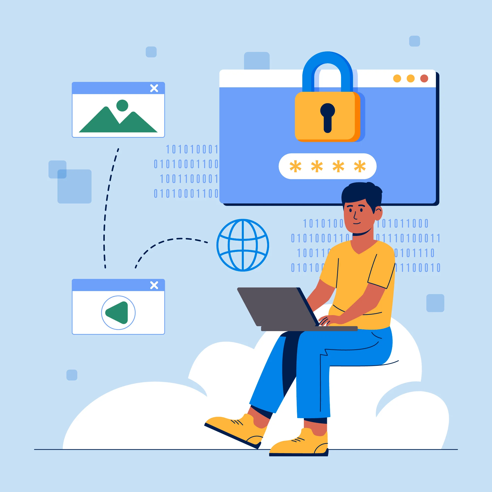
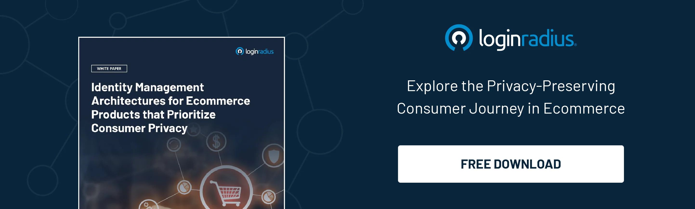
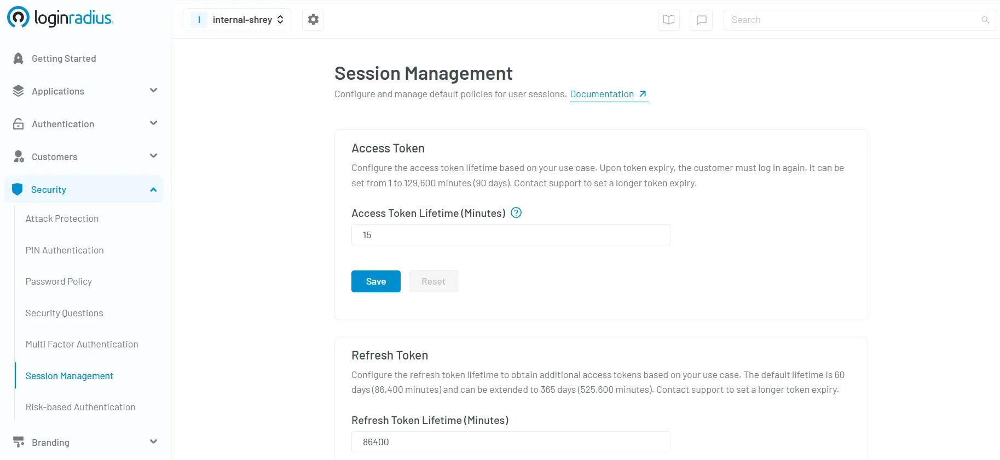
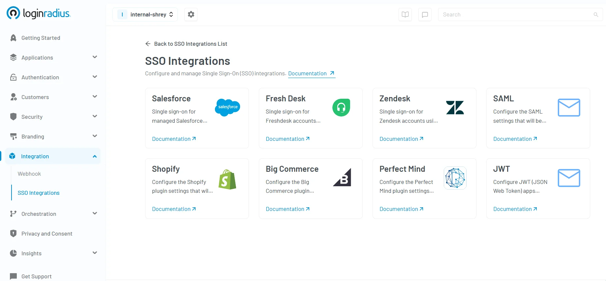
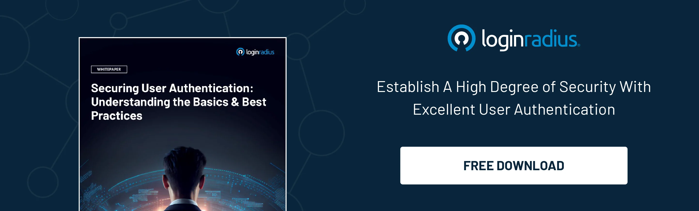

## Introduction

In an era where digital transformation is at the core of every business operation, securing user access has become more critical than ever. The twin pillars of digital security today are authentication and identity verification. 

These processes are fundamental not just for regulatory compliance, but for fostering user trust, reducing fraud, and maintaining data integrity. 

Let’s explore the different types of identity verification and types of authentication, their evolving nature, and how businesses can implement them effectively in a real-world context.

## What is Authentication?

[Authentication](https://www.loginradius.com/blog/identity/what-is-authentication/) is the process of confirming that someone is who they claim to be. This is done by validating login credentials such as usernames, passwords, PINs, tokens, or biometric data. In the broader context of identity and authentication, authentication ensures that access is granted only to legitimate users.

With cyber threats becoming more sophisticated, organizations must shift from traditional methods to robust authentication best practices. It's not just about protecting data but ensuring the authenticity of each digital interaction. Authentication verification lays the foundation for all secure access protocols, making it a key focus for both IT leaders and compliance teams.

Take, for example, an online banking app. When a user attempts to log in, the system checks their credentials against stored information. If matched, access is granted. 

However, if the bank has mandatory [two-factor authentication](https://www.loginradius.com/blog/identity/2fa-security-measures/) enabled, a one-time code will be sent to the user’s phone that must be entered to log in. This process illustrates how authentication protects sensitive data and helps prevent unauthorized access.

Take another scenario into consideration where a B2B scenario where a logistics company like DHL partners with multiple third-party vendors to manage shipments, inventory, and reporting. 

These vendors need access to DHL’s internal dashboards—but only to the specific systems relevant to their operations. 

With LoginRadius Partner IAM, DHL can securely onboard partner users, authenticate them via SSO and MFA, and enforce granular access controls. This ensures external users only access what they’re authorized to—without risking core infrastructure exposure. [Explore how Partner IAM works.](https://www.loginradius.com/docs/partner-iam/overview/) 

## Common Methods of Authentication

There are multiple types of authentication in use today, each suited to different levels of risk and user convenience. As part of authentication best practices, organizations often use a layered approach.

### 1. Password-Based Authentication

Still widely used, this method involves a secret known only to the user. However, it's vulnerable to phishing, brute force, and social engineering. As per Verizon's latest [2024 Data Breach Investigations Report](https://www.verizon.com/business/resources/Te3/reports/2024-dbir-data-breach-investigations-report.pdf), compromised credentials caused 38% of breaches, with weak or reused passwords significantly contributing to these incidents. Encouraging strong password policies and regular updates can mitigate this risk.

Businesses often pair passwords with secondary security questions or CAPTCHA to slow down automated attacks. 

E-commerce platforms like Amazon still use password-based login as the first layer of user authentication, although they strongly encourage adding two-step verification. 

Example of password-based authentication alone: Logging into your Gmail or Instagram account using a username and password. This is the most familiar method, though it’s vulnerable if passwords are weak or reused.

If you're building secure experiences for eCommerce, our white paper on Identity Management Architectures for Ecommerce Products offers insights into how password hygiene and CIAM best practices can help preserve consumer privacy across the shopping journey:

### 2. Multi-Factor Authentication (MFA)

[Multi-factor authentication (MFA)](https://www.loginradius.com/blog/identity/what-is-multi-factor-authentication/) enhances security by requiring users to verify their identity through at least two different categories of authentication:

* **Something you know** (e.g., a password) 
 *Example*: Logging into your email with a password as the first step. 

* **Something you have** (e.g., OTP token, security key) 
 *Example*: Entering a one-time code from an authenticator app or inserting a YubiKey for secure access to a work account. 

* **Something you are** (e.g., biometrics like fingerprint or facial recognition) 
 *Example*: Using Face ID to approve a login attempt on a banking app. 

Google reported a 96% drop in phishing attacks after adopting physical security keys for employee MFA.

In business settings, MFA is typically integrated with identity providers like Active Directory or cloud platforms such as Azure AD. Many organizations also implement mobile-based MFA via [push notifications](https://www.loginradius.com/blog/identity/push-notification-authentication/) using apps like Microsoft Authenticator, LoginRadius Authenticator, or Duo Security, making the login process secure yet user-friendly.

### 3. Biometric Authentication

Biometric data, like fingerprints or facial scans, represent a secure and user-friendly method. If you’re asking, [what type of authentication is biometrics](https://www.loginradius.com/blog/identity/what-is-mob-biometric-authentication/)? It falls under "something you are," offering a high assurance level. Apple Face ID and Android's fingerprint scanners are common biometric implementations used by millions daily.

Biometric authentication is also gaining traction in airport security and retail, where speed and accuracy are crucial. Amazon One, for example, allows customers to pay using a palm scan.

### 4. Token-Based Authentication

[Token-based authentication](https://www.loginradius.com/blog/identity/what-is-token-authentication/) is a secure method where users receive a time-bound token after successfully logging in, which is then used to access protected resources without repeatedly entering credentials. 

At LoginRadius, this is seamlessly implemented through access and refresh tokens as part of our modern CIAM infrastructure. Here’s how to enable token-based authentication in the [LoginRadius console:](https://console.loginradius.com/security/session-management)

These tokens are securely generated and validated through industry-standard protocols like OAuth 2.0 and JWT, ensuring both flexibility and scalability. They allow organizations to enforce session controls, manage user access efficiently, and enhance the overall user experience—especially in single-page applications and mobile apps where persistent login sessions are crucial.

This approach not only reduces the risk of session hijacking but also enables fine-grained control over user access, making it ideal for businesses handling sensitive consumer data.

### 5. Forms Based Authentication

Common in web applications, forms based authentication requires users to submit credentials through a web form. While easy to implement, it's essential to combine it with secure protocols like HTTPS. It’s widely used in CMS platforms and eCommerce login portals like Shopify and WordPress.

To improve this method, businesses often deploy additional measures like account lockouts, session expiry timers, and CAPTCHA verification. 

### 6. API Authentication

For developers, understanding the types of API authentication is vital. Common methods include API keys, OAuth tokens, and [JWT (JSON Web Tokens)](https://www.loginradius.com/blog/engineering/guide-to-jwt/). Proper API security ensures that backend systems remain uncompromised. Netflix, for example, uses OAuth 2.0 to secure user sessions and application calls.

Misconfigured APIs can lead to serious security breaches. In a notable example from late 2024, the U.S. Department of the Treasury was compromised after attackers exploited a leaked API key from third-party software. 

This incident, [reported by The Verge](https://www.theverge.com/2024/12/30/24332429/us-treasury-department-beyondtrust-hack-security-breach?utm_source=chatgpt.com), underscored how critical it is to secure API credentials and enforce strict authentication and access controls. 

### 7. Single Sign-On (SSO)

[Single sign-on (SSO)](https://www.loginradius.com/blog/identity/what-is-single-sign-on/) allows users to authenticate once and gain access to multiple applications without the need to re-enter credentials. This not only simplifies the login process but also enhances productivity and security by reducing the attack surface associated with multiple logins.

For example, an organization using Microsoft 365 can provide employees with seamless access to Outlook, Teams, OneDrive, and SharePoint—all from a single authenticated session. SSO is especially beneficial in industries like education, media, and healthcare, where users interact with multiple digital tools throughout their day.

LoginRadius offers out-of-the-box SSO integrations with popular platforms like Salesforce, Shopify, Zendesk, Freshdesk, BigCommerce, and more—as shown in the image below. The intuitive dashboard makes it easy to configure and manage these integrations with just a few clicks.

Looking to simplify identity management while improving user experience? Explore our powerful [SSO integrations](https://www.loginradius.com/docs/integrations/pre-built-connections/overview/?q=sso+integrations) and streamline access across your SaaS stack. Read our complete guide on authentication methods to find the right fit for your business.

Need a complete guide to authentication methods? [Read this insightful blog](https://www.loginradius.com/blog/identity/how-to-choose-authentication/) to learn more about different authentication methods and how to pick the right one for your business needs. 

## What is Identity Verification?

While authentication confirms that someone accessing your system is authorized, [identity verification](https://www.loginradius.com/blog/identity/digital-identity-verification/) establishes who that person truly is. It ensures that the individual engaging with your platform isn’t just using valid credentials—but is, in fact, the real, verified person behind them.

To illustrate: imagine booking an international flight. When you buy the ticket, you enter your name and details online. But at the airport, before you board, you must present your passport and photo ID—proof that the name on the ticket matches your real-world identity. That process of validating your identity before granting access to a secure or high-risk experience? That’s identity verification.

In the digital world, this typically takes place during account registration or at sensitive touchpoints—like large transactions or password recovery. It answers the critical question: Can we confidently trust this person is who they claim to be?

Modern identity verification is becoming faster and smarter, thanks to technologies like:

* **Document scanning** (e.g., passports or government-issued ID) 

* **Biometric matching** (such as facial scans or selfies) 

* **Database and credit bureau checks** to validate data integrity 

Airlines, for example, often ask users to upload their travel documents when checking in online or to verify identity at the boarding gate. Some carriers are even piloting biometric boarding—using facial recognition instead of tickets to speed up the process while improving security.

Organizations also use identity verification to comply with KYC (Know Your Customer) and fraud prevention requirements—particularly in sectors like finance, healthcare, and insurance.

Ultimately, identity verification provides a trusted foundation for any digital relationship. It ensures that once users are verified, their future access can be safely authenticated—creating a balance between security, compliance, and user experience.

## Common Methods of Identity Verification

### 1. Document-Based Verification

Users upload government-issued documents like passports or driver’s licenses. AI-powered tools then validate the document’s authenticity. This is widely used by online travel agencies and insurance companies for onboarding and claim processing.

### 2. Biometric Verification

Often paired with document verification, this involves matching a selfie or live video to the document photo. It’s one of the fastest-growing types of identity verification in finance and healthcare. 

### 3. Knowledge-Based Verification

Involves answering questions based on personal data. While still used, it’s vulnerable if an attacker has access to personal information. For instance, users might be asked their mother’s maiden name or a previous address.

### 4. Database and Credit Bureau Checks

Verifies user data against authoritative databases. This is particularly effective in regions with comprehensive digital identity ecosystems. U.S. banks often rely on Equifax or TransUnion for this type of user identity verification.

## Authentication vs. Identity Verification: How They Differ

<table>
  <tr>
   <td><strong>Aspect</strong>
   </td>
   <td><strong>Identity Verification</strong>
   </td>
   <td><strong>Authentication</strong>
   </td>
  </tr>
  <tr>
   <td><strong>Primary Role</strong>
   </td>
   <td>Confirms a user’s real-world identity before granting account access.
   </td>
   <td>Confirms that the person trying to log in is the verified user of the account.
   </td>
  </tr>
  <tr>
   <td><strong>When It's Used</strong>
   </td>
   <td>Typically during onboarding, registration, or high-risk actions like financial transactions.
   </td>
   <td>Used consistently—at login and during sensitive user sessions.
   </td>
  </tr>
  <tr>
   <td><strong>Data & Tools Used</strong>
   </td>
   <td>Leverages official documents, biometrics, or third-party databases.
   </td>
   <td>Utilizes credentials such as passwords, OTPs, tokens, or biometrics.
   </td>
  </tr>
  <tr>
   <td><strong>Security Objective</strong>
   </td>
   <td>Prevents fake identities and fraudulent registrations.
   </td>
   <td>Protects ongoing access to digital assets from unauthorized users.
   </td>
  </tr>
  <tr>
   <td><strong>Nature of Use</strong>
   </td>
   <td>Often a one-time or infrequent identity check.
   </td>
   <td>Performed repeatedly to validate each session or interaction.
   </td>
  </tr>
  <tr>
   <td><strong>System Dependency</strong>
   </td>
   <td>Commonly linked to KYC, AML, or compliance processes.
   </td>
   <td>Embedded in login systems, apps, and CIAM platforms for access control.
   </td>
  </tr>
</table>

## How Users Are Now Verified

Modern user identity verification leverages AI, ML, and biometric technologies to create frictionless experiences. Rather than relying on outdated methods, businesses now adopt continuous identity and authentication strategies.

For example, dynamic authentication uses behavioral biometrics and user context to verify identity in real time. This adaptive approach intelligently adjusts authentication requirements based on risk levels—requiring more stringent verification only when anomalies are detected. This not only minimizes user friction but also significantly boosts security.

Behavioral signals such as typing speed, mouse movement, device location, and login frequency help determine risk. If something seems off, adaptive authentication kicks in with an extra verification layer.

To learn more about how this intelligent method works, check out our blog on [What Is Adaptive Authentication?](https://www.loginradius.com/blog/engineering/what-is-adaptive-authentication/)

Additionally, decentralization is emerging as a trend. Users may soon store and manage their identity credentials via blockchain-powered wallets, enhancing both control and privacy. Governments and global financial institutions alike are exploring self-sovereign identity platforms.

Although often used interchangeably, identity verification and authentication serve distinct but complementary purposes in the digital security landscape. Understanding their differences is essential to designing a secure and seamless user experience.

While identity verification establishes who the user is at the start of their journey, authentication ensures it's still the same user accessing your system each time.

Here’s a side-by-side comparison to make it crystal clear:

<table>
  <tr>
   <td><strong>Aspect</strong>
   </td>
   <td><strong>Identity Verification</strong>
   </td>
   <td><strong>Authentication</strong>
   </td>
  </tr>
  <tr>
   <td><strong>Purpose</strong>
   </td>
   <td>Confirms if the user is who they claim to be
   </td>
   <td>Confirms the user accessing the system is the same verified user
   </td>
  </tr>
  <tr>
   <td><strong>When it's used</strong>
   </td>
   <td>At account creation, onboarding, or high-risk actions
   </td>
   <td>Every time a user logs in or accesses a protected resource
   </td>
  </tr>
  <tr>
   <td><strong>Data required</strong>
   </td>
   <td>Government ID, biometrics, personal data
   </td>
   <td>Passwords, OTPs, tokens, biometrics
   </td>
  </tr>
  <tr>
   <td><strong>Frequency</strong>
   </td>
   <td>One-time or occasional (e.g., during KYC)
   </td>
   <td>Recurring (every login or sensitive session)
   </td>
  </tr>
  <tr>
   <td><strong>Example</strong>
   </td>
   <td>Uploading a passport to verify identity
   </td>
   <td>Entering a password and OTP to log into a dashboard
   </td>
  </tr>
  <tr>
   <td><strong>Risk Level Managed</strong>
   </td>
   <td>Identity fraud, fake accounts
   </td>
   <td>Unauthorized access, session hijacking
   </td>
  </tr>
  <tr>
   <td><strong>User Journey Stage</strong>
   </td>
   <td>Beginning of user journey
   </td>
   <td>Throughout user interaction and engagement
   </td>
  </tr>
  <tr>
   <td><strong>Real-World Analogy</strong>
   </td>
   <td>Showing your ID at airport check-in
   </td>
   <td>Scanning your boarding pass at the gate
   </td>
  </tr>
</table>

Both processes are vital pillars of a robust digital identity framework. The types of identity verification you implement help validate legitimacy upfront, while authentication ensures ongoing secure access as the user interacts with your application.

Learn how to implement these effectively with our guide on user authentication and identification: 

## Final Thoughts 

As digital ecosystems evolve, securing user access is no longer just a technical necessity—it's a strategic imperative. Understanding the different types of authentication and types of identity verification enables businesses to strike the right balance between security and user convenience.

From passwords and biometrics to adaptive authentication and decentralized identity, today’s identity solutions are more intelligent and dynamic than ever. By adopting a layered approach that combines user identity verification, robust login authentication, and the latest authentication best practices, organizations can build trust, reduce fraud, and stay ahead of compliance mandates.

Whether you're protecting a consumer-facing app, an enterprise platform, or a multi-channel eCommerce environment, LoginRadius offers scalable and secure CIAM solutions tailored to your needs.

Ready to enhance your identity strategy? [Contact the LoginRadius team](https://www.loginradius.com/contact-us?utm_source=blog&utm_medium=web&utm_campaign=authentication-and-identity-verification)today to see how we can help you implement smarter authentication and identity verification across your digital touchpoints.

## FAQs

### 1. What’s the difference between authentication and identity verification?

 **A.** Authentication confirms access rights using credentials, while identity verification proves the real-world identity of the user. Both work together to ensure secure and trusted interactions.

### 2. Why is multi-factor authentication (MFA) more secure than passwords alone? 
**A.** MFA requires a combination of something you know, have, or are—making it far harder for attackers to gain access even if a password is stolen.

### 3. How do businesses verify user identity online? 
 **A.** They use document scanning, biometrics, and database checks to validate a person’s identity, often during account creation or high-risk actions.

### 4. Is biometric authentication better than traditional methods? 
**A.** Biometrics offer higher assurance and convenience, reducing reliance on weak passwords while speeding up secure logins.

