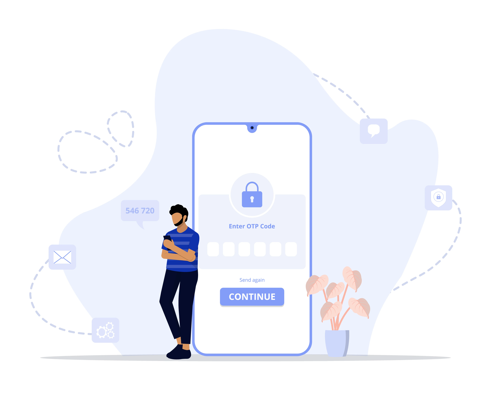
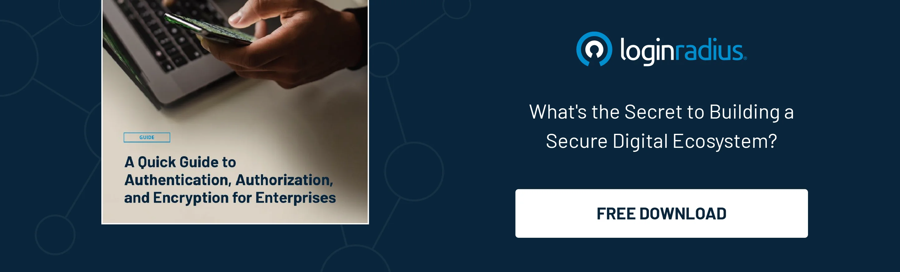

You’ve probably heard these three words tossed around a lot: authentication, authorization, and encryption. They sound pretty technical—maybe even interchangeable—but trust me, they’re not. And if you use the internet (which you clearly do, at least for reading this blog 😀), these concepts touch your life more than you realize.

Whether you’re logging into a website, sending a secure message, or working on a company app, there are security layers working behind the scenes. Let’s take a real-world look at what all of these terminologies mean, how they differ, and why you should care.

## What is Authentication?

[Authentication](https://www.loginradius.com/blog/identity/what-is-authentication/) is the process of confirming that someone (or something) is genuinely who they claim to be. The word comes from the Greek "authentikos," which means real or genuine. 

Okay, let’s start simple. Authentication is just a fancy word for proving you are who you say you are. That’s it. No smoke, no mirrors.

Every time you log into an account, ex: Netflix, you unlock your phone with your fingerprint or enter a six-digit code sent to your device—that’s authentication doing its thing.

The idea is straightforward: before any system lets you in, it needs to know you're legit. And these days, it’s not just about usernames and passwords. You’ve probably noticed apps asking for a fingerprint, a face scan, or that one-time passcode (OTP) sent to your email or phone.

That’s because passwords alone aren’t enough anymore. Hackers are getting creative. We sometimes reuse our passwords, and if the hackers crack them once, they might get access to other accounts as well. 

That’s why [multi-factor authentication (MFA)](https://www.loginradius.com/blog/identity/what-is-multi-factor-authentication/) is becoming the norm these days—it layers security by asking for more than one way to confirm who you are.

In more technical environments, especially when apps talk to each other, things like API authentication and authorization come into play. That’s how systems verify that another system or app has the right to connect and access certain data.

So, in a nutshell? Authentication is the digital version of someone asking for your ID—and checking that it’s not fake.

## What is Authorization?

Now, just because you’ve proven who you are doesn’t mean you get access to everything. That’s where authorization comes in.

Let’s say you log into your workplace dashboard. Congrats—you’re authenticated. But are you allowed to see payroll data? Can you edit customer details? Probably not unless you’re in HR or account management, respectively.

Authorization is all about setting access boundaries. It tells the system what you’re allowed to do once you’re inside. Think of it like a hotel keycard: you may have access to your room and the gym, but not the staff area or other specific places.

What’s really important is this: authentication and authorization are not the same. You can’t authorize someone until you’ve authenticated them. First, the system checks who you are. Then it decides what you’re allowed to do. 

And guess what? One of the biggest security risks companies face isn’t just letting the wrong people in—it’s giving the right people too much access. That’s why authorization rules need to be tight, specific, and constantly reviewed.

Most organizations manage this using mechanisms like [role-based access control (RBAC) ](https://www.loginradius.com/blog/identity/what-is-rbac/)or authorization platforms that let admins set rules and permissions. So, if you’re in marketing, you might be authorized to create a new campaign but not touch financial reports.

Here’s how setting up roles and permissions in the [LoginRadius CIAM](https://accounts.loginradius.com/auth.aspx?return_url=https://console.loginradius.com/login&action=register) looks like:

Look how easily businesses can define and manage user roles and permissions. With just a few clicks, you can control access levels, ensuring admins, customers, and other users only see and do what they’re allowed to. It’s streamlined, secure, and built for scalable identity management.

## What is Encryption?

If authentication and authorization are about who and what, encryption is all about how the data is protected.

Here’s the gist: [encryption](https://www.loginradius.com/blog/engineering/encryption-and-hashing/) takes your data and scrambles it into a secret code. Unless someone has the right key, they can’t read it.

It’s kind of like writing a note in a language only you and a friend understand. Even if someone grabs the note, it’s gibberish to them.

Encryption is working all the time. Ever noticed the little lock icon in your browser when you’re on a secure site? That’s HTTPS, and it means your data is encrypted between your device and the website. Cloud storage platforms? Encrypted. Messaging apps like Signal? Encrypted. Online banking? You better believe it’s encrypted.

There are two main flavors of encryption:

* **Symmetric**, where the same key is used to lock and unlock the data. 

* **Asymmetric**, which uses two keys: a public one to encrypt and a private one to decrypt. 

Most modern apps and services use both, depending on the scenario. And here’s a cool twist: there's something called authenticated encryption, where the system not only encrypts the message but also verifies where it came from. This is used in things like secure APIs, encrypted chats, and VPN connections—where both privacy and trust matter.

So, even if someone intercepts your data without the key, it’s just digital noise.

## How Encryption and Authentication Work Together?

Here’s where it gets interesting. These tools don’t work in silos. They stack, like layers of armor.

Let’s say you’re working remotely and need to connect to a secure work server. First, you go through authentication—maybe your password, plus a biometric check. Once you’re in, any files you download or send are encrypted, so nobody can snoop on them in transit.

It’s a one-two punch: verify the person, then protect the data. You’ve probably heard of “end-to-end encryption.” That’s a real-world example of encryption and authentication teaming up.

When both are done right, even if someone intercepts the communication, it won’t matter because the data’s encrypted, and only verified users can unlock it.

Still need a deeper comparison between authentication, authorization, and encryption? Download this insightful guide: 

## Authentication vs Authorization vs Encryption: How They Really Differ

Let’s be honest—these terms get thrown around like they’re interchangeable. But understanding the difference between authentication and authorization, and how encryption fits in, is crucial.

Here’s a simplified breakdown:

<table>
  <tr>
   <td><strong>Feature</strong>
   </td>
   <td><strong>Authentication</strong>
   </td>
   <td><strong>Authorization</strong>
   </td>
   <td><strong>Encryption</strong>
   </td>
  </tr>
  <tr>
   <td><strong>What it means</strong>
   </td>
   <td>Confirming identity
   </td>
   <td>Granting access based on that identity
   </td>
   <td>Scrambling data so others can't read it
   </td>
  </tr>
  <tr>
   <td><strong>Key question</strong>
   </td>
   <td>“Who are you?”
   </td>
   <td>“What can you do?”
   </td>
   <td>“Is this data protected?”
   </td>
  </tr>
  <tr>
   <td><strong>When it happens</strong>
   </td>
   <td>First
   </td>
   <td>After authentication
   </td>
   <td>Any time data is at rest or in transit
   </td>
  </tr>
  <tr>
   <td><strong>Example</strong>
   </td>
   <td>Logging into Spotify
   </td>
   <td>Accessing premium-only content
   </td>
   <td>Securing your playlist metadata
   </td>
  </tr>
  <tr>
   <td><strong>Used for</strong>
   </td>
   <td>Login, SSO, MFA
   </td>
   <td>Role-based permissions
   </td>
   <td>HTTPS, secure messaging, file storage
   </td>
  </tr>
</table>

All three—authentication, authorization, and encryption—form a triangle of trust. You need identity, permissions, and data protection working together. Leave one out, and you’ve got a hole in your security strategy.

## So, Here’s the Takeaway

* **[Authentication](https://www.loginradius.com/platforms/authentication-and-registration)** is how systems confirm who you are. 

* **[Authorization](https://www.loginradius.com/platforms/authentication-and-federation)** is how they decide what you’re allowed to do. 

* **[Encryption](https://www.loginradius.com/legacy/docs/security/data-management/confidentiality-integrity-and-availability/#dataconfidentiality0)** is how your data stays hidden from the wrong eyes. 

If you think about it, these principles are everywhere. They protect your emails, secure your files, keep your personal info out of the wrong hands, and even safeguard the APIs that power your favorite apps.

Whether you're managing a cloud platform, building a SaaS product, or just want better control over your digital life, understanding these three terms can go a long way. And if you're in cybersecurity, this trio is your toolkit.

We’ve come a long way from passwords and PINs. In today’s zero-trust, cloud-native world, we need authentication encryption, context-aware authorization, and seamless identity management just to keep up.

## FAQs

### 1. What is the difference between authentication and authorization?
**A.** Authentication checks your identity. Authorization checks your permissions. You can’t be authorized without being authenticated first.

### 2. How does authentication work?
**A.** It checks your login credentials (like passwords or fingerprints) against a known system. If they match, you're in. If not, you’re locked out.

### 3. Is OTP authentication or authorization? 
**A.** OTP is used for authentication. It confirms who you are by verifying that you also have access to a trusted device or email.

### 4. Is SSO authentication or authorization? 
**A.** SSO is an authentication method. It lets you log in once and access multiple systems without logging in again. Authorization still controls what you can do once inside.

