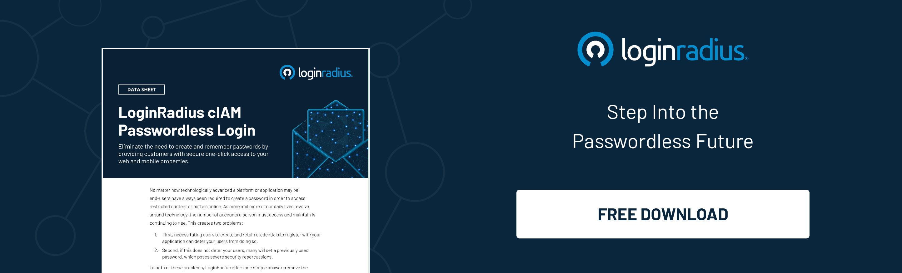
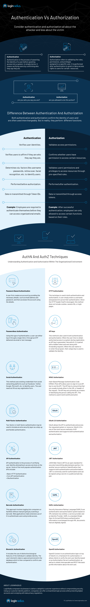

## Introduction

As enterprises advance towards digital maturity in the times of robust cloud-based systems and stringent online security, _authentication_ and _authorization_ are used in conjunction (also, often interchangeably) with each other.

Though both the terms sound similar, they refer to entirely different security processes. Within the scope of [customer identity and access management (CIAM)](https://www.loginradius.com/blog/2019/06/customer-identity-and-access-management/), authentication verifies a user's identity, while authorization validates if the user has access to perform a specific function.

In other words, authentication is identifying users by confirming who they say they are, while authorization is the process of establishing the rights and privileges of a user.

Both processes play equally important roles in securing sensitive data assets from breaches and unauthorized access.

Here, we'll cover how they're defined and what distinguishes one from the other.

## What is Authentication?

Authentication is the process of identifying users and validating who they claim to be. One of the most common and obvious factors to authenticate identity is a password. If the user name matches the password credential, it means the identity is valid, and the system grants access to the user.

Interestingly, with enterprises going passwordless, many use modern authentication techniques like one-time passcodes (OTP) via SMS, or email, [single sign-on (SSO)](https://www.loginradius.com/blog/2019/05/what-is-single-sign-on/), multi-factor authentication (MFA) and biometrics, etc. to authenticate users and deploy security beyond what passwords usually provide.
## Types of Authentication

Authentication is a crucial process that verifies the identity of users accessing a system, website, or application. There are several types of [authentication methods](https://www.loginradius.com/authentication/) employed in today's digital landscape to ensure secure access to sensitive data. The most common ones include:

### Password-based Authentication

This traditional method requires users to provide a unique combination of characters known only to them. While passwords are simple to implement, they are susceptible to security breaches if not managed properly.

### Multi-Factor Authentication 

[MFA enhances security](https://www.loginradius.com/blog/identity/benefits-of-mfa/) by combining two or more authentication factors, such as passwords, biometrics (fingerprint or facial recognition), or one-time codes sent to a user's registered device. This layered approach significantly reduces the risk of unauthorized access.

### Two-Factor Authentication

2FA is a subset of MFA that employs two different authentication factors to verify user identity. Typically, this includes a password and a one-time code generated by a mobile app or sent via SMS.

### Biometric Authentication

This cutting-edge method uses unique biological traits like fingerprints, iris scans, or facial features to validate a user's identity. Biometrics offer a high level of security and convenience, but they may raise privacy concerns.

### Token-based Authentication

Token-based systems use physical or virtual tokens to grant access. These tokens can be hardware devices or software applications that generate temporary codes for authentication.

## Advantages of Authentication 

Effective authentication protocols offer numerous benefits to individuals, organizations, and online platforms, ensuring a secure and seamless user experience.

### Enhanced Security

Authentication prevents unauthorized access and protects sensitive data from falling into the wrong hands, reducing the risk of data breaches and cyberattacks.

### User Trust and Confidence

Implementing robust authentication measures instills confidence in users, assuring them that their personal information is safe, thereby fostering trust in the platform or service.

### Regulatory Compliance

In many industries, adhering to specific [data protection regulations](https://www.loginradius.com/blog/identity/stay-compliant-with-data-privacy-laws-2023/) and standards is mandatory. Proper authentication procedures aid in meeting compliance requirements.

### Reduced Fraud and Identity Theft

By requiring users to verify their identity through authentication, the likelihood of fraudulent activities and identity theft is significantly minimized.

### Customizable Access Control

Different authentication methods can be tailored to suit specific security needs, allowing organizations to grant appropriate levels of access to different user groups.

## What is Authorization?

Authorization happens after a user’s identity has been successfully authenticated. It is about offering full or partial access rights to resources like database, funds, and other critical information to get the job done.

In an organization, for example, after an employee is verified and confirmed via ID and password authentication, the next step would be defining what resources the employee would have access to.

## Types of Authorization

Authorization is a crucial aspect of identity and access management, ensuring that individuals or entities are granted appropriate access to resources and actions within a system. There are several types of authorization mechanisms that organizations implement to control access and protect sensitive information.

### Role-Based Authorization

In this approach, access rights are assigned based on predefined roles or job functions within the organization. Users are grouped into specific roles, and each role is granted a set of permissions that align with the responsibilities of that role. This [simplifies access management](https://www.loginradius.com/user-management/) and reduces administrative overhead, especially in large enterprises.

### Attribute-Based Authorization

This type of authorization evaluates access requests based on specific attributes of the user, such as their department, location, or clearance level. Access is granted or denied depending on whether the user's attributes match the defined criteria for accessing certain resources or performing particular actions.

### Rule-Based Authorization

Rule-based authorization enforces access control based on predefined rules and conditions. These rules specify the circumstances under which access should be granted or denied. Organizations can define complex access policies using rule-based authorization to cater to unique business requirements.

### Mandatory Access Control (MAC)

MAC is a high-security authorization model commonly used in government and military settings. It operates on the principle of strict access controls determined by the system administrator. Access rights are assigned based on labels and categories, ensuring that users can only access information at or below their clearance level.

### Discretionary Access Control (DAC)

In contrast to MAC, DAC allows users to control access to the resources they own. Each resource has an owner who can determine who else can access it and what level of access they have. DAC is commonly used in less secure environments where users have more control over their data.

### Role-Based Access Control (RBAC)

RBAC is a variation of role-based authorization that focuses on managing user access based on roles and their associated permissions. It simplifies access control by allowing administrators to grant or revoke permissions to entire groups of users through the management of roles.

## Advantages of Authorization

Implementing robust authorization mechanisms offers various advantages that strengthen an organization's security posture and overall access management strategies.

### Enhanced Security

Authorization ensures that only authorized users can access specific resources and perform permitted actions. By enforcing proper access controls, organizations can significantly reduce the risk of data breaches, unauthorized access, and other security incidents.

### Granular Access Control

Authorization systems provide the flexibility to grant access on a granular level. This means administrators can define fine-grained access permissions for different users based on their roles, attributes, or other conditions. Granular access control allows for a more tailored and least privilege approach to access management.

### Compliance and Auditing

Many industries have specific compliance requirements regarding data access and protection. Authorization mechanisms help organizations comply with these regulations by monitoring and controlling access to sensitive information. Additionally, audit logs can track user activities, providing valuable data for security investigations and compliance reporting.

### Reduced Human Errors

Implementing a structured authorization system reduces the likelihood of human errors in access control. Automated role-based or rule-based access assignment minimizes the chances of accidental misconfigurations and unauthorized access.

### Scalability and Manageability

As organizations grow, managing access rights can become challenging. Authorization systems, particularly role-based ones, offer [scalable solutions](https://www.loginradius.com/scalability/), making it easier to add or remove users from different roles as the organization's structure evolves.

### User Experience

A well-designed authorization system ensures that users can access the resources they need without unnecessary barriers. By providing a seamless and efficient user experience, employees can focus on their tasks without being impeded by access restrictions.

## Authentication vs Authorization: Understanding the Techniques

When we talk about the difference between authentication and authorization, C IAM administrators should understand the core of utilizing both authentication and authorization, and how one differentiates from the other.

For example, an organization will allow all its employees to access their workplace systems (that’s authentication!). But then, not everyone will have the right to access its gated data (that’s authorization!).

[Implementing authentication](https://www.loginradius.com/authentication/) with the right authorization techniques can protect organizations, while streamlined access will enable its workforce to be more productive.

Here is the common authentication vs authorization techniques used by CIAM solutions to help you better understand the difference between authentication and authorization. However note that technologies like JWT, SAML, OpenID Authorization, and OAuth are used in both authentication and authorization.

### **Popular authentication techniques** 

- **Password-based authentication** is a simple [method of authentication](https://www.loginradius.com/blog/2019/06/what-is-multi-factor-authentication/) that requires a password to verify the user's identity. 
- **Passwordless authentication** is [where a user is verified](https://www.loginradius.com/blog/2019/10/passwordless-authentication-the-future-of-identity-and-security/) through OTP or a magic link delivered to the registered email or phone number.

- **2FA/MFA** requires [more than one security level](https://www.loginradius.com/blog/2019/06/what-is-multi-factor-authentication/), like an additional PIN or security question, to identify a user and grant access to a system. 
- **Single sign-on** (SSO) allows users to access multiple applications with a single set of credentials. 
- **Social authentication** verifies and [authenticates users](https://www.loginradius.com/social-login/) with existing credentials from social networking platforms.

### **Popular authorization techniques** 

- **Role-based access controls** (RBAC) can be implemented for system-to-system and user-to-system privilege management.
- **JSON web token** (JWT) is an open standard for securely transmitting data between parties, and users are authorized using a public/private key pair.
- **SAML** is a standard Single Sign-On format (SSO) where authentication information is exchanged through XML documents that are digitally signed.
- **OpenID authorization** verifies user identity based on an authorization server's authentication.
- **OAuth** allows the API to authenticate and access the requested system or resource.

To learn more about the authentication vs authorization - concept, differences, and techniques, check out the infographic created by LoginRadius.

## Implementing Identity and Access Management with LoginRadius 

Centralized identity and access management solutions can play a major role in delivering robust authentication and authorization for users within the organizational framework. 

A cloud-based CIAM solution like LoginRadius verifies authoritative user identities and automates privileges and rights based on [pre-defined roles](https://www.loginradius.com/role-management/). 

What more? Not having to manually define permissions saves time, reduces backlogs, and ensure hassle-free user experience.

Furthermore, with LoginRadius, opportunities to streamline CIAM are endless. That also includes securing access to privileged resources and safeguarding IT infrastructure from [cyber attacks](https://www.loginradius.com/blog/2019/10/cybersecurity-attacks-business/).

## Frequently Asked Questions (FAQs)

**1.  What are some real-world examples of authentication and authorization in use?**

Logging into a social media account using a username/password (authentication) and setting privacy controls for posts (authorization).

**2. How do authentication and authorization improve overall security?**

Authentication ensures only legitimate users access resources, while authorization restricts their actions, reducing potential threats from unauthorized users.

**3. How can businesses determine which solution is best for their needs?**

Businesses should assess their security requirements, user base, and budget to choose between various authentication methods (e.g., password-based, multi-factor, biometrics).

**4. What are some common authentication and authorization technologies in use today?**

Common authentication technologies include OTPs, fingerprint recognition, and smart cards. For authorization, role-based access control (RBAC) and OAuth are prevalent.

**5.  How can authentication and authorization help with compliance requirements?**

Properly implemented authentication and authorization processes can ensure data privacy and access controls, aiding businesses in meeting compliance regulations like GDPR or HIPAA.

**6.  What is the future of authentication and authorization?**

The future likely involves more advanced biometrics, continuous authentication, and AI-driven security measures to combat evolving cyber threats and enhance user experience. 

