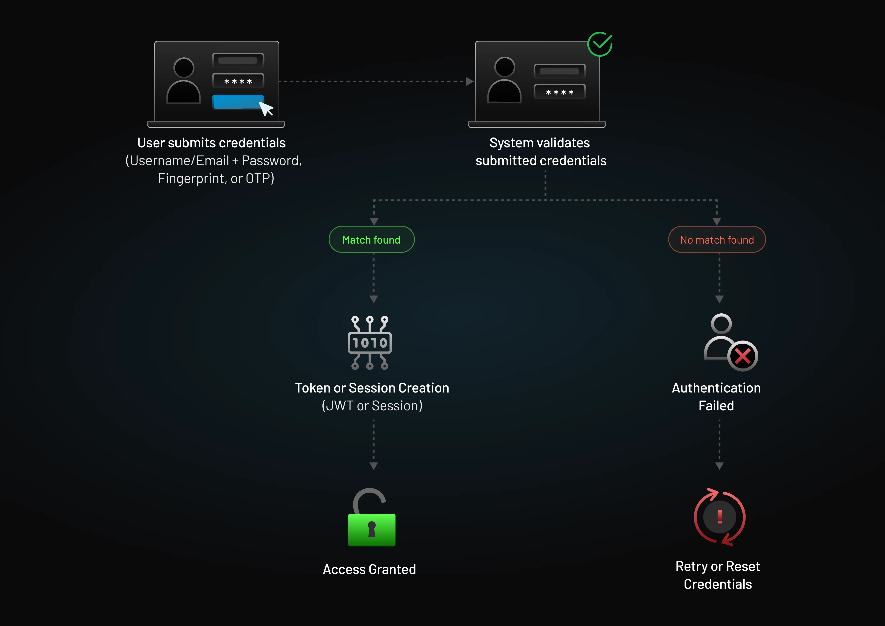
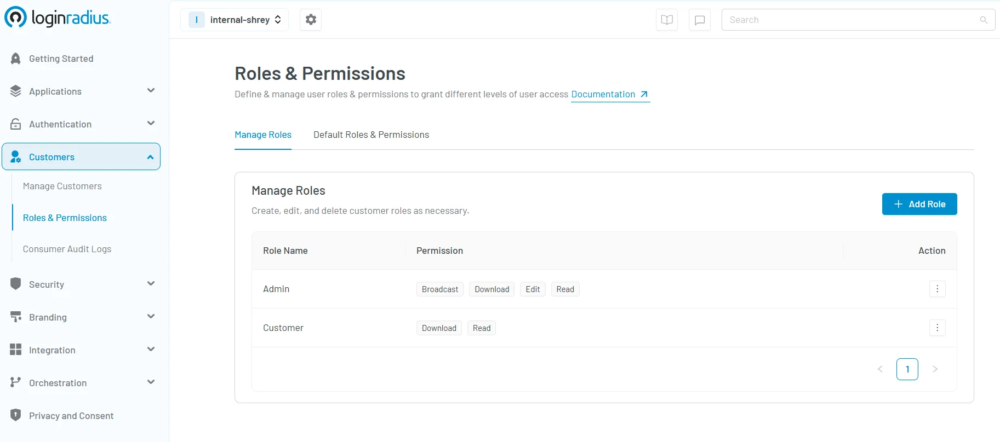
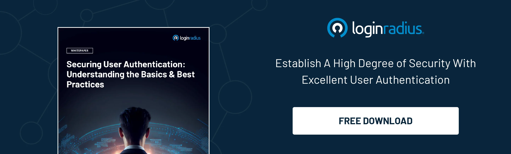

## Introduction

In a world where cyber threats like data breaches and identity theft are making headlines almost daily, securing digital systems isn’t just important — it’s essential. That’s where two commonly confused terms come in: authentication and authorization. You’ve probably heard them used together (or even interchangeably), but they serve very different purposes.

Whether you're building secure apps, managing access for a team, or simply curious about how systems stay protected, understanding the difference between authentication and authorization is key.

In this blog, we’ll unpack both concepts with relatable examples and clear insights — so you can confidently grasp how each one keeps your data and users safe.

## What is Authentication? 

[Authentication ](https://www.loginradius.com/blog/identity/what-is-authentication/)is the process of verifying who a user is. It answers the question: Are you really who you say you are?

For authentication, users typically provide credentials — such as a username and password, biometric data, or a one-time code — to prove their identity. It acts like a digital passport that validates a person before letting them into a system.

Imagine you walk into a secured office building. At the entrance, a security guard checks your ID. If it matches the employee database, you’re allowed in. That’s authentication. 

In technical aspects, imagine a user logs into an online banking app with a password and receives a 2FA code on their phone. Only after both credentials are verified is the user granted access. This is a prime example of authentication in cyber security.

## What is the Purpose of Authentication?

The core goal of authentication is to ensure that only verified users can access a system. It prevents impersonation, data theft, and breaches by validating user identities before granting entry.

In today’s digital landscape, where everything from cloud apps to enterprise databases is remotely accessible, robust authentication methods — like biometrics, OTPs, and social logins — are critical for security.

Authentication lays the foundation. Without it, systems wouldn’t know *who* they are dealing with — making any additional security effort meaningless.

## What is Authorization?

Authorization, on the other hand, determines *what* an authenticated user is allowed to do. It answers: *Do you have permission to access this resource or perform this action?*

If authentication is the security guard verifying your ID, authorization is the list showing what rooms or data you're allowed to access.

In simple terms, authorization in cybersecurity is about assigning privileges and access levels to different users based on their role, location, or behavior.

## Common Types of Authorization

There are various ways to authorize users, depending on the system’s needs. Here are some of the most common:

### 1. Role-Based Access Control (RBAC):

In role-based access control, users are granted permissions based on roles (admin, editor, viewer). For example, in the [LoginRadius console](https://accounts.loginradius.com/auth.aspx?return_url=https://console.loginradius.com/login&action=register) below, the “Admin” has permission to broadcast, download, edit, and read. On the other hand, the “Customer” is only authorized to download and read. 

Explore how [Role-Based Access Control (RBAC)](https://www.loginradius.com/blog/identity/what-is-rbac/) simplifies permissions and strengthens security. 
In a nutshell, RBAC simplifies access management by assigning permissions based on user roles, such as admin, editor, or viewer, rather than handling access at the individual level.

In a B2C context, this often means differentiating capabilities between everyday users and internal staff. For instance, a streaming platform might allow viewers to consume content, while admins manage uploads and settings.

In B2B scenarios, this concept scales to entire organizations. For example, a retail company which collaborates with suppliers, franchisees, and distributors, requires precise control over who can access what across partner ecosystems. 

Our Partner IAM feature enables role-based permissions at the organization level, such as Partner Admin or Franchise Manager with access defined down to specific resources or workflows.

Discover how LoginRadius Partner IAM enables precise, organization-level [RBAC tailored for complex B2B environments](https://www.loginradius.com/docs/user-management/roles-and-permissions/).

### 2. Attribute-Based Access Control (ABAC)

Attribute-based access ensures that access is granted based on a combination of user attributes such as department, role, location, time of day, or device type. 

For example, an employee from the finance department can access payroll data only during working hours and only when using a company-issued device—ensuring granular and context-aware security controls.

You can read our [RBAC vs ABAC guide](https://www.loginradius.com/blog/identity/rbac-vs-abac/)for a detailed comparison between RBAC and ABAC to ensure you make the right decision that meets your business requirements.

### 3. JSON Web Token (JWT) Authorization

JWT (JSON Web Token) authorization is a widely used method for securely transmitting user data between parties—particularly in modern web applications and services. It's especially popular in systems that use stateless authentication, such as RESTful APIs. For instance, after a user logs in, the server issues a JWT that the client includes in subsequent requests to authenticate without needing to re-enter credentials.

If you’d like to dive deeper into how JWTs work and when to use them, check out our full guide on [JWT authorization best practices](https://www.loginradius.com/blog/engineering/guest-post/jwt-authentication-best-practices-and-when-to-use/).

### 4. OAuth 2.0 

OAuth 2.0 is a widely adopted protocol for delegating access without exposing user credentials. For example, when you log into Spotify using your Google account, Google handles the authentication, and Spotify receives limited, authorized access to your basic profile—without ever seeing your Google password. This secure delegation is ideal for third-party integrations and API-based systems.

To understand how OAuth 2.0 works, its core flows, and when to use it, check out our in-depth breakdown on[ OAuth 2.0 and its role in modern identity management.](https://www.loginradius.com/blog/engineering/what-is-oauth2-0/)

The aforementioned types show the depth of authorization in cybersecurity, shaping how users interact with systems securely.

## Authentication vs Authorization

To put it plainly, authentication and authorization are two sides of the same coin — often paired but serving different purposes.

* *Authentication*: Confirms your identity. 

* *Authorization*: Grants or denies permissions based on that identity.

Let’s go back to the real world: You check into a hotel (authentication), but your key card only grants you access to your room and the gym — not the penthouse suite (authorization).

### Key Differences Between Authentication and Authorization

<table>
  <tr>
   <td><strong>Feature</strong>
   </td>
   <td><strong>Authentication</strong>
   </td>
   <td><strong>Authorization</strong>
   </td>
  </tr>
  <tr>
   <td><strong>Definition</strong>
   </td>
   <td>Verifies identity
   </td>
   <td>Determines access rights
   </td>
  </tr>
  <tr>
   <td><strong>Function</strong>
   </td>
   <td>"Who are you?"
   </td>
   <td>"What are you allowed to do?"
   </td>
  </tr>
  <tr>
   <td><strong>Process</strong>
   </td>
   <td>Done before authorization
   </td>
   <td>Done after authentication
   </td>
  </tr>
  <tr>
   <td><strong>Data</strong>
   </td>
   <td>Requires login credentials
   </td>
   <td>Requires permission policies
   </td>
  </tr>
  <tr>
   <td><strong>Visibility to user</strong>
   </td>
   <td>Visible (e.g., login form)
   </td>
   <td>Often invisible to the user
   </td>
  </tr>
  <tr>
   <td><strong>Use case</strong>
   </td>
   <td>Login portals, biometric scans
   </td>
   <td>Accessing internal dashboards or APIs
   </td>
  </tr>
</table>

This comparison helps answer the question: How is authentication different from authorization? If you need a more detailed comparison, [read this insightful blog](https://www.loginradius.com/blog/identity/authentication-vs-authorization-infographic/). 

## Authentication vs Authorization: Factors & Permissions

When we take a closer look at auth vs authorization, it's evident that both processes serve different purposes and rely on separate sets of criteria to function effectively. Understanding these underlying components helps demystify how modern systems maintain security without compromising user experience.

Authentication is all about identity verification — confirming that a user is who they claim to be. This is typically done through one or more of the following factors:

* **Something you know** – such as a password, PIN, or secret answer to a security question. 

* **Something you have** – like a hardware token, mobile authenticator app, or a smart card. 

* **Something you are** – biometric data such as fingerprints, facial recognition, or iris scans. 

These layers form the foundation of secure access. For example, logging into your online banking account may require both your password (*something you know*) and a fingerprint scan (*something you are*), especially when sensitive transactions are involved.

Authorization, on the other hand, determines what that authenticated user is allowed to do once access has been granted. It sets boundaries and defines permissions based on rules, roles, or policies. Common types of access include:

* **Read-only access** – allowing users to view content without making changes, such as viewing reports or dashboards. 

* **Edit or write access** – enabling users to create, update, or delete content, like editing a document in a CMS. 

* **Administrative access** – providing full control over a system or platform, including managing users, permissions, and settings. 

Both authentication and authorization are vital to protecting sensitive data and ensuring users only have access to the resources they genuinely need.

## Which Comes First, Authentication or Authorization?

Authentication always comes before authorization. This sequence is non-negotiable in cybersecurity and access control. Why? Because a system must first verify who the user is before it can determine what the user is allowed to do.

Think of it as meeting someone at your front door. You wouldn’t ask them which rooms they’d like to enter before confirming they’re a trusted friend or family member. Similarly, in digital systems, authentication validates identity, and only then can authorization define access levels.

Here’s a breakdown to illustrate this better:

### Step 1 – Authentication:

The system checks the user’s credentials — such as a username and password, fingerprint, or OTP — to confirm their identity. During this step, encryption protocols like TLS are typically used to protect credential data as it travels between the client and server, ensuring it can’t be intercepted or tampered with.

### Step 2 – Authorization:

Once the identity is verified, the system evaluates what resources that identity has permission to access — like read-only access to a report, admin rights on a dashboard, or restricted areas in a company portal.

### Step 3 – Encryption in Action:

While encryption supports both steps, it becomes even more critical once access is granted. Sensitive data that the authorized user accesses—whether in transit or at rest—should be encrypted to maintain confidentiality and integrity throughout the session.

Skipping authentication and jumping straight to authorization would be like giving someone the keys to your office without knowing if they even work there. It's not just risky — it's a security failure waiting to happen.

This foundational flow—authentication first, followed by authorization, and supported by encryption throughout—ensures your digital ecosystem remains secure and logically controlled. 

Learn more in our guide on[ Authentication, Authorization, and Encryption](https://www.loginradius.com/blog/identity/authentication-authorization-encryption/).

## Conclusion

In cybersecurity and identity management, knowing the difference between authorization and authentication is foundational. While they’re often mentioned together, they perform distinct — and equally vital — roles in protecting systems. 

Whether you’re building a secure app, managing employee access, or integrating APIs, always start with authentication and then apply authorization based on roles, policies, or attributes.

By mastering both, you’ll reduce vulnerabilities, improve user experience, and align with best practices in authentication and authorization. 

Need help implementing secure authentication and authorization for your applications? [Contact LoginRadius](https://www.loginradius.com/contact-us) to get expert guidance today.

## FAQs

### 1. Can a person be authenticated and still not authorized?

**A.** Yes. Being authenticated simply proves identity. A user might log in (authenticated) but lack the right permissions (not authorized) to access certain features or data.

### 2. What are the different types of authentication?

**A.** Common types include:

* Password-based authentication 

* Biometric (fingerprint, facial recognition) 

* Multi-factor authentication (MFA) 

* Token-based (e.g., JWT) 

* Social login (OAuth) 

These are essential for **authentication in cyber security**.

### 3. How is authentication different from authorization?

**A.** Authentication checks identity; authorization checks access rights. It’s the classic **authorize vs authenticate** debate — where both are needed, but for different reasons.

### 4. What is authorization testing?

**A.** Authorization testing ensures users can only access what they are permitted to. It checks for access control vulnerabilities and misconfigurations — key in **authorization in cybersecurity**.

### 5. How does authentication work?

**A.** Authentication works by matching provided credentials against stored user data. If the credentials match, access is granted. Methods include passwords, biometric scans, OTPs, and digital certificates.

