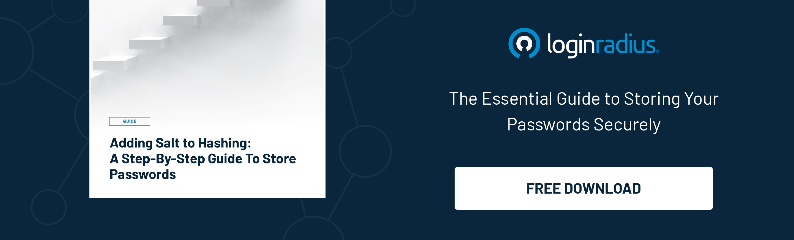

## Introduction

Online security is paramount, especially when cybercriminals target users by finding loopholes in the authentication mechanism. With the increasing number of cyber threats, it's crucial to know the common authentication vulnerabilities that can compromise your customers’ online identity. 

Hence, if you’re catering to your customers online and using conventional authentication mechanisms, you must stay vigilant regarding many authentication vulnerabilities. 

In this blog, we’ll explore some prevalent authentication vulnerabilities and provide insights on how to avoid them. Understanding these issues, you can better protect your business, customers, and online assets from cyberattacks.

### Understanding Authentication Vulnerabilities: How They Emerge and Pose Threats

Authentication vulnerabilities in cybersecurity refer to weaknesses and flaws in the processes and mechanisms used to verify the identity of users or systems. These vulnerabilities can emerge for various reasons, often rooted in technology, human behavior, or both.

One primary factor contributing to authentication vulnerabilities is the rapid advancement of technology. As new software, protocols, and authentication methods are developed, cybercriminals continually seek to exploit potential loopholes in these systems. 

Outdated or improperly configured authentication protocols become easy targets, allowing attackers to gain unauthorized access.

Human behavior also plays a significant role in the emergence of authentication vulnerabilities. Users often choose convenience over security, opting for weak passwords or reusing them across multiple platforms. 

[Phishing attacks](https://www.loginradius.com/blog/identity/phishing-for-identity/), where unsuspecting individuals are tricked into revealing their credentials, exploit human trust and naivety. Additionally, a lack of awareness about secure authentication practices can lead to poor choices, making it easier for hackers to compromise accounts.

Furthermore, the interconnected nature of digital platforms and services amplifies the impact of authentication vulnerabilities. A breach in one system can have a domino effect, compromising multiple accounts and sensitive data. Cybercriminals exploit these interconnections to launch attacks such as credential stuffing, where stolen credentials from one service are used to infiltrate other accounts, taking advantage of the commonality in user behavior.

### #1. Phishing Attacks

Phishing attacks involve tricking users into divulging their sensitive information by posing as a trustworthy entity. Be cautious of unsolicited emails or messages requesting your login credentials. Always verify the sender's authenticity before clicking links or providing personal information.

### #2. Credential Stuffing

Credential stuffing occurs when cybercriminals use stolen usernames and passwords from one platform to access multiple accounts on various websites. To avoid falling victim to this vulnerability, refrain from using the same login credentials across different platforms. Consider using a password manager to generate and store unique passwords for each account.

### #3. Weak Passwords

One of the most common authentication vulnerabilities is weak passwords. Many users still opt for easily guessable passwords, such as "123456" or "password." Creating strong, unique passwords for each account is essential to mitigate this risk. Hence, businesses must encourage their customers to use strong passwords. Also, companies should consider relying on secure password storage mechanisms to ensure the highest level of security. 

### #4. Insecure Authentication Protocols

Outdated or insecure authentication protocols can leave your online accounts vulnerable. Always use secure and up-to-date authentication methods, such as OAuth 2.0 or OpenID Connect, to protect your information from potential breaches.

### #5. Brute Force Attacks

[Brute force attacks](https://www.loginradius.com/blog/identity/brute-force-lockout/#:~:text=Brute%20Force%20is%20a%20hacking,vulnerability%20in%20the%20web%20application.) involve systematically trying all possible combinations of passwords until the correct one is found. To safeguard against this, implement account lockout policies and CAPTCHA challenges after a certain number of failed login attempts. Additionally, use multi-factor authentication (MFA) to add an extra layer of security.

### #6. Session Hijacking

Session hijacking, or session stealing, occurs when an attacker intercepts and steals a user's session identifier. To prevent this, websites should implement secure communication channels, such as HTTPS, and use secure, randomly generated session tokens that are not easily predictable.

### #7. Lack of Multi-Factor Authentication (MFA)

The lack of MFA is a significant vulnerability that many users overlook. MFA adds an extra layer of security by requiring users to provide multiple verification forms before gaining access to their accounts. By enabling MFA, you significantly enhance your account's protection against unauthorized access.

### How LoginRadius MFA Helps Overcome Challenges of Authentication Vulnerabilities

[LoginRadius MFA](https://www.loginradius.com/multi-factor-authentication/) is a robust authentication mechanism that helps businesses and individuals overcome the challenges of authentication vulnerabilities. By integrating LoginRadius MFA into your authentication process, you can ensure that even if attackers obtain your password, they cannot access your account without the additional verification step.

LoginRadius MFA offers various authentication methods, such as SMS codes, email verification, biometric authentication, and authenticator apps, allowing users to choose the best way for their preferences and security needs. By implementing LoginRadius MFA, you can fortify your online security, protect sensitive data, and enhance user trust.

### To Conclude 

Neglecting authentication vulnerabilities could lead to financial and reputational damages since there are high chances of customer data exploitation by cybercriminals. 

Staying vigilant and proactive in addressing these common authentication vulnerabilities is key to safeguarding your online presence. 

By adopting secure practices, using strong and unique passwords, and integrating multi-factor authentication solutions like LoginRadius MFA, you can significantly reduce the risk of falling victim to cyber threats and enjoy a safer online experience.

