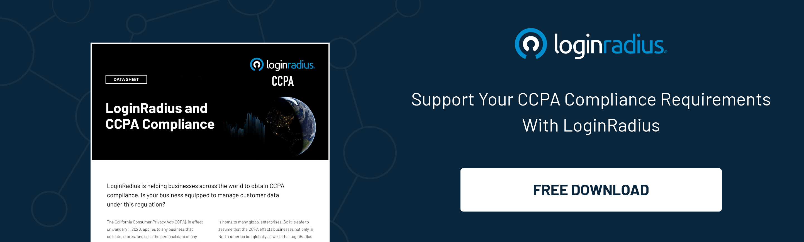

Software-as-a-service (SaaS) has become the predominant model for business software delivery. According to the latest roundup by Synergy Research Group, spending on enterprise SaaS applications was [$270 billion](https://www.srgresearch.com/articles/cloud-market-gets-its-mojo-back-q4-increase-in-cloud-spending-reaches-new-highs) by 2023 and is estimated to reach [the $500 billion](https://www.srgresearch.com/articles/cloud-market-gets-its-mojo-back-q4-increase-in-cloud-spending-reaches-new-highs) mark soon. 

Securing these applications has become paramount with the exponential growth in the adoption of **B2B SaaS** apps by businesses. Data breaches can result in loss of sensitive customer and financial data, privacy violations, compliance issues, and loss of reputation and revenue.

Let's discuss the top five security challenges faced by **B2B SaaS providers** and how identity and access management solutions can help mitigate these risks effectively.

## Top Five B2B SaaS Security Risks

As cloud-based software-as-a-service (SaaS) solutions gain widespread adoption among businesses, new security challenges emerge. SaaS providers handling sensitive customer data face an expanded attack surface and greater compliance burdens. To help SaaS companies stay secure, we outline the top 5 **B2B SaaS** security risks to know [why B2B companies should implement identity management](https://www.loginradius.com/blog/engineering/identity-management-for-b2b-companies/):

### 1. Data Breaches

The risk of attack threats expands with more users, devices, and access points in B2B SaaS apps. Phishing, malware, compromise of credentials, and misconfigurations are some common attack vectors exploited by hackers to steal data. Breaches that expose sensitive customer data can damage trust, prompt legal issues, and severely impact revenue and reputation.

### 2. Account Takeovers

Compromise of user credentials is one of the simplest ways for an attacker to gain access to SaaS applications. Tactics like phishing, password stuffing, and password sprays are commonly used to steal user credentials. 

With valid user accounts, hackers can exploit access rights and hide under the radar to move laterally within the network to access sensitive systems and data.

### 3. Insufficient Identity Governance

Lack of visibility and control over user access is another major security gap in B2B SaaS environments. Some common identity governance issues faced by SaaS providers include:

* Orphan, stale, and unused user accounts
* Excess or unnecessary entitlements granted to users
* Role misconfigurations providing over-privileged access
* Lack of processes for access reviews and certification

### 4. Insecure API Access

SaaS applications provide APIs for integration with other cloud services and on-premises software. Lack of authentication and authorization controls for API access enables hackers to extract data, manipulate transactions, and access backend cloud infrastructure.

### 5. Compliance Risks

Depending on the industry, companies have to comply with regulations like HIPAA, PCI DSS, GDPR, CCPA, etc. Non-compliance can lead to fines and reputational damage. Weak identity and access controls conflict with compliance mandates around data security, privacy, and user access governance. It leads to increased audit scrutiny and financial risk.

## Identity and Access Management - Solution to B2B SaaS Security Challenges

Identity is the new security boundary for B2B SaaS environments. An [identity and access management (IAM) system](https://www.loginradius.com/b2b-identity/) provides capabilities to manage user identities, authenticate access, authorize what users can do, provision appropriate access rights, and govern and audit all identity and access activity.

Here is how a comprehensive IAM solution helps strengthen **B2B SaaS** application security:

### 1. Mitigate Data Breaches

A robust identity and access management solution provides multiple layers of protection to prevent data breaches. By securing access points and monitoring usage patterns, potential data breach threats can be prevented.

* Multi-factor authentication prevents the compromise of stolen credentials by requiring an additional factor like biometrics or one-time passwords to allow access.
* Adaptive authentication detects suspicious login attempts by triggering step-up authentication based on IP address, geo-location, and other contextual signals.
* Behavioral analytics spots unusual activity indicative of a breach by analyzing usage patterns to flag deviations from normal behavior.
* Access controls minimize insider threats by restricting data access on a need-to-know basis and granting the least privilege permissions.

### 2. Prevent Account Takeovers

Account takeovers typically result from compromised user credentials. An identity management system strengthens authentication protections and detects credential attacks.

* Password policies enforce strong credentials by imposing complexity rules and mandatory rotation.
* Password hash synchronization eliminates plain-text passwords by only transmitting encrypted passwords between systems.
* Anomaly detection identifies unusual patterns and password spray attacks by tracking failed login patterns.
* Automated identity verification validates user identity by prompting multi-factor authentication to confirm suspicious logins.

### 3. Enforce Identity Governance

Lack of visibility into user access permissions leads to [identity governance](https://www.loginradius.com/blog/identity/identity-governance-cloud-security-compliance/) challenges. Automating identity administration and reviews enhances governance.

* Automate user provisioning and deprovisioning lifecycles to manage joiners, movers, and leavers in a timely manner.
* Role-based access control ties rights to roles to align privileges with business needs.
* Access reviews detect excessive permissions by providing tools for owners to certify role assignments.
* Access certification ensures privileges align with job functions through periodic campaign-based reviews.

### 4. Control API Access

Exposed APIs enable data access by apps and partners. Securing these integration points prevents data exploitation.

* Standards-based authentication (OAuth2, OIDC, SAML) secures API access by implementing token-based authentication.
* Fine-grained authorization assesses context to approve API calls to prevent abuse.
* API security gateway centralizes API access policies by enforcing controls at a single choke point.

### 5. Achieve Compliance

Non-compliance with data protection regulations results in significant financial penalties and reputation damage.

* Access transparency provides detailed audit trails to demonstrate regulatory compliance.
* Automated access reviews simplify compliance audits by providing instant reports on user entitlements.
* Granular [consent](https://www.loginradius.com/consent-preference-management/) captures user permissions and preferences as an audit record for privacy regulations.
* Data residency and encryption meet regional compliance directives by allowing data to remain within geographic boundaries.

## How to Choose a Robust IAM Solution for B2B SaaS?

Here are key considerations when evaluating identity and access management systems for securing **B2B SaaS** environments:

* **Comprehensive Identity Lifecycle Management:** The solution should fully automate identity processes like self-service signup, profile updates, workflow approvals, and account cleanup. Built-in connectivity with user stores and HR systems is vital for lifecycle automation.

* **Enterprise-grade Access Management:** Sophisticated policy engines, context-based access controls, and standards-based SSO/federation capabilities are required to simplify and strengthen access management.

* **Advanced Security Controls:** [MFA (Multi-factor authentication)](https://www.loginradius.com/blog/identity/benefits-of-mfa/), adaptive auth, password management, data encryption, DDoS prevention, and other controls are essential for countering advanced threats.

* **Multi-Tenant Architecture:** The system should natively support multi-tenancy to isolate identities, data, and customizations for individual tenants. Shared services help drive economies of scale.

* **Compliance Support:** Pre-built controls, reports, and frameworks to comply with regulations like GDPR, ISO27001, HIPAA, etc., can accelerate compliance.

* **Analytics and Reporting:** Robust reporting and analytics around access, rіsks, and entitlements are crucial for ensuring governance and generating audit evidence.

* **Developer-Friendly APIs:** Rich APIs and SDKs help embed IAM security controls directly into custom apps during development, leading to more security by design.

* **Cloud Scalability:** As B2B SaaS users and workloads grow exponentially, the IAM infrastructure must auto-scale limitlessly while maintaining performance and uptime.

## The Bottom Line

Identity management is essential for securing **B2B SaaS** environments. As software and data shift increasingly to the cloud, businesses must prioritize protecting access to these web-based applications.

Robust identity and access management (IAM) solutions provide businesses with the capabilities required for SaaS security in 2024, including stronger authentication, fine-grained access controls, governance guardrails, and risk analytics. An enterprise-grade IAM platform tailored for cloud applications can help **B2B SaaS** companies enhance security, achieve compliance, improve customer experiences, and increase business agility.

By investing in [LoginRadius](https://www.loginradius.com/) cloud-native Identity-as-a-Service platform, SaaS companies can future-proof security while also enabling great customer experiences. Schedule a demo and discuss a risk-free pilot project for your **B2B SaaS** identity needs. 

