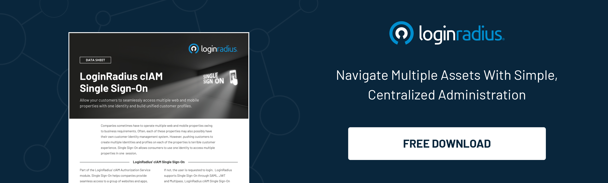

In the ever-evolving landscape of B2B SaaS, the significance of SSO login cannot be overstated. As we enter 2024, enterprises find themselves at the crossroads of technological advancements and security imperatives. 

Let’s unravel the complexities surrounding B2B SaaS Single Sign-On, shedding light on the key considerations that enterprises are contemplating in the coming year.

## Understanding B2B SaaS Single Sign-On:

Single Sign-On is the linchpin in ensuring seamless and secure access to multiple applications within an enterprise ecosystem. 

SSO is an essential feature of an Identity and Access Management (IAM) platform for controlling access. Verification of user identity is important when it comes to knowing which permissions a user will have. 

The [LoginRadius Identity platform](https://www.loginradius.com/single-sign-on/) is one example of managing access that combines user identity management solutions with SSO solutions.

B2B SaaS platforms, in particular, demand a sophisticated approach to authentication and authorization. In 2024, businesses are not just looking for a convenient login process but are also emphasizing the need for enhanced security and user experience. Let’s understand in detail. 

## Challenges and Solutions in B2B SaaS Single Sign-On

While the advantages of implementing SSO Login are evident, enterprises are not immune to challenges. This blog will dissect common hurdles businesses face while deploying and managing SSO solutions. 

From issues related to identity federation to the complexities of maintaining a balance between security and usability, we'll explore how enterprises proactively address these challenges. Moreover, the blog will shed light on innovative solutions and best practices that are emerging in the B2B SaaS sector to overcome these hurdles, offering readers practical insights for a smoother SSO implementation.

## Emerging Trends in B2B SaaS Single Sign-On for 2024

The fast-paced nature of the tech industry ensures that new trends and innovations are constantly on the horizon. In this section, we'll uncover the emerging B2B SaaS Single Sign-On trends that enterprises are eyeing for 2024 and beyond. 

Whether it's the integration of biometric authentication, the rise of adaptive authentication models, or the exploration of Zero Trust Security frameworks, enterprises are exploring cutting-edge solutions to stay ahead of the curve. 

By understanding these emerging trends, businesses can position themselves strategically and harness the full potential of B2B SaaS Single Sign-On in the coming year.

## Key Considerations for Enterprises

### Security in the Spotlight

With cyber threats growing in sophistication, enterprises prioritize[ security in their SSO ](https://www.loginradius.com/blog/identity/benefits-single-sign-on-sso/)strategies. The blog will delve into the latest security measures and protocols enterprises adopt to safeguard sensitive data and ensure a robust defense against cyber threats.

### User Experience Matters

A seamless and user-friendly experience is no longer a nice-to-have but a necessity. Explore how enterprises align their SSO login solutions with user-centric design principles to enhance productivity and user satisfaction.

### Integration Challenges and Solutions

B2B SaaS ecosystems are diverse, and integrating various applications can pose challenges. Uncover the integration solutions enterprises are considering to streamline their SSO processes and create a cohesive digital environment.

### Compliance and Regulatory Landscape

As data protection regulations continue to evolve globally, enterprises are navigating a complex web of compliance requirements. Discover how businesses ensure their [SSO implementations align with the latest regulatory standards.](https://www.loginradius.com/blog/identity/legal-implications-of-sso/)

### Scalability and Future-Readiness

The technology landscape is dynamic, and scalability is a key concern for enterprises. Explore the strategies and technologies businesses adopt to future-proof their B2B SaaS Single Sign-On solutions.

### Vendor Selection and Evaluation

The blog will provide insights into the criteria enterprises are using to [evaluate and select SSO vendors](https://www.loginradius.com/blog/identity/best-sso-providers-loginradius/). Businesses are meticulous in their vendor selection process, from reputation to performance metrics.

## Conclusion

As we step into 2024, the landscape of B2B SSO login is marked by innovation, security imperatives, and a relentless pursuit of optimal user experiences. The aspects mentioned above offer enterprises the knowledge and insights needed to make informed decisions and stay ahead in the dynamic realm of B2B SaaS. 

Stay tuned for a comprehensive exploration of the considerations shaping the future of Single Sign-On in the enterprise space.

