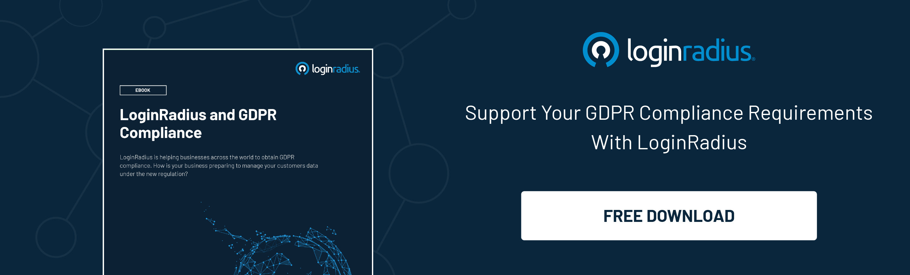

Adding stringent layers of security becomes a tough nut to crack in a digital world where consumers are always on a hunt for a personalized and flawless user experience.

But that doesn’t mean that security can be compromised to deliver a rich user experience on a web application or a website.

As per stats,[ 69% of internet users](https://www.statista.com/statistics/1172265/biggest-cloud-security-concerns-in-2020/) are concerned about data loss/leakage and 66% are worried about their data privacy and confidentiality.

On the other hand,[ 67% of consumers mentioned bad experiences](https://www.huffpost.com/entry/50-important-customer-exp_b_8295772?ec_carp=6823990201176436044) as a big reason for churn, but only a few of them complain. Many people think that adding a robust layer of security would certainly hamper consumer experience and negatively impact the overall consumer onboarding journey.

So, what’s the trick that helps market leaders stay ahead of the curve? How do they secure consumer data without affecting the consumer experience?

Well, the key lies in creating a perfect harmony of security and user experience through a [CIAM (Consumer Identity and Access Management)](https://www.loginradius.com/blog/identity/customer-identity-and-access-management/) solution that helps scaling business growth.

Let’s dig deeper into this and understand why a CIAM solution is becoming the need of the hour in the ever-expanding competitive digital world.

## Why Consumer Experience Matter Now More than Ever Before

Since the internet is becoming the second home for every individual globally, especially amid the global pandemic, creating and maintaining a great user experience is crucial.

We’ve already seen the paradigm shift from traditional shopping to online purchases, cinemas being replaced by OTT platforms, and almost everything is being made available with just a few clicks.

This means the ones that weren’t leveraging the true potential of online services are now geared up and offering online services as a part of their digital transformation.

Moreover, this trend indicates that enterprises that haven’t yet focused on user experience would surely end up compromising their potential clients to their competitors.

Undoubtedly, keeping pace with the growing competition demands that enterprises should focus more on delivering personalized experiences right from the beginning to enhance conversions and increase signups.

However, leaders are also well aware that even a minor sneak into their network that affects consumer data could be fatal for their brand image.

Let’s understand why security shouldn’t be ignored when focusing on user experience.

**Also Read**: [Customer Identity – The Core of Digital Transformation](https://www.loginradius.com/resource/customer-identity-the-core-of-digital-transformation/)

## Why Security Matters for Your Enterprise and Consumers

In the past couple of years, consumers have gotten a big wake-up call about the value of their personal data and the risks they run if it’s leaked, stolen, or misused.

Moreover, several high-profile hacks and breaches have generated widespread awareness of just how negligent enterprises can be. And consumers are much more careful about which brands they do business with.

On the other hand, stringent consumer privacy legislation such as the General Data Protection Regulation (GDPR) is spreading to new jurisdictions. Even the most prominent companies aren’t exempt from significant fines.

If consumers don’t trust your business to protect their data and accounts, they’ll find another one. The digital world makes it easy for them to switch providers within a few clicks.

## User Experience Reinforced with Security- The Key to Success in 2021 and Beyond

To keep pace with the ever-growing digital world, enterprises need to create a perfect harmony of a great user experience and robust security.

This can be achieved by leveraging a consumer identity and access management (CIAM) solution like LoginRadius.

The cutting-edge technology coupled with great user experience right from the beginning when your consumers first interact with your brand helps build consumer trust that guarantees conversion.

Moreover, the best-in-class security that comes with the [LoginRadius Identity Platform](https://www.loginradius.com/) lets you assure your consumers of how vigilant you are about data privacy and security.

## With LoginRadius, Every Consumer Interaction is Delightful and Secure

LoginRadius CIAM paves the path for delivering a rich experience to your consumers both in terms of security and personalization. Let’s learn how:

* **Design the Ideal Consumer Journey**

From the first step of onboarding to the thousandth login, create a welcoming and intelligent process to foster great consumer relationships.

* **Localization. Agnostic of Everything**

LoginRadius supports every human language, so all of your forms, email messages, and texts can be customized for your worldwide market.

* **Deliver a High-Performance Experience**

Never turn a consumer away because your login service is down. LoginRadius has unmatched uptime, and we can handle 150K logins per second—that’s 20x more than our competitors.

* **Unify the Login Process with Single Sign-On**

Easily connect your websites, mobile apps, and third-party services so that consumers can interact with you everywhere using a single identity.

* **Protect Consumer Accounts**

Make passwords harder to crack with rigorous password policies and LoginRadius Multi-Factor Authentication. Use hashing and encryption to protect account credentials and data in transit and at rest.

* **Safeguard Sensitive Data**

Our modern cloud infrastructure is protected to the highest industry standards. LoginRadius maintains all [major security compliances](https://www.loginradius.com/compliances-list/) for our application and data storage. 

* **Maintain Data Privacy**

Thanks to unified consumer profiles and centralized management, you can follow privacy regulations that protect a consumer’s right to control, export, and delete their data.

* **Manage Consumer Consent**

Stay current on regulations for acquiring consumer consent, data collection and use, age verification, and site access. Give consumers transparency into the consent process to demonstrate good faith.

## Final Thoughts

When it comes to digital transformation by creating a perfect harmony of a great user experience and security, consumer trust is only part of the equation.

You need a delightful yet secure[ consumer experience](https://www.loginradius.com/customer-experience-solutions), which can help your business grow even in the most uncertain situations. Learn more about the LoginRadius Identity Platform, starting with a [Quick Personalized Call](https://www.loginradius.com/contact-sales/) with our sales team.

