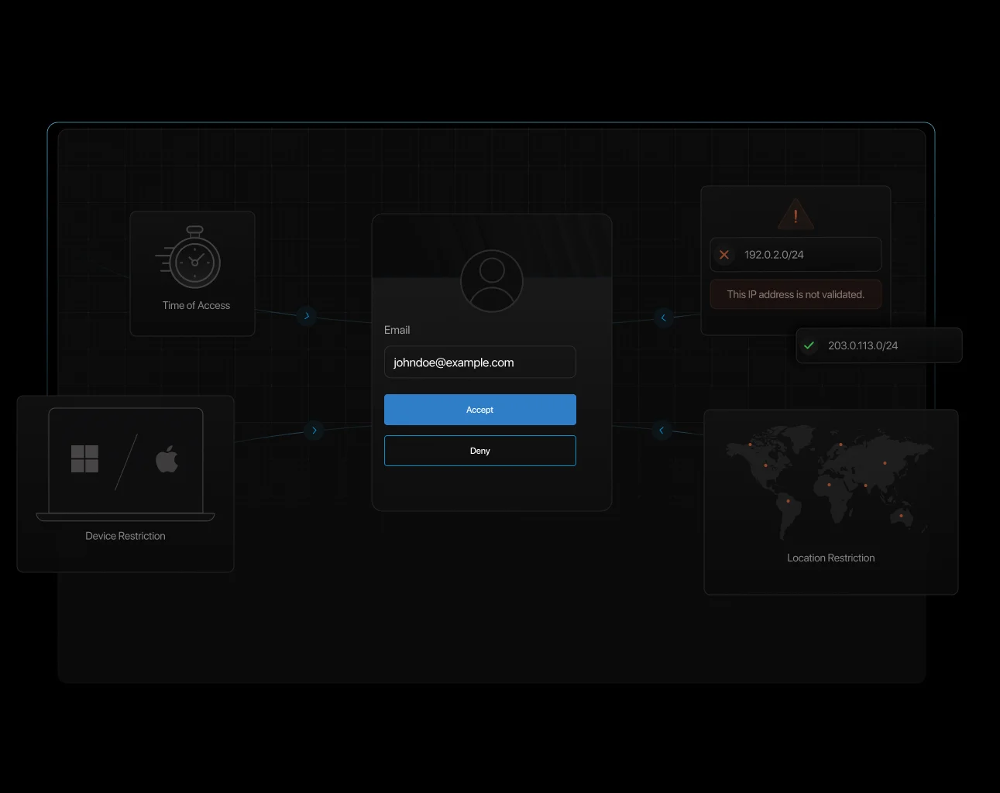

# Top 10 Benefits of Multi-Factor Authentication (MFA)

In today’s digital world, passwords alone are no longer enough to keep cybercriminals at bay. Hackers have become increasingly sophisticated, and a simple login credential is often all they need to access sensitive data. That’s where Multi-Factor Authentication (MFA) comes in. By requiring multiple forms of verification, MFA adds an extra shield against cyber threats.

But what makes MFA so essential? Why is it a must-have security feature in businesses and personal accounts alike? Let’s break it down and explore the top 10 benefits of multi-factor authentication that make it an indispensable security feature in today’s cybersecurity landscape.

## What is Multi-Factor Authentication (MFA)?

Imagine trying to enter a high-security building. Instead of just showing an ID, you also need to scan your fingerprint and enter a code sent to your phone.

Just like a high-security building requires multiple layers of verification, the digital world demands the same level of protection. Multi-factor authentication (MFA) ensures that even if a password is compromised, unauthorized access is still blocked—keeping your accounts and data secure in an increasingly connected world. That’s MFA in a nutshell.

[Multi-factor authentication (MFA)](https://www.loginradius.com/platforms/multi-factor-authentication) is a security process that requires users to verify their identity using more than one method before they can access an account. Instead of just a password, users must also provide something they have (like a phone-generated code) or something they are (like a fingerprint or facial recognition).

This dramatically reduces the risk of unauthorized access, even if login credentials are compromised. This highlights the advantages of multi-factor authentication in ensuring strong security measures.

## Common Multi-Factor Authentication Methods

### SMS or Email-Based One-Time Passwords (OTP)

Imagine you’re logging into your online banking account, and right after entering your password, you receive a six-digit code via text or email. This one-time password (OTP) is only valid for a short time, making it difficult for hackers to use stolen credentials alone.

While this is a widely used method, it’s not foolproof—SIM swapping and phishing attacks can still pose a risk. However, one of the benefits of two-factor authentication is that it provides an added security step.

### Authenticator Apps Generating Time-Based One-Time Passwords (TOTP)

Apps like Google Authenticator or Microsoft Authenticator take OTPs to the next level. Instead of relying on SMS or email, they generate codes directly on your device every 30 seconds. This method significantly reduces the risk of interception and is commonly used in securing email and cloud accounts.

### Hardware Tokens

For industries dealing with highly sensitive data, hardware tokens provide an extra layer of security. These are physical devices, like YubiKeys, that generate codes or require tapping on a USB port for authentication.

While incredibly secure, they can be inconvenient if lost or misplaced. This is an important aspect when considering the pros and cons of multi-factor authentication for an organization.

### Biometric Authentication

You probably unlock your phone using your fingerprint or facial recognition—this is biometric authentication in action.

From Apple’s Face ID to Windows Hello, biometrics provide a seamless and highly secure authentication method, as they rely on unique personal traits that cannot be easily replicated.

### Push Notifications on Registered Devices

Instead of entering a code, push notifications allow users to verify logins with a simple tap on their mobile devices.

For example, when logging into Gmail from a new device, Google might send a prompt that says “Was this you?” to your phone, letting you confirm the login attempt instantly. This method reinforces why you should use the multi-factor authentication approach for strong security.

Learn how to [incorporate push notification MFA into your apps with LoginRadius](https://www.loginradius.com/legacy/docs/api/v2/customer-identity-api/multi-factor-authentication/push-notification/overview/).

## Why is MFA Good for Security?

Before we learn the benefits of multi-factor authentication, let’s understand why MFA is good for security. The answer lies in its ability to stop unauthorized access in its tracks. Even if a hacker manages to steal your password, they would still need the second (or third) authentication factor to gain access.

MFA significantly reduces the risk of cyber attacks such as phishing, credential stuffing, and brute-force attacks. It’s particularly valuable for businesses with remote employees, as it ensures that only verified users can access company systems, reducing the risk of a data breach. These are key MFA benefits that improve cybersecurity measures.

## Benefits of MFA (Multi-Factor Authentication)

### 1. Enhanced Security

Hackers love weak passwords. MFA ensures that even if your password gets leaked, cybercriminals still can’t access your account without additional verification. This is a core reason why MFA is important in securing online accounts.

### 2. Reduced Risk of Unauthorized Access

Think of MFA as an extra lock on your door. Even if someone picks the first lock (password), they still need a second key (a fingerprint, OTP, or hardware token) to break in.

### 3. Protection Against Phishing Attacks

Phishing emails trick users into entering their passwords on fake websites. But with MFA, stolen passwords alone aren’t enough to gain access, preventing attackers from infiltrating accounts.

### 4. Customizable Security Policies

Businesses can tailor MFA policies based on risk levels. For example, logging in from a trusted device may require just a password, while accessing from an unknown location might trigger an additional authentication factor. This is called adaptive multi-factor authentication (MFA). See how [LoginRadius can help you combat real-time threats](https://www.loginradius.com/products/adaptive-mfa) with adaptive MFA.

You can quickly [configure adaptive authentication with LoginRadius](https://www.loginradius.com/docs/security/customer-security/risk-based-auth/#configuration).

### 5. Enhanced User Trust and Confidence

Customers feel safer knowing their accounts are well-protected. By implementing MFA, businesses build trust and demonstrate a commitment to security through a user-friendly interface.

### 6. Ease of Integration and Usability

Modern MFA solutions integrate seamlessly with applications, making it easier for users to log in securely without frustration.

### 7. Cost-Effectiveness

A data breach can cost millions. Investing in MFA is far cheaper than dealing with the aftermath of stolen customer information or legal fines.

### 8. Future-Proof Security

Cyber threats evolve, but MFA benefits companies by offering flexibility in authentication methods. As technology advances, businesses can adopt new MFA techniques like AI-driven authentication and behavioral biometrics.

### 9. Reduced Impact of Password Fatigue

With MFA, users don’t have to rely solely on passwords, reducing the burden of remembering complex combinations. This leads to better security hygiene and fewer instances of password reuse. The benefits of 2FA help reduce password dependency.

### 10. Improved Access Management

MFA enables businesses to track login attempts, enforce [role-based access controls](https://www.loginradius.com/docs/security/consent-and-access/roles-and-permissions/), and mitigate insider threats by ensuring that only authorized personnel can access critical systems.

## Summary

MFA is not just another security feature—it’s a necessity in today’s cyber threat landscape. The benefits of multi-factor authentication range from stopping unauthorized access to reducing the impact of phishing attacks. Businesses that prioritize MFA in cyber security are safeguarding their future against cyber criminals.

If you wish to incorporate MFA into your apps/website, you can [read the implementation docs](https://www.loginradius.com/docs/security/customer-security/multi-factor-authentication/overview/) or quickly [book a live demo.](https://www.loginradius.com/book-a-demo/)

## FAQs

**What is the risk of not using multi-factor authentication?**

Without MFA, your accounts are vulnerable to hacking, phishing, and credential stuffing. A single stolen password can lead to a full-blown data breach.

**The Importance of MFA for Securing Remote Access?**

Remote work exposes businesses to cyber threats. The importance of MFA lies in ensuring that employees can securely access corporate systems from anywhere without increasing security risks.

**Are magic links more secure than password authentication?**

Magic links offer convenience but are only as secure as the email account receiving them. MFA remains a stronger option as it requires multiple authentication steps.

**What types of authentication solutions are available?**

Authentication methods include passwords, security questions, MFA, biometrics, hardware tokens, and risk-based authentication. The best approach combines multiple layers of security.

By implementing MFA benefits, businesses can ensure stronger security, reduce risks, and build trust among users. If you haven’t already adopted MFA, now is the time to do so!