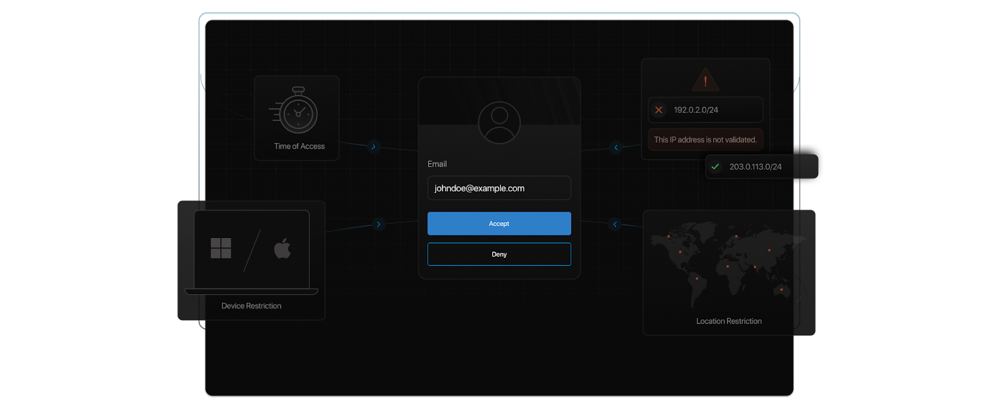

One of the primary mfa benefits is that it provides additional security layers and decreases the chance of consumer identities becoming compromised.

No wonder the market for MFD is projected to reach [USD 22.51 billion dollars](https://www.marketsandmarkets.com/Market-Reports/multi-factor-authentication-market-877.html) in another two years. And there’s more to it!

Every organization has its own set of online applications. Most of them include shared documents, files, folders, videos, audios, etc., to create in-house and client profiles. Unfortunately, with the rise in cyber attacks, companies have become vulnerable. 

In this scenario, [multi-factor authentication (MFA)](https://www.loginradius.com/multi-factor-authentication/) becomes supercritical for most organizations, big or small. Put simply, MFA reduces the risk of a security breach drastically, and **sensitive data** stays protected. 

Besides this, an average employee has different resource accounts, and the company motivates the user to create complex and unique passwords for each of them as part of their best practices. At the same time, the IT team struggles with access controls. The result of poorly [secured identities](https://www.loginradius.com/blog/2019/12/identity-as-a-service-for-business/) leads to more security risks for the organization.

MFA adds an **extra layer of security** to such applications using time-based one-time password (TOTP) via call or SMS, Google Authenticator, etc. Moreover, it is better than two-factor authentication because it can add more levels of security. It can help an organization achieve zero-trust security remotely. Let’s uncover some advantages of multi factor authentication. 

## What is MFA and How Does it Work?

Multi-Factor Authentication (MFA) is a security system that requires users to verify their identity through multiple credentials before gaining access to a system. These credentials typically fall into three categories: something you know (like a password), something you have (like a phone or token), and something you are (like a fingerprint or facial recognition). By combining these factors, MFA adds an extra layer of security beyond just a password.

## Types of Multi-Factor Authentication

There are several types of MFA methods that organizations can implement:

* **Time-Based One-Time Password (TOTP)**: Users receive a temporary code via an authenticator app like Google Authenticator.

* **SMS or Email Codes**: A code is sent to the user's mobile phone or email, which they must enter to complete the login.

* **Biometric Authentication**: This includes fingerprint scans, facial recognition, or even iris scans.

* **Hardware Tokens**: Physical devices that generate unique codes, often used in high-security environments.

## Why is it Important to Use Multiple Factors of Authentication?

Using multiple factors of authentication is crucial for several reasons:

* **Increased Security**: With MFA, even if one factor is compromised (like a password), the attacker would still need the other factor to gain access.

* **Protects Against Phishing**: Since MFA codes are often time-sensitive and not reusable, they are less susceptible to phishing attacks.

* **Compliance**: Many industry regulations, like PCI-DSS, require MFA to protect sensitive data.

## What is the Risk of Not Using Multi-Factor Authentication?

The risk of not using MFA is significant:

* **Increased Vulnerability**: Without MFA, a compromised password can lead to unauthorized access.

* **Data Breaches**: Hackers can exploit weak passwords or stolen credentials to access sensitive information.

* **Identity Theft**: Users' personal and financial information is at risk if their accounts are breached.

## MFA vs 2FA

While Two-Factor Authentication (2FA) offers an additional layer of security, MFA goes further by providing more layers of authentication. While 2FA typically uses two factors (like a password and SMS code), MFA can involve multiple factors, such as passwords, TOTP codes, biometrics, and more.

## 7 Benefits of Multi-Factor Authentication

There are numerous benefits of using multi factor authentication, which we’ll discuss here. MFA plays a vital role when it comes to **information security.** It protects the data against potential breaches, keeps an eye on employee accounts, and strays away hackers. Besides this, it protects users even if their **login credentials** are exposed by mistake. Let’s understand in detail why is multi factor authentication important:

### 1. It provides more layers of security than 2FA.

MFA provides more layers of security as compared to 2FA. An organization can make it mandatory for both employees and consumers to verify their credibility using a password, Time-based One Time Password (TOTP), and Google Authenticator. This way, they can make sure that the end-user is verified. 

The multiple layers of security ensure that the consumers looking for access are who they claim to be. Even if hackers steal one credential, they will be forced to verify identities in another manner. Therefore, companies that store consumers’ confidential details should opt for more than two authentications. It will help them build and maintain [consumer trust](https://www.loginradius.com/customer-security/).

### 2. It assures consumer identity.

A lot of people wonder about why is mfa important? Well, MFA is an important tool for protecting consumer data from identity theft. By implementing this measure, the security of the traditional username and password login is supplemented by an additional layer of protection. Cybercriminals will have a hard time cracking TOTP since it is either sent via SMS or through an automated phone call. A consumer needs two pieces of information to access their resource. MFA adds a sense of mindfulness to authentication.

### 3. It meets regulatory compliances.

Implementing multi-factor authentication can be a key requirement when it comes to complying with certain industry regulations. For example, PCI-DSS requires MFA to be implemented in certain situations to prevent unauthorized users from accessing systems. So, even when application updates lead to unknown and unattended consequences, MFA compliance ensures that it remains virtually non-intrusive.

### 4. It comes with easy implementation.

[Multi-factor authentication](https://www.loginradius.com/blog/identity/2019/06/what-is-multi-factor-authentication/), by its very nature, is non-invasive. It does not affect the rest of the virtual space of an organization or institution. To add, its intuitive user experience allows it to be picked up by the consumer with almost little to no effort.

### 5. It complies with Single Sign-On (SSO) solutions.

An industry-compliant MFA comes with an [SSO solution](https://www.loginradius.com/single-sign-on/). You no longer have to create multiple complex passwords for different applications.  Moreover, when we discuss the importance of multi factor authentication, using a secondary authentication with SSO confirms the consumer identity and removes the risk of losing data due to password misplacement. This not only saves time but also enhances security.

### 6. It adds next-level security, even remotely.

Quite often, cybercriminals try to gain access to the system when a user is working remotely. Their task can become tricky if MFA is used with an SSO solution. MFA can help block such users and even report potential threats. The IT department immediately gets notified. They can take strict actions to block such users.

The rise in password thefts through phishing, keylogging, and pharming has raised many concerns for organizations across the globe, especially on an open network. All these concerns can be laid to rest through the implementation of MFA. For example, a user would receive a prompt to confirm secondary authentication even if the [password is stolen](https://www.loginradius.com/blog/2019/09/prevent-credential-stuffing-attacks/). This will help prevent any data loss.

### 7. It is an effective cybersecurity solution.

When we talk about the benefits of multi factor authentication,hackers have a tough time cracking a 2FA or MFA because of the implementation of strict security measures, such as TOTP, Google Authenticator, and more. The users can make the task for hackers even more difficult by using **complex passwords**, mainly if the MFA is used with an SSO solution.

## How Can LoginRadius Help in Securing Business Data While Providing Delightful CX

Besides the benefits mentioned above, LoginRadius can help arm businesses with many more advantages. MFA with SSO allows users to connect with multiple applications by passing through numerous security measures at once. 

LoginRadius Identity Platform makes use of both MFA and centralized credentials through networks, applications, and more. The IT department can even ask the employees and business consumers to strengthen their password as they have to use it once before proceeding ahead with other 2FA or MFA securities. 

LoginRadius’ MFA provides a customized consumer experience with [options like security questions](https://www.loginradius.com/blog/2019/01/best-practices-choosing-good-security-questions/), authenticator apps, email, automated phone calls, etc. It does not interfere with the delightful CX experience. It adds more security to business and employee data.

## Conclusion

As more and more companies move towards [digital transformation](https://www.loginradius.com/blog/identity/2018/11/enterprise-needs-digital-business-transformation-strategy/), cybersecurity becomes more and more critical and enterprises need to understand why MFA is important. It’s here that MFA becomes super important since it offers enhanced and adequate security against theft and damage of a company’s critical data.

## **Frequently Asked Questions (FAQs)**

**1. What is an example of MFA?**

An example of MFA is using a password (something you know) along with a time-based one-time password (TOTP) from an authenticator app (something you have).

**2. How does MFA improve security?**

MFA improves security by requiring users to provide multiple credentials, making it more difficult for unauthorized users to access accounts.

**3. What is the difference between MFA and 2FA?**

The difference is that MFA involves more than two factors of authentication (like passwords, TOTP, and biometrics), whereas 2FA typically involves just two factors (like a password and SMS code).

**4. How is cloud MFA different than on-prem MFA?**

Cloud MFA is managed and hosted in the cloud, offering scalability and accessibility from anywhere, while on-prem MFA is installed and managed locally, offering more control but requiring physical infrastructure.

**5. How does MFA increase security for enterprises working with third parties?**

MFA increases security for enterprises working with third parties by ensuring that even if third-party credentials are compromised, additional factors are needed for access, reducing the risk of unauthorized entry.

