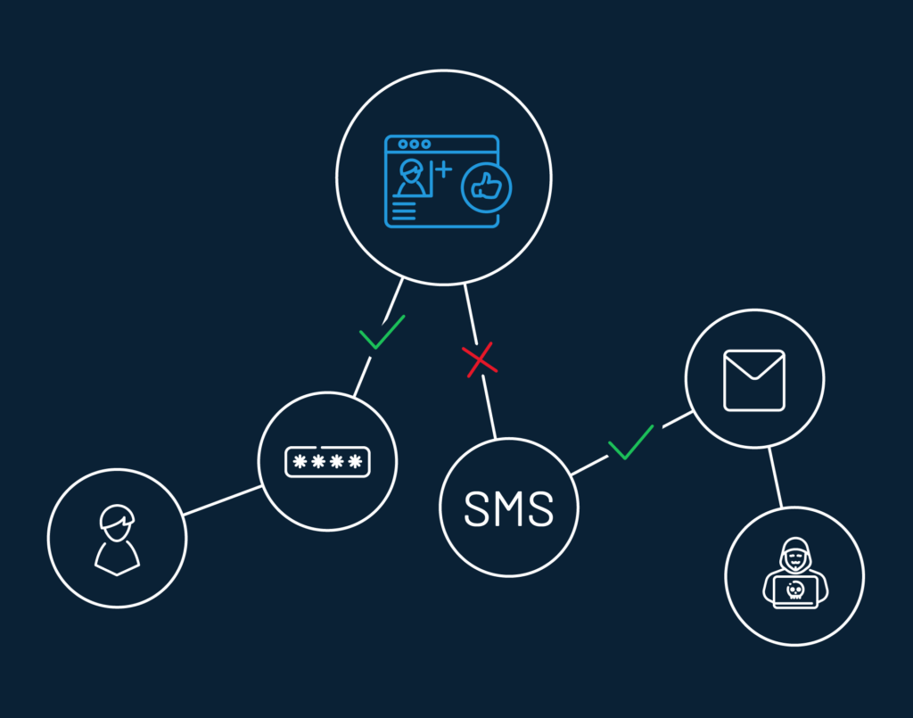

## Introduction

When you respect your consumer's time, they will return the favor with even better involvement on your platform. The benefit of SSO for enterprises runs on a similar concept. 

So, [what is SSO](https://www.loginradius.com/blog/identity/what-is-single-sign-on/), and why does the above statement hold true?

Single Sign-On or SSO is an authentication process that allows consumers to log in to multiple independent applications with a single set of credentials. With SSO, users can access a suite of applications via one single login, irrespective of the platform, technology, or domain used. 

On a similar note, it is also a challenge for both users and IT administrators to secure thousands of accounts and related user data.

For both users and IT administrators, securely handling thousands of accounts and related user data is challenging. Enterprises use single sign-on as a single strategy to improve IT security, improve user experience, and cut IT cost in one go. 

## Understanding Single Sign-On (SSO)

Single Sign-On (SSO) is an authentication method that allows users to access multiple applications or systems with a single set of credentials. Here's how SSO works and its key components:

### 1. Authentication Process

When a user attempts to access an application, they are redirected to the SSO system for authentication. The user provides their credentials (e.g., username and password) once to the SSO system.

### 2. Authentication Token

Upon successful authentication, the SSO system issues a secure authentication token or session identifier to the user's browser. This token serves as proof of authentication and grants access to authorized applications.

### 3. Token-based Access

The user's browser presents the authentication token to each application they attempt to access within the SSO environment. If the token is valid and the user is authorized, they are granted access without the need to re-enter their credentials.

### 4. Centralized Identity Management

SSO systems typically include centralized identity management capabilities, allowing administrators to manage user accounts, access permissions, and authentication policies from a single console.

### 5. Integration Protocols

SSO implementations often utilize standard protocols such as Security Assertion Markup Language (SAML), OAuth, or OpenID Connect for integration with various applications and systems. These protocols facilitate secure communication and interoperability between the SSO system and supported applications.

By adopting SSO, organizations can streamline access management, enhance security, and improve user experience, ultimately driving operational efficiency and productivity across the enterprise.

## **7 Advantages of SSO That Every Enterprise Should Know**

No matter what your role as an end-user might be, you probably don’t like memorizing unique credentials for multiple logins, right? For instance, when a customer calls IT about resetting passwords, an enterprise can lose hours, tech resources, and money. 

### 1. It increases employee and IT productivity.

By contrast, a single point of access will reduce wasted time and resources. Here’s how.

With single sign-on, you can: 

- **Reduce support calls**: Users with just one password to access all their apps won't require assistance as often.

- **Improve user experience**: Since there’s no need to hop between multiple login URLs, or reset passwords, users save between 5 to 15 seconds per login. 

- **Mitigate security risks**: Employees can use their SSO login credentials on any device, in any web browser, without risking security.

As you can see, the ability to increase the productivity of end-users is one of the greatest single sign on benefits.  

### 2. It improves security capabilities.

One misconception about using an SSO solution is that it weakens security. The argument rests on the premise that if a master password is stolen, all related accounts will be compromised. 

In theory, this appears to be true, but with common-sense practices, SSO can actually reduce password theft. How?

Since users only need to remember one password for multiple applications, they’re more likely to create a stronger (harder to guess) passphrase, and less likely to write it down. These best practices reduce the risk of password theft. 

As explained in the next section, a single sign-on strategy can also be combined with [multi-factor authentication (MFA)](https://www.loginradius.com/blog/identity/what-is-multi-factor-authentication/) for extra security.

### 3. It combines with Risk-Based Authentication (RBA).

Here’s how combining RBA with Single Sign-on provides an extra layer of security. 

As mentioned earlier, SSO gives your customer or end-user one “key” to sign in to multiple web properties, mobile apps, and third-party systems using one single identity. 

For even more security, you can combine SSO with risk-based authentication (RBA). With RBA, you and your security team can monitor user habits. This way, if you see any unusual user behavior, such as the wrong IP, or multiple login failures, you can demand extra identification verification. If the user fails at this, you can block them from access. 

This powerful combination can prevent cybercriminals from stealing data, damaging your site, or draining IT resources. 

### 4. It reduces password fatigue.

To prevent cybercrime, security professionals insist on unique passwords for every single application. This means that the average user must remember dozens of passwords for personal and office use. Unfortunately, this often leads to "password fatigue." 

How does password fatigue hurt enterprises? In short, more passwords, more problems. If customers have a hard time signing in, they’ll leave your site or app before you can convert them.

A [recent usability study](https://baymard.com/blog/password-requirements-and-password-reset) by Baymard Institute proves this point. In this study, Baymard tested existing account users at two e-commerce sites (Amazon and ASOS) and found that 18.75% of users abandon their carts due to forgotten passwords or password reset issues.  

The benefit of single sign-on is that it’s only one password for customers to remember, for all of your applications.

### 5. It streamlines the user experience.

[Enhanced user experience](https://www.loginradius.com/customer-experience-solutions/) is one of the most valuable benefits of SSO. As repeated logins are no longer required, customers can enjoy a modern digital experience. The SSO benefits for enterprises include an increase in customer loyalty and higher conversion rates.

### 6. It prevents Shadow IT.

Shadow IT is not new to the world of cybersecurity. It refers to unauthorized [downloads in the workplace](https://www.csoonline.com/article/3239849/shadow-it-its-not-what-you-think.html).

In the past, Shadow IT was limited to employees purchasing software at office supply stores. But as cloud-based downloads become more popular, the potential for risk grows.

To solve this issue, IT admins can leverage SSO to monitor what apps employees use. Thus, identity theft risks can be thwarted. 

Bonus: With a single platform, a company’s IT or compliance team can ensure that global and local compliance rules are being followed, as well.

### 7. It increases software adoption rates.

Have you ever given up on a new app because the customer access or sign-up process was a pain? If you have, that’s a “technology fail.”

Technology should make our lives easier, not cause frustration. Making sign-up or login easier with SSO increases the chance that customers will adopt your technology, use your app, and keep returning for more.

To help you achieve this, LoginRadius is 100% committed to providing the latest industry-standard authentication technology. 

If SSO sounds like a good choice for your company, here’s how to get started. 

*   **Web SSO**  is a browser-based session management system that allows consumers to access any connected web properties with a single identity.

*   **Mobile SSO** works the same way as web SSO, except it unifies consumer sessions across multiple connected mobile applications. 

*   **Federated SSO** utilizes IDPs to store and authenticate consumer identities to log in to third-party web portals, mobile applications, and more, depending on their configuration. Several identity protocols like SAML, JWT, OpenID Connect, OAuth, and Multipass are designed to authenticate consumers. 

See how the [LoginRadius platform provides SSO](https://www.loginradius.com/single-sign-on/) (and more) in one easy-to-use platform. Book a free demo with us today. 

## Security Considerations with SSO

While Single Sign-On (SSO) offers numerous benefits, it's essential to address potential security considerations:

### 1. Centralized Access Point

SSO creates a centralized access point for multiple applications, making it crucial to secure this entry point against unauthorized access. Implementing robust authentication mechanisms, such as multi-factor authentication (MFA) and risk-based authentication (RBA), can help mitigate risks.

### 2. Credential Management

Since users rely on a single set of credentials for multiple applications, securing these credentials becomes paramount. Encourage users to create strong, unique passwords and regularly update them. Additionally, consider implementing password policies and enforcing password complexity requirements.

### 3. Session Management

Proper session management is vital to prevent unauthorized access to user accounts. Implement session timeout mechanisms to automatically log users out after a period of inactivity. Furthermore, consider implementing techniques such as session encryption and token-based authentication to enhance session security.

### 4. Data Privacy and Compliance

Ensure compliance with data privacy regulations, such as GDPR and CCPA, when implementing SSO. Protect sensitive user data by implementing encryption protocols and access controls. Additionally, regularly audit access logs and monitor user activity to detect and respond to any suspicious behavior promptly.

### 5. Vendor Security

When choosing an SSO provider or solution, thoroughly assess their security measures and protocols. Ensure that the vendor follows industry best practices and complies with relevant security standards. Additionally, consider conducting security assessments and audits of the vendor's infrastructure and processes to verify their security posture.

By addressing these security considerations proactively, businesses can maximize the benefits of SSO while maintaining robust security measures to protect user data and mitigate potential risks.

## ROI Analysis of SSO Implementation

Implementing Single Sign-On (SSO) can yield significant returns on investment (ROI) for businesses:

### 1. Cost Savings

SSO reduces IT support costs by minimizing password-related support calls and helpdesk inquiries. With fewer password resets and account lockouts, IT resources can be allocated more efficiently, resulting in cost savings for the organization.

### 2. Productivity Gains

By streamlining the authentication process and eliminating the need for multiple logins, SSO enhances user productivity. Employees spend less time managing credentials and navigating authentication processes, allowing them to focus on core tasks and projects.

### 3. Security Enhancements

While security considerations are paramount, implementing SSO with robust authentication measures can enhance overall security posture. By reducing the risk of password-related vulnerabilities and enforcing stronger authentication methods, businesses can mitigate the potential costs associated with data breaches and security incidents.

### 4. Improved User Experience

SSO enhances user experience by providing seamless access to multiple applications with a single set of credentials. This improves user satisfaction and loyalty, leading to increased engagement and retention rates.

### 5. Compliance Benefits

SSO facilitates centralized access control and authentication management, simplifying compliance with regulatory requirements. By enforcing consistent access policies and auditing user activity, businesses can demonstrate compliance with industry regulations and avoid non-compliance penalties.

By conducting a comprehensive ROI analysis, businesses can quantify the financial benefits of SSO implementation and make informed decisions about investing in this technology to drive efficiency, productivity, and security across the organization.

## Frequently Asked Questions (FAQs)

**1. What are the benefits of SSO and MFA?**

SSO enhances user experience by allowing access to multiple applications with one login, while MFA adds an extra layer of security, reducing the risk of unauthorized access.

**2. Why is SSO needed?**

SSO simplifies access management by allowing users to use one set of credentials for multiple applications, streamlining authentication processes and enhancing productivity.

**3. What is SSO between two applications?**

SSO between two applications enables users to log in once and access both applications seamlessly without the need to re-enter credentials, enhancing user experience and efficiency.

**4. What is the single sign-on method?**

Single sign-on (SSO) is an authentication method that allows users to access multiple applications or systems with a single set of credentials, improving convenience and security.

