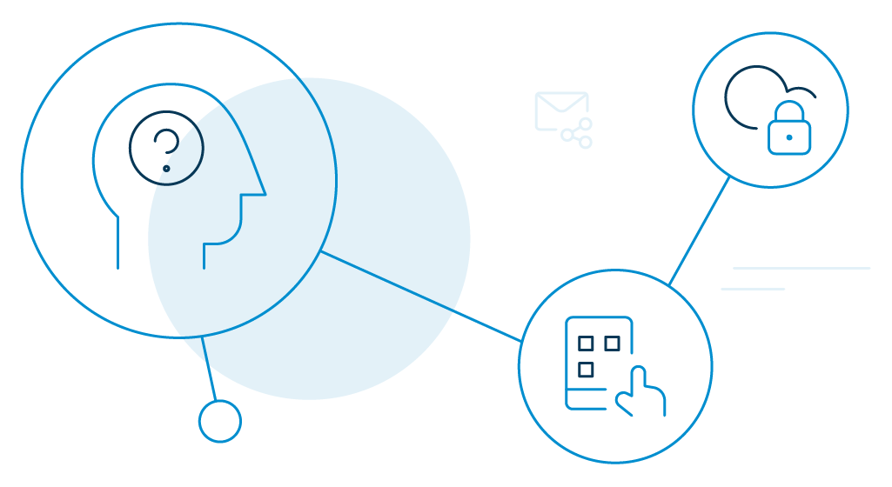

Identity-as-a-service or IDaaS refers to cloud-based identity and access management solutions that are offered on a subscription basis. At its core, IDaaS delivers access, intelligence, and identity governance capabilities to consumers' systems.

Interestingly, IdaaS has been experiencing exponential growth in recent years. So, to understand this rapid surge in the best IDaaS providers, let's go back a little.

Consumers have already been exploring and utilizing the online facilities—from transactions, education, work, shopping, entertainment, to medicines—for some time now. They want frictionless, non-invasive, and [seamless solutions](https://www.loginradius.com/customer-experience-solutions/). 

So, how are companies delivering instant, personalized gratification? The basis for most is _identity_.

Consumers want identity solutions to be easy and simple-to-use.

[Data privacy](https://www.loginradius.com/blog/2020/06/consumer-data-privacy-security/) is another prerequisite necessity. In fact, a survey by Gemalto finds out that 71% of consumers [choose to opt-out of a company](https://www.thalesgroup.com/en/markets/digital-identity-and-security/press-release/majority-of-consumers-would-stop-doing-business-with-companies-following-a-data-breach-finds-gemalto) that experienced a data breach. Talk about a dealbreaker!

Likewise, there are also key questions about data privacy, ownership, control, and scalability. Scoring these areas on a firm ground will make a good ID solution. A growing number of companies are already working on this goal. 

The best IDaaS providers are evolving, and new ones are emerging. How do you choose the right one?

## 5 Factors to Consider Before Choosing the Best IDaaS Provider

**1\. It should connect to mixed platform environments.**

A lot of organizations (especially enterprise-level) still prefer the hybrid approach to host their business applications, i.e. both [on-premises and in the cloud](https://www.loginradius.com/multi-tenant-cloud/). The best IDaaS providers will offer consumers seamless access from a variety of devices, or mostly when legacy solutions are involved. 

It should not matter where the applications are hosted or accessed, the IDaaS solution should simplify integration and create a simplified, smooth, and unified consumer experience. 

**2\. It should deliver better security.**

With a [modern cloud identity platform](https://www.loginradius.com/blog/2019/06/customer-identity-and-access-management/#:~:text=Customer%20identity%20and%20access%20management%20(CIAM)%20is%20a%20digital%20identity,while%20securely%20managing%20customer%20identities.) comes security with modern techniques. Identity theft and network compromise are a big problem that IT managers face today, and the lack of passwords is a major explanation for these breaches.

There should be a large number of security techniques included as the identity management platform transitions to the cloud. Examples include one-way password hashing, salting that secures communication between all vulnerable end-points. 

**3\. It should verify and manage all identities.**

With modern industries requiring robust access and security policies, the best IDaaS provider should include identity management tools for different use cases. 

For example, when new devices, applications, and consumers are introduced, or third-party relationships are integrated, the access requirement and priorities are also changed. Your IDaaS provider should be able to access authorized resources without having to [authenticate and sign in](https://www.loginradius.com/authentication/) separately to each application.

Moreover, your IDaaS solutions provider should also include frameworks for single sign-on (SSO) and federated identity with [multi-factor authentication](https://www.loginradius.com/blog/2019/06/what-is-multi-factor-authentication/) (MFA) that removes silos and enables uninterrupted network environments.

**4\. It should offer a complete app access lifecycle management.**

When a new user joins your organization or an existing user takes on a different role, your IDaaS solution should make provisioning easier with automatic account creation, role-based authorization management, [single sign-on](https://www.loginradius.com/blog/2019/05/what-is-single-sign-on/), and automated account deprovisioning.

A comprehensive, automated app access lifecycle management eliminates helpdesk calls, reduces IT burden, and saves time. It is also easier to offboard users by instantly removing access and deactivating app accounts.

**5\. It should offer multi-factor authentication (MFA).**

Consumers aren't confined to just the one network, device, or applications today. They have to remember a lot of passwords for different accounts. But then, passwords alone cannot be trusted to keep accounts secure. You need a stronger authentication factor at a granular level and MFA should do the trick.

The best IDaaS provider should include MFA with (at least) the following combination:

- Soft token with one-button authentication.
- One Time Passcode (OTP) sent over text or email.
- User-configurable security question as a second layer.

Also, ensure that your IDaaS provider offers custom configurations, whenever necessary for optimal performance. Make sure it is affordable, flexible, and designed to scale (forecasting your rapid growth).

## Why LoginRadius Is Considered to Be Your One-Stop Solution for IDaaS for Both Developers and Businesses

LoginRadius is credible and the best IDaaS provider that can be applied to any situation where consumers expect to connect securely to organizations' IT resources.

The platform offers next-gen technology to make sure employees, consumers, clients, or partners are who they say they are. Once confirmed, it offers access rights to resources based on the roles and permissions granted. 

Additionally, the LoginRadius [IDaaS is deployed through the cloud](https://www.loginradius.com/blog/2019/12/identity-as-a-service-for-business/)—meaning businesses can request access securely, irrespective of the location or device. 

Let's find out the key capabilities that make LoginRadius an interesting pick for developers and businesses, in general. 

### Best IDaaS Provider for Developers

- **Cloud-Based and Multitenant Architecture**: LoginRadius offers a [multi-tenant cloud architecture](https://www.loginradius.com/multi-tenant-cloud/). As a result, developers can issue updates, perform security fixes and improvements for consumers instantly. They can scale the use of cloud-based IDaaS solutions to meet organizations' identity and access management needs.
- **Single Sign-On and Federation**: [LoginRadius offers SSO](https://www.loginradius.com/single-sign-on/) and Federation to allow consumers to authenticate to multiple applications (including third-parties) with a single set of credentials. It encourages seamless end-user experiences with accessing their day-to-day IT services.
- **Access management and control**: With LoginRadius developers can assign access privileges to consumers based on their attributes, roles, and responsibilities. It also allows them to assign or revoke access, whenever required.
- **Identity management**: LoginRadius offers identity management capabilities by keeping track of consumers' access privileges. It also offers organizations with information on consumers' lifecycles by monitoring, auditing, and reporting their activities from the LoginRadius admin console.

### Best IDaaS Provider for Businesses

- **Governance and Compliance**: LoginRadius enforces [governance policies and regulatory compliances](https://www.loginradius.com/data-governance/) to mitigate security vulnerabilities. A few of the certificates include ISO/IEC 27001:2013, ISO/IEC 27017:2015, SOC 2 (Type II), ISAE 3000, NIST Cybersecurity Framework, CSA Star CCM, CIS Critical Security Controls, PCI DSS Compliant, and OpenID. 
- **Scalability**: LoginRadius is a cloud-based platform that scales as your business grows. The platform regularly experiences peak transaction volumes of 150,000 logins per second and easily handles around 10,000 requests per second with less than 500 milliseconds latency. 
- **Security**: Not just MFA and SSO, LoginRadius IDaaS solution also offers end-to-end encryption. Businesses can verify consumer identities with confidence. Also, on the cloud, they back up data regularly so they can restore/recover quickly in case of any disaster. 

## Conclusion

It is incredibly important for IT professionals to safeguard systems and data while providing easy, convenient access to consumers and clients. Only the best IDaaS provider can offer reliable security that businesses require. 

LoginRadius is the comprehensive ideal solution for enterprises who need to implement identity management into applications quickly and easily.

