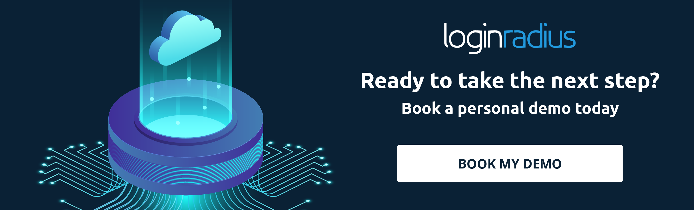

In January of 2019, Akamai acquired Janrain and rebranded their [CIAM solution](https://www.loginradius.com/blog/2019/06/customer-identity-and-access-management/) as “Identity Cloud,” a platform designed to improve security access controls and identity management. Before the purchase price was revealed, Forrester predicted it would be in the $250M–$275M range (based on an estimation of Janrain’s annual revenue). In reality, the sale price was [$125M](https://www.bizjournals.com/portland/news/2019/03/01/that-sale-price-for-janrain-125.html)—_roughly half of Forrester’s estimate_. Since then, perhaps in response to the Janrain acquisition, customers have reached out to LoginRadius seeking a Janrain alternative. Here’s what they told us. 

## **Why customers want a Janrain alternative**

LoginRadius has had many conversations with current and former Janrain customers in the last few months. Through these discussions, we’ve learned that the Janrain acquisition is playing out in a similar fashion to the Gigya acquisition. If you’re interested in reading about the pitfalls of the Gigya/SAP merger, you might like our article [Looking for a Gigya Alternative?](https://www.loginradius.com/blog/2019/02/looking-gigya-alternative-try-loginradius-superior-modern-identity-platform/). In it, we explain some of the problems arising from the Gigya/SAP merger. 

Likewise, in this article, I’ll demonstrate that while mergers and acquisitions (M&A) can be exciting, an acquisition may sometimes be damaging for customers, partners, and employees. To illustrate that, here are some of the reasons customers are seeking a Janrain alternative today.

## **Recent Janrain/Akamai complaints**

### “We lost the freedom to use our existing stack.”

One of the chief concerns that companies have shared with us involves service level agreements (SLAs). In particular, we’ve heard that many companies fear that Akamai will not offer the flexibility of custom tech stacks. Their concern is that if they use software or apps not provided by Akamai, they’ll lose the quality, availability, and features that they relied on before the merger. 

To put it into perspective, former Gigya customers complained to us that during the SAP acquisition, they didn’t want to switch their tech stack to SAP. However, in order to get a full SLA and the optimal service and features they had come to expect, it suddenly became necessary. 

The reason for their cold feet is simple: switching software can lead to a massive drain of resources within large companies. Therefore, it’s reasonable for companies to avoid that kind of change. Let’s face it, if you already have a tried-and-true tech stack, wouldn’t you want to choose a CIAM solution that works _with_ it?

### “We noticed a decline in support.”

Anytime a big acquisition or disruption occurs in a company, there’s a high probability that customer service may suffer. In fact, time and again, customers told our consultants that they switched from Akamai/Janrain or Gigya due to a decline in technical assistance and customer support.

### “What happened to auto-renew?”

Another customer related complaint occurred after Akamai acquired Janrain.  Janrain customers became concerned when their accounts did not auto-renew. Since the Janrain/Akamai merger, Akamai is exercising its right to renegotiate terms. As a result, _Janrain customers are reported to be wary of the fine print on these new terms_.

### “We can’t afford any outages.”

Customers revealed that they noticed a [lot of downtime](https://status.janrain.com/incidents/j66wdht40wmc) on sites using [Akamai Identity Cloud as their provider](https://deets.feedreader.com/secure-now.sportsnet.ca). Most recently, the [NBA Finals game outage](https://www.theglobeandmail.com/business/article-i-missed-a-big-chunk-of-the-game-raptors-fans-frustrated-by-rogers/) on Sportsnet created a lot of heat for Rogers. And since Janrain is the CIAM provider for Rogers, the outage is a result of their inability to handle peak loads. For any business that experiences surges in logins, downloads, or streaming, [downtime can cost $300,000](https://www.the20.com/blog/the-cost-of-it-downtime/) (on average) in lost revenue. 

**Key Takeaway** 

Akamai is a security company, so its acquisition of Janrain confirms that CIAM is a security platform. Akamai clearly saw Janrain as a missing piece in their security company. 

However, LoginRadius made this pivot sooner than Janrain—in 2016, to be precise. Simply put, we've spent more years innovating and delivering value to enterprises than Janrain has. Here are just some of the reasons why LoginRadius is the best Janrain alternative for your business.

## **Why LoginRadius Should Be Your Janrain Alternative**

**Our 100% uptime is second to none.**

You don’t have to worry about surges or spikes driving customers away and hurting revenue. _LoginRadius is the only identity platform with a 100% uptime._

**We’re a global leader in customer identity.** 

LoginRadius was named a [global CIAM leader](https://www.loginradius.com/press/loginradius-named-global-ciam-leader-by-identity-research-firm-kuppingercole/) by KuppingerCole and has been _positioned ahead of other vendors such as ForgeRock, Okta, and Ping Identity._ Recently, [LoginRadius received $17 million Series A funding](https://www.loginradius.com/blog/loginradius-announces-17m-series-funding-forgepoint-microsoft/), led by ForgePoint Capital and Microsoft. _W__e may not be enterprise-size, but we’re enterprise grade—meaning you’ll get both dedicated service and an exceptional product from LoginRadius._ 

**We provide data privacy and consent solutions.**

We follow the strictest government regulations for privacy and consent and offer out-of-the-box solutions for GDPR, CCPA, and COPPA compliance. _We also provide the highest industry standards for secure single sign-on, data storage, and customer access management._

**We’re 100% CIAM with 24/7 tech support.**

Our product consultants, customer support, and tech teams act quickly to meet your needs. _Data migration from your current provider is included, as are customization features and fast deployment._

**Simply put, LoginRadius excels at what Akamai/Janrain doesn’t—****_giving companies an edge over the competition._** 

* * *

### **Know Your Audience**

_“The secret to exceeding customer expectations_

 _is knowing what customers want before they do.”_

* * *

## **Ready to switch to LoginRadius?**

LoginRadius is a CIAM solution that offers seamless migration from your current provider within days. _We also do migration testing on a staging site, so your customers won’t notice a thing._

Want to hear more about making the switch to LoginRadius? Call a LoginRadius digital identity consultant today at 1-844-625-8889. We’ll be happy to give you a product demo so you can compare LoginRadius with your current provider. 

