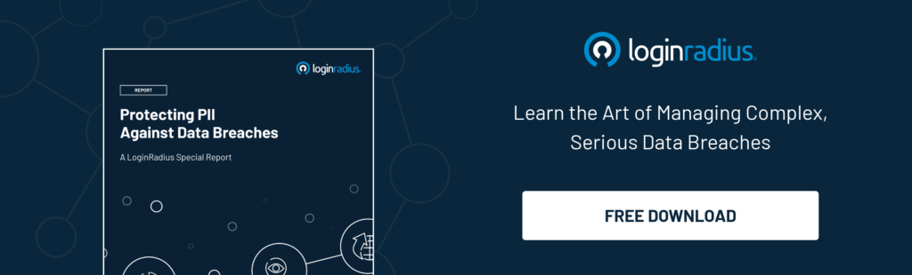

Today, data breaches have become a significant threat to businesses across the globe.  Therefore, considering the long list of resultant consequences to be faced as an aftermath, it is crucial for companies to come out the other side of a breach intact.

The Annual Cybercrime Report  2019 by [Cybersecurity Ventures](https://www.herjavecgroup.com/the-2019-official-annual-cybercrime-report/#:~:text=Cybersecurity%20Ventures%20has%20reaffirmed%20their,associated%20with%20cybercrime%20are%20vast.) says that these data breaches can cost global businesses around $6 trillion in 2021!

According to experts, implementing business resilience best practices can help companies overcome issues that come with a data breach.

So, what is business resiliency? Why is it important for companies? How to implement business resiliency practices during a data breach?

Read on!

## What are the Business Impacts of a Data Breach
 

During a data breach, companies’ confidential data are accessed by attackers without permission.  It is not only about sensitive information going out to the wrong hands. These cyber attackers can also hack your database and conduct malicious activities, costing you both money and reputation. 

As per [Cost of a Data Breach Report 2020](https://www.ibm.com/security/digital-assets/cost-data-breach-report/#/) by IBM, the global average total cost of a data breach in 2020 was $3.86M. If this situation continues, by 2021, a business is expected to fall victim to a [ransomware attack every 11 seconds](https://www.herjavecgroup.com/wp-content/uploads/2018/12/CV-HG-2019-Official-Annual-Cybercrime-Report.pdf). 

Now let’s consider some of the negative impacts of data breaches that make companies susceptible to financial and credibility loss.

*   **Finance and revenue loss**

    If your company is operating in regions with data protection legislation, you have to pay implied legal fees, regulatory fines, security expenses in case of a data breach.  It can cost you a lot if it is a non-compliant company. All these expenses come in addition to the financial damage you have faced because of revenue loss. 

*   **Brand’s reputation**

    According to 71% of CMOs, the most consequential cost of a company’s security data breach incident is the loss of its brand value. This could in turn affect the company’s reliability, thus having to struggle to find the best candidates, investors, and customers.

*   **Consumer trust, retention and turnover**

    [Seven out of ten consumers](https://www6.thalesgroup.com/2016-data-breaches-customer-loyalty-report-pr) believe [it is a company’s responsibility to secure their personal information](https://www6.thalesgroup.com/2016-data-breaches-customer-loyalty-report-pr). So, when there is a data breach, and the consumer’s personal data is hacked, they will quickly lose trust in the business. This can result in losing the most loyal customers, even affecting customer turnover. It could worsen if the company is not ready to accept the responsibility for data breaches.

That’s why today, businesses are more focused on building a better security culture. According to Gartner forecasts, global spending on cybersecurity is expected to reach [$133.7 billion by 2022](https://www.gartner.com/en/newsroom/press-releases/2018-08-15-gartner-forecasts-worldwide-information-security-spending-to-exceed-124-billion-in-2019). 

But, how effectively companies can deal with data breaches, especially in a hyper-connected world?

To handle a data breach incident and the resulting loss of revenue and trust, every company should have an incident response plan with effective threat modeling. That’s where the idea of business reliance comes into the picture.

## What is Business Resiliency

Business resilience can be defined as a business’ ability to quickly adapt and respond to impending risks or disruptions. More like a combination of crisis management and business continuity strategies post-disaster. 

## Why is Business Resiliency Important for an Organization

Business resilience has become an essential part of the business. Why? Because it saves businesses with its potential for higher recovery. 

Consider the unforeseen disasters, shifting market demands, and changing regulatory terms in today’s business world. In addition to these, there will be IT disruptions, sudden competitive movements, security threats like data breaches, etc. too. In order to survive all these unpredictable disruptions, businesses should achieve resilience at all means. 

For example, take a look at how businesses worldwide were affected by the COVID-19 pandemic. Only those organizations with [agile business resilience](https://www.mckinsey.com/business-functions/organization/our-insights/an-operating-model-for-the-next-normal-lessons-from-agile-organizations-in-the-crisis) planning were able to adapt and survive the COVID-19 challenges successfully. By adapting quickly to shifting business priorities, they are ready for the ‘new normal’ in the business battlefield.

On the other side, business resilience best practices will assure that all your business activities comply with the latest industry standards and regulations. This will, in turn, improve your reliability, brand value, and reputation, especially in front of your stakeholders and customers. The resilience plans will also act as a blueprint of all your operations, giving you a head start. 

This can even cultivate a resilient organizational culture. It makes the whole business, including employees, quickly adapt to unforeseen challenges whenever the business operations or processes go awry. Or under threat like a data breach.

## 5 Best Practices of Implementing Business Resiliency during a Data Breach

So, to overcome the after-effects of a data breach in your business, it is important to implement a business resiliency. 

How? We are going to see the best practices of implementing business resilience under a data breach occurrence:

**1. Design a strong business resilience plan**

Develop a reliable, self-healing, resilience easy to manage architecture. It should be designed in such a way that the business can access all its components during a data breach. 

A native high-availability clustering is needed. Because no matter how well you have come up with a crisis management and continuity plan, it will be of no use if it’s not available on demand.  

So, it should be able to deploy quickly, with [high scalability and flexibility](https://www.loginradius.com/scalability/).

**2. Virtual Desktop Infrastructure (VDI)**

Business resilience usually includes detailed planning and solutions to be implemented whenever an unexpected situation occurs, like a data breach. For this, companies use data centers, backups, and server virtualization. An example of this is the VDI. 

VDI makes sure that all the data is stored and accessed in the data center, not on the user’s device. This will eliminate the chances of [data being leaked](https://www.loginradius.com/blog/identity/2019/01/how-do-i-know-if-my-email-has-been-leaked-in-a-data-breach/) in case the device is stolen.

**3. Ransomware protection**

According to [Purplesec](https://purplesec.us/resources/cyber-security-statistics/ransomware/) 85% of security service providers, ransomware is one of the most common threats for small businesses. 

So, for ransomware protection and recovery as a part of business resilience during a data breach, you can make use of the following practices:

*   Use a multi-faceted security solution
*   Employ effective backup strategies like keeping a copy of the data 
*   Implement endpoint protection best practices and train the workforce to handle it 

**4. Personnel, training, and expertise**

In the event of a data breach, the employees must have the required expertise for successfully executing the business resilience plans on time. 

To achieve this, there is a need for cross-training sections to be conducted. Some companies often choose to outsource all their IT operations to third-party service providers or consultants.

But it is also important to have a good plan for survival, in case experts and trained personnel too are affected by the data breach disaster. 

**5. Creating a Disaster Recovery (DR) plan**

During data breaches, businesses should come up with a plan to put the affected critical business systems back online as quickly as possible. This is important to avoid further damages. 

One of the best practices is to launch a secondary site as a stand-in for the primary data center.

This Disaster Recovery (DR) site should have the following attributes:

*   It should be geographically distant from the primary site
*   Must have sufficient computing resources for handling
 critical workload

*   It should be easily manageable by the hosting provider. 

When a DR site is launched, the networking connectivity must be restored with the aid of IP address redirects or gateways. This way, the users can reconnect without changing their default settings. And it will be easier in the future to redirect them back to the primary data center when it is recovered.

## Conclusion

A standard business resilience plan in the need of the hour. A recent study shows that the number of data breaches in 2020 almost doubled compared to that in 2019. The [average total cost of data breaches ](https://www.capita.com/sites/g/files/nginej146/files/2020-08/Ponemon-Global-Cost-of-Data-Breach-Study-2020.pdf)in 2020 was $3.86 million. And it is expected to increase in the coming future too.

So, it is important to implement fail-proof business resilience practices in your business to survive unexpected data breaches.

