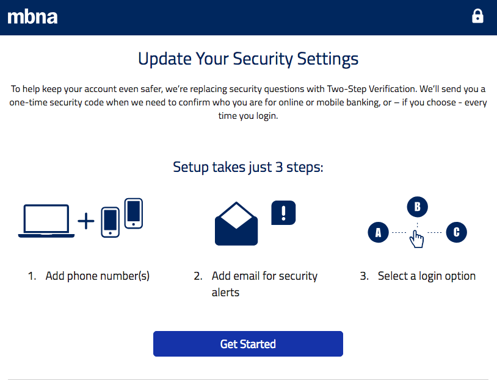
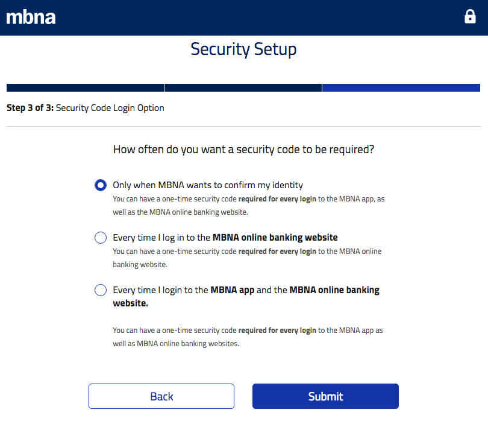

Security questions can add an extra layer of certainty to your authentication process.

Security questions are an alternative way of identifying your consumers when they have forgotten their password, entered the wrong credentials too many times, or tried to log in from an unfamiliar device or location.

So, how do you define a good security question? We have come up with some basic guidelines that will help you create the best ones. 

## What Makes a Good Security Question

The best security questions make it easy for legitimate consumers to authenticate themselves without worrying about their account being infiltrated.

*   If a question is too hard to answer due to complexity or changing circumstances, it can end up wasting your consumer’s time—and ultimately, it may keep them locked out of their account.
*   If the answer is too quickly researched or there are too few possible answers, it can be easy for an attacker to gain access by guessing correctly.
*   If the answer has favorite foods or colors, they change over time.
*   If the answer has birthdays, it can be easy for an attacker to find online.
*   If the answer has a school name or location too, such information is easily available for attackers.

You can minimize both of these outcomes by creating good security questions. \
 \
_According to the Good Security Questions_ _[website](https://goodsecurityquestions.com/), answers to a good security question should meet these criteria:_

1. Safe: Cannot be guessed or researched.
2. Stable: Does not change over time.
3. Memorable: Can be remembered.
4. Simple: Is precise, easy, and consistent.
5. Many: Has many possible answers.

_You can see examples of good security questions from the_ _[University of Virginia](https://sites.google.com/site/pwordsecuritykate/home/list-of-ideas-security-questions). Let’s take a look at each of these criteria in more detail._

### 1. Safe

When choosing security questions, it’s extremely important that the correct answers cannot be guessed or researched over the internet.

Here’s an example of a question that fails to meet these rules:

_“In what county were you born?”_

This question could be considered unsafe because the information can be found online. Also, this information may be common knowledge to friends and family members.

Aside from these issues, if a hacker was interested in a specific account, it might be easy to brute-force their way past this question since there are only a fixed number of counties in each US state.

### 2. Stable

A good security question should have a fixed answer, meaning that it won’t change over time.

A good example of a security question with a stable answer:

_“What is your oldest cousin’s first name?”_

This example works because the answer never changes.

Note: Questions like this one might not apply to all users. Asking about someone’s wedding anniversary or cousins does them no good if they have never been married or have no cousins! It’s important to offer your consumers several questions to choose from to make sure they apply.

Some examples of questions with unstable answers:

_“What is the title and artist of your favorite song?”_

_“What is your work address?”_

Both of these examples make for poor security questions because their answers will change for most people over time. Many people change their minds about their favorite things over the course of their lives, and they also may change jobs or move to a different office location.

### 3. Memorable

A good security question should be easily answered by the account holders but not readily obvious to others or quickly researched.

Examples of good memorable questions:

_“What is your oldest sibling's middle name?”_

Most consumers who have siblings know their middle name off the top of their heads, making this a good example of a memorable security question. This question is also excellent because someone would have to do quite a bit of digging to first find out who the consumer’s oldest sibling is, and then find their middle name in order to crack this question.

_“In what city or town did your mother and father meet?”_

Most consumers know the answer to a question like this, making it fit the criteria of being memorable. It is also more difficult to guess or research this fact. Best of all, it fits the stability criteria as well.

Some examples of questions with unmemorable answers:

_“What is your car’s license plate number?”_

Many people don’t have their license plate number memorized. Also, it’s relatively simple for a potential intruder to do some digging and find this information for themselves.

_“What was your favorite elementary school teacher’s name?”_

The answer to this question may be quick to recall for someone younger, but for older consumers, things from their childhood can be a lot foggier. So answers to such questions might not come so easily. It’s good practice to try to avoid questions from a consumer’s childhood.

### 4. Simple

A simple question has a precise answer that doesn’t create confusion.

Some examples of questions with simple answers:

_“What was your first car’s make and model? (e.g. Ford Taurus)”_

_“What month and day is your anniversary? (e.g. January 2)”_

These both make for good security questions because the answers are specific. These questions show consumers how to format their answers in a memorable, simple way.

These questions can also be asked in a way that doesn’t give simple, precise answers:

_“What was your first car?”_

_“When is your anniversary?”_

### 5. Many

A good security question should have many potential answers. This makes guessing the answer much more difficult and will also slow down automated or brute-force attempts at gaining access to the consumer’s account.

An example of a question with many possible answers:

_“What is the middle name of your oldest child?”_

A question with too few possible answers:

_“What is your birth month?”_

## But wait. Is there any such thing as a good security question?

By their very nature, even so-called good security questions are vulnerable to hackers because they aren’t random—users are meant to answer them in meaningful, memorable ways. And those answers could be obtained through [phishing](https://www.loginradius.com/blog/2018/02/phishing-for-identity), social engineering, or research.

There’s a scene in the movie _[Now You See Me 2](https://en.wikipedia.org/wiki/Now_You_See_Me_2)_ where a magician tricks his target into giving him the answers to his bank security questions. The magician guesses the answers and his target corrects him with the actual information. It’s a fictional example, but the phishing mechanics are real.

Many social media memes tap into the answers to common security questions, such as the name of your first pet or the street you grew up on. So by innocently posting your superhero name or rapper name on Facebook, you’re inadvertently sharing important personal information.

## What Authentication Methods are Good Alternatives to Security Questions

Passwords and security questions aren’t the only methods for locking down consumer accounts. A good [CIAM](https://www.loginradius.com/blog/2018/03/top-5-business-objectives-that-ciam-solves) solution offers several secure alternatives:

### Multi-factor authentication

[Multi-factor authentication](https://www.loginradius.com/two-factor-authentication/) is a much more robust and secure method of consumer authentication that relies on two or more ways of verifying the consumer’s identity. Typically, the consumer will be required to present something that they know, something they possess, and/or something they are. Some examples of these different factors are:

*   Something they know: A password, pin code, or an answer to a security question.
*   Something they possess: Such as a bank card, key, or key fob.
*   Something they are: A scanned fingerprint or retina, voice or face recognition.

As an example, the [MBNA bank](https://www.mbna.ca/) recently decided that security questions were not doing enough for them and their consumers to keep their accounts safe. To upgrade their security, they decided to go with two-factor authentication instead of security questions in order to verify their consumer’s identities.

_Source: MBNA website_

 
In these screenshots, you can see that the transition from security questions to two-factor authentication was fairly seamless for MBNA consumers. They even had the option to choose how often they would be prompted to provide a security code as their second factor.

_Source: MBNA website_

### Strong password rules

By requiring your consumers to follow [strong password rules](https://www.loginradius.com/blog/2018/12/infographic-the-death-of-passwords/), you minimize the risk of hackers brute-forcing their way into their accounts. Lengthy alphanumeric passwords with special and non-repeating characters are much more difficult for an attacker to guess. It also takes significantly longer for brute force programs to break in.

### Passwordless Login

[Passwordless Login](https://www.loginradius.com/passwordless-login/) takes the password right out of the equation. consumers log in with a key fob, a biometric such as a fingerprint, or a magic link. This login method eliminates the issue of consumers forgetting passwords entirely, and it also makes it impossible for hackers to crack their accounts by brute-forcing.

## Conclusion

If you’re interested in learning why passwords are slowly becoming a thing of the past, download our e-book [The Death of Passwords](https://www.loginradius.com/resource/the-death-of-passwords/). There are better authentication methods than passwords and security questions available for your company—and with support from LoginRadius, you can adopt them quickly and easily.

