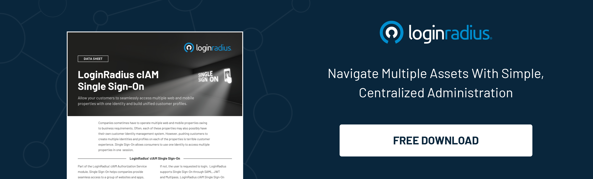

## Introduction

Though most platforms have already offered [passwordless authentication](https://www.loginradius.com/passwordless-login/), many are still relying on conventional password-based authentication. 

Username and password authentication is a widely used method of verifying the identity of users accessing digital systems. It involves a user providing a unique identifier, called a username, and a secret, called a password, to gain access to a system. 

While this method is convenient and widely used, it is also vulnerable to attacks and breaches, making it essential for organizations to implement [best practices for secure authentication](https://www.loginradius.com/blog/identity/login-security/). 

And we know it’s crucial to ensure robust password authentication security since failing could lead to financial and reputational damages. 

Let’s discuss the best practices for username and password authentication to ensure the highest level of security for both users and organizations. 

## Brief Overview of the Importance of Secure Authentication

In an increasingly digital world, where sensitive information is shared and stored online, secure authentication is paramount. The use of usernames and passwords is a fundamental method for verifying user identity. It serves as the first line of defense against unauthorized access to personal data, financial information, and other sensitive resources.

Effective authentication not only protects users' accounts but also safeguards the reputation and trust of organizations. Breaches in authentication can lead to severe consequences, including financial losses, data theft, and damage to brand reputation. Hence, implementing robust authentication practices is crucial to mitigate these risks.

## What is Username and Password Authentication?

Username and password authentication is a method of verifying the identity of a user accessing a digital system. The user provides a unique identifier, called a username, and a secret, called a password, to gain access. The system then compares this information with its stored database to verify the user's identity.

## Benefits of Username and Password Authentication

Username and password authentication is a fundamental and widely used method of verifying the identity of users accessing online systems, websites, and applications. 

It serves as a crucial line of defense against unauthorized access and protects sensitive information from falling into the wrong hands. The primary purpose of username and password authentication is to ensure that only authorized individuals with valid credentials can access restricted resources.

The importance of username and password authentication lies in its ability to establish a unique identity for each user, thereby enabling personalized access to various services while maintaining security. 

By requiring users to provide a username and password combination, organizations can effectively control access to confidential data, mitigate the risk of data breaches, and protect user privacy.

However, it is essential to acknowledge that username and password authentication, while widely used, has its limitations. Weak or easily guessable passwords, password reuse across multiple platforms, and the risk of password leaks or phishing attacks can undermine the effectiveness of this method. 

To enhance security, it is crucial to follow best practices such as enforcing strong password requirements, implementing multi-factor authentication (MFA), and regularly updating and monitoring user credentials.

## How to Implement Password Authentication?

To implement password authentication, organizations should follow the following steps:

* **Create a firm password policy:** This policy should define passwords' minimum length, complexity, and expiry time. Passwords should be long, complex, and changed regularly.

* **Use salted and hashed passwords:** Passwords should be salted and hashed before storing them in the database. Salting adds random data to the password before hashing, making it more challenging to crack.

* **Implement multi-factor authentication:** [Multi-factor authentication](https://www.loginradius.com/multi-factor-authentication/) (MFA) adds an extra layer of security by requiring a second form of authentication, such as a fingerprint or a code sent to a mobile phone.

* **Using risk-based authentication (RBA):** RBA helps automatically add a stringent authentication layer to the existing authentication mechanism whenever an unusual authentication attempt is detected. RBA is one of the robust authentication security mechanisms specially designed for high-risk situations. 

* **Use password managers:** Password managers are tools that store and generate complex passwords for users, reducing the risk of users choosing weak passwords.

## What are Some Challenges of Password Authentication?

Password authentication has several challenges, including:

* **Password reuse:** Users often reuse the same password across multiple systems, making them vulnerable to attacks if one system is breached.
* **Password guessing:** Attackers can use automated tools to guess passwords, mainly if they are weak or easily guessable.
* **Password sharing:** Users sometimes share their passwords with others, either intentionally or unintentionally, compromising security.
* **Phishing attacks:** Attackers can use [phishing for identity](https://www.loginradius.com/blog/identity/phishing-for-identity/) to trick users into revealing their passwords.

## Best Example of Username and Password Authentication

One notable example of effective username and password authentication can be observed in the login system used by popular social media platforms such as Facebook. Facebook's login process employs a combination of a username or email address and a password to authenticate users and grant access to their accounts.

When a user attempts to log in to their Facebook account, they are prompted to enter their registered email address or username, followed by their password. Facebook employs various security measures to ensure the integrity of this authentication process. 

These measures include robust password hashing techniques to store passwords securely, detection mechanisms for suspicious login attempts, and the option to enable additional security layers, such as two-factor authentication (2FA) using SMS or authentication apps.

By implementing username and password authentication effectively, Facebook enables its users to secure their accounts, safeguard personal information, and maintain control over their online presence. This example highlights the importance of combining a unique username or identifier with a strong password to authenticate users and protect their digital identities.

## What are Password Authentication Methods?

There are several [password authentication](https://www.loginradius.com/standard-login/) methods, including:

* **Plain-text passwords:** This is the simplest method, where passwords are stored in plain text in the database. However, it is highly insecure and should be avoided.

* **Encrypted passwords:** Passwords are encrypted before storing them in the database. However, attackers can easily crack encryption, making this method less secure.

* **Hashed passwords:** Passwords are hashed before storing them in the database. Hashing is a one-way function that cannot be reversed, making it more secure than encryption.

## What are Password Alternatives?

Since the digital world demands seamless user experience and security, conventional password-based authentication isn’t potent to serve the same. Hence, there’s an immediate need for password alternatives that can help balance user experience and security in a way that fosters overall business growth. 

There are several password alternatives that organizations can consider, including:

* **Biometric authentication:** [Biometric authentication](https://www.loginradius.com/blog/identity/biometric-authentication-mobile-apps/) uses unique biological characteristics, such as fingerprints or facial recognition, to verify a user's identity.

* **Social Login:** Social login enables users to use their current social media accounts to sign in or sign up for a new account. With social login, the need to create a new account on a different platform is eliminated. Users can use their existing social media accounts, including Facebook, Gmail, Instagram, etc., to sign-up for a platform. 

* **Single sign-on (SSO):** Single sign-on allows users to access multiple systems with a single login credential. SSO offers a seamless user experience between multiple interconnected applications and ensures zero friction while users switch from one application to another since they need not re-authenticate themselves while switching. 

## Best Practices for Password Storage and Transmission

Many businesses aren’t aware of the fact that a little glitch in handling passwords or storage could lead to severe consequences. And companies may end up losing brand reputation and even millions of dollars. 

To ensure secure password storage and transmission, organizations should follow these best practices:

* **Use a secure transmission protocol:** Passwords should be transmitted over a secure protocol, such as HTTPS, to prevent interception by attackers.

* **Salt and hash passwords** should be salted and hashed before storing them in the database.

* **Store passwords in a secure location:** Passwords should be stored in a secure location with restricted access.

* **Monitor password attempts:** Organizations should monitor failed passwords to detect and prevent brute-force attacks.

## LoginRadius Features for Enhanced Authentication

* **Multi-Factor Authentication (MFA):** One of the key features of LoginRadius is its robust Multi-Factor Authentication (MFA) system. MFA adds an extra layer of security by requiring users to provide two or more forms of verification before gaining access. This could include something the user knows (like a password), something they have (such as a mobile device), or something they are (like biometric data).

* **Password Policy Enforcement:** LoginRadius allows organizations to enforce strict password policies. Administrators can set requirements for password length, complexity, and expiration. This ensures that users create strong, unique passwords and regularly update them, reducing the risk of password-based attacks.

* **Risk-Based Authentication (RBA):** LoginRadius implements Risk-Based Authentication (RBA), an intelligent system that evaluates each login attempt based on various factors. If a login appears unusual or risky, such as from an unfamiliar location or device, RBA can prompt additional verification steps. This adaptive approach strengthens security without inconveniencing legitimate users.

* **Passwordless Authentication:** While traditional passwords are prone to vulnerabilities, LoginRadius offers passwordless authentication options. This includes methods such as email magic links or one-time passcodes (OTPs) sent to a user's registered email or phone. By eliminating passwords, this approach reduces the risk of credential theft and simplifies the login process for users.

## Future Trends in Authentication

* **Biometric Authentication**: With the rise of [biometric technology](https://www.loginradius.com/blog/identity/biometric-authentication-mobile-apps/), such as fingerprint and facial recognition, we can expect to see wider adoption of biometric authentication methods. These unique biological identifiers offer convenience and heightened security, as they are difficult to forge or replicate.

* **Blockchain-Based Authentication:** Blockchain technology provides a decentralized and tamper-resistant way to store authentication data. This could revolutionize authentication by eliminating the need for centralized identity providers, enhancing privacy, and reducing the risk of data breaches.

* **Continuous Authentication:** Rather than relying on a single login event, continuous authentication monitors user behavior throughout a session. This ongoing assessment can detect suspicious activities and prompt re-verification, ensuring that access remains secure even after the initial login.

* **Zero Trust Architecture:** The [Zero Trust model](https://www.loginradius.com/blog/identity/beginners-guide-zero-trust-security/) assumes that threats can come from both external and internal sources. It advocates for strict access controls and verification at every stage of interaction, regardless of the user's location or device. This approach minimizes the attack surface and enhances overall security posture.

These additional sections expand on the blog post, providing insights into the importance of secure authentication, highlighting features of LoginRadius for enhanced security, and discussing future trends that will influence authentication practices.

## Conclusion 

Username and password authentication is a widely used method of verifying the identity of users accessing digital systems. While this method is convenient, it is also vulnerable to attacks and breaches. 

Organizations should implement best practices to ensure secure authentication, such as creating a firm password policy, using salted and hashed passwords, implementing two-factor authentication, and using password managers. 

Additionally, organizations should consider password alternatives, such as biometric authentication or single sign-on, to enhance security. By following these best practices, organizations can better protect their users' identities and sensitive data from attacks and breaches.

## Frequently Asked Questions (FAQs)

**1. How does authentication ensure that the username and password are correct?**

Authentication checks if the entered username and password match the stored credentials.

**2. What are the 3-factor authentication for username and password?**

3FA involves using three different authentication factors for verification.

**3. What is the strongest authentication factor?**

The strongest authentication factor varies, but biometrics like fingerprint or iris scans are considered highly secure.

**4. Would a username and password be considered multi-factor authentication?**

No, a username and password alone are not considered multifactor authentication.

**5. What is the authentication method that uses usernames and passwords?**

The authentication method that uses usernames and passwords is known as "username and password authentication."

**6. What is the best practice for user authentication?**

The best practice for user authentication includes creating a firm password policy, using salted and hashed passwords, implementing multi-factor authentication (MFA), and using password managers.

