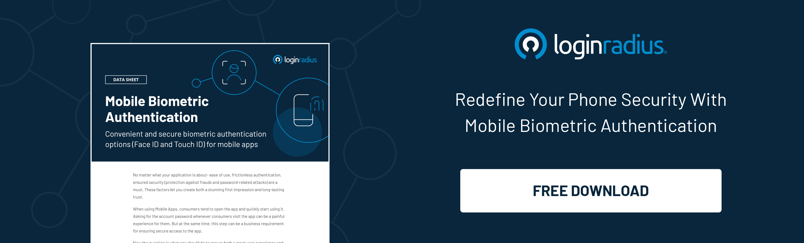

No matter what your application is for, it is a must to have ease of use, frictionless authentication, and guaranteed security (against fraud protection and password-related attacks). These variables help you to build both a spectacular first impression and long-lasting confidence.

When [using mobile apps](https://www.loginradius.com/blog/start-with-identity/2020/11/authentication-sso-native-mobile-apps/), consumers prefer to open it and quickly start using it. It can be a frustrating experience for them if you keep asking for the account password every time they open the app. But then, it is also a business necessity to ensure safe access to the app.

So, how do you offer a great experience and security at the same time? 

The LoginRadius Mobile Biometric Authentication can help. The feature is dedicated to mobile apps and allows consumers to use their mobile devices' FaceID and TouchID for authentication. 

## Intend Behind the Launch

With Mobile Biometric Authentication, consumers can use their existing FaceID or TouchID for authentication without any additional effort.

Also, consumers' biometric data remains stored on their phone rather than the server, making it even more secure. 

Let's underline some of the major benefits of Mobile Biometric Authentication.

*   Since biometric data cannot be hacked or duplicated, the feature protects consumers against [account takeover attacks](https://www.loginradius.com/blog/start-with-identity/2020/04/corporate-account-takeover-attacks/). 
*   It ranks high on the usability quotient as consumers need not remember or enter a new password or PIN. Also, consumers don’t need to worry about resetting their credentials since there is no use case of forgetting one’s biometric credentials like fingerprint or face. 
*   Consumers have already been authenticating themselves using Face ID and Touch ID on their Android and iOS devices.  Thus, they are already familiar with the method. 
*   For biometric authentication, physical proximity is required if hackers want to bypass the login process. Cybercriminals coming into the physical proximity of the actual consumer is rare. 

## Key Features Offered by LoginRadius

LoginRadius offers local authentication with Touch ID and Face ID for Android and iOS devices—provided the consumers' mobile devices also support these features.

*   **Touch ID:** This feature lets you authenticate consumers using their Fingerprint. Consumers can use fingerprints that are the same as already set for their Android or iOS mobile devices without having to go through the entire setup process on your app. 
*   **Face ID:** This feature lets you authenticate consumers using their Face. Similar to Touch ID, the Face ID remains the same as already set for the consumer's Android or iOS mobile device. They need not go through the Face ID setup process on your app as well. 

You can configure both authentication options for your app and later, ask the consumer to choose according to their preference or the option available with their device. 

## Conclusion

The Mobile Biometric Authentication by LoginRadius is a local authentication concept and consumers' biometric data don't even leave their mobile devices. Hence, as a business, you don't need to worry about storing, processing, and securing your consumer's biometric data. 

