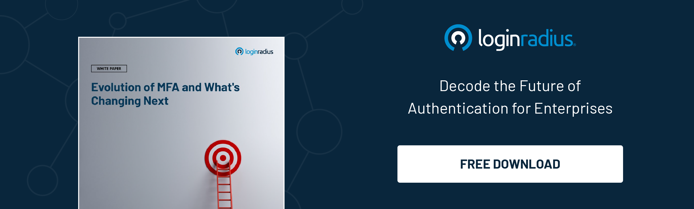

**Biometric authentication multi-factor authentication** is the best line of defense that stands between protecting your organization's sensitive information and your customers’ digital identity and potential cyber-attacks. As technology evolves, it is time to move past the traditional usernames and passwords because it increases the risk of cyber-attacks and creates friction in the customer journey.

Nowadays, **multi-factor authentication** is garnering significant attention as businesses are future-proofing their IT infrastructure. Multi-factor authentication provides an additional layer of security over traditional usernames and passwords, where the user proves the identity through multiple methods. There are different ways to [implement multi-factor authentication](https://www.loginradius.com/multi-factor-authentication/), and biometric authentication is one of the methods. Let’s learn why biometric authentication is the best way to implement MFA in your systems and applications. 

## Overview of Multi-Factor Authentication (MFA)

Multi-factor authentication is an authentication process where the customers or users have to provide two or more than two factors to gain access to sensitive information or complete a transaction. Usernames and passwords are vulnerable to brute-force attacks, besides third-party apps can easily steal them. It is where multi-factor authentication comes in, where users are required to provide additional verification information. 

The main aim behind MFA is to verify that you are who you say you are. The multi-factor authentication can be broadly classified into three categories: 

1. Knowledge-based authentication is when the user knows about something, like a password or PIN. 

2. Possession-based authentication is when the user has access to a device like SMS OTP sent to the user’s mobile phone. 

3. Inherence-based or biometric authentication is based on something that the user inherits, like fingerprints. 

Now, the first two, knowledge and possession-based authentication, can create friction in the customer journey, negatively impacting the user experience. 

Now, high security doesn’t come at the price of losing a sale, and that’s why **multi-factor authentication using biometrics** is the most secure and usable method to protect your customers and enhance the user experience. 

## What is Biometric Authentication?

Biometrics authentication uses the user’s unique biological attributes, like fingerprint patterns, facial features, and iris structure, to identify and verify the user’s identity. During the first interaction with the application, the information is recorded, and a biometric profile is created against the customer’s name to represent their digital identity. 

**[Biometric authentication techniques](https://www.loginradius.com/blog/identity/what-is-mob-biometric-authentication/)** provide a better sense of security to the users and make customer identification for businesses easier, a win-win situation for both parties. Facial recognition biometric authentication method ensures businesses that they are dealing with the right person because if the device is stolen, no one can get access to it because they cannot replicate the user’s face. 

If you are wondering if a photo of the user can unlock the device, then it is not possible because liveness detection is a part of biometric verification. This feature ensures that an online person is a real person by detecting if the face presented on the camera screen is a real person. If anyone uses a photo or a mask, it won’t pass the liveness assessment, hence denying access. However, not all liveness assessments are the same, and it is essential to choose the right multi-factor authentication vendor. 

## Seven Reasons Why to Choose Biometrics in Multi-Factor Authentication

Here are the seven reasons why multi-factor authentication using biometrics is the best and safest option: 

### 1. Convenient

Biometric authentication methods are convenient as there is no need to reset the passwords. If the multi-factor authentication process isn’t simple, users are most likely to abandon the process. However, in the biometric authentication process, once the test is activated, all the fingerprints, iris, and facial recognition are done, and your employees or customers are good to go. You can even log the data and audit it conveniently. 

### 2. Security

The key factor differentiating biometrics authentication from other multi-factor authentication methods is its security. It ensures and [verifies that each person is the right and real person](https://www.loginradius.com/blog/identity/what-is-identity-verification/), eliminating the fraudsters and imposters from spoofing the system. 

### 3. Profitable

Implementing other authentication methods requires specialized software, and integrating it with other systems can be expensive. The best part of implementing the biometrics authentication method is there is no need to invest in additional capital once the biometric verification system is integrated. It significantly reduces upfront investment costs and prevents the risks of loss due to fraud and illegal entries. 

### 4. Scalable

Your business will grow, and you’ll require heightened security measures to accommodate its growing needs without compromising security. The [highly scalable system](https://www.loginradius.com/scalability/) can easily incorporate additional employee and user data without compromise. 

### 5. User-friendly

Managing, fitting, and analyzing biometric verification is user-friendly as it offers technical and accurate results with minimal time required for intervention. Businesses can enter new data quickly and analyze the logs swiftly. Besides, when used for employees, it simplifies key functions, like attendance tracking for payroll. The employees do not have to carry the cards everywhere with biometric verification installed in the office premises. 

### 6. Accurate

**Multi-factor authentication using biometrics** provides accurate authentication as it might be easy to gain access using passwords or OTPs; however, an individual's identity cannot be forged. Besides, with liveness detection, the imposter will not get access because this technique comprises an algorithm that analyzes data collected from biometric sources to determine whether the source is live or reproduced. 

### 7. Mitigate cybercrimes

When fraudsters or hackers get their hands on the user’s identity, they can commit crimes like money laundering, opening fake accounts, financing terror, and creating fake identities to issue credit cards. Biometric verification utilizes unique characteristics to identify and verify the person, reducing the risk of committing such fraud. 

## Conclusion

Implementing **multi-factor authentication through biometrics** is an emerging trend to create a secure work environment for your end-users. Biometrics verification protects the data and keeps the information secure through encryption, secure storage, data minimization, secure data transmission, and Anonymization and Pseudonymization. [Customer Identity Access and Management solutions](https://www.loginradius.com/), like LoginRadius, can help businesses implement robust MFA authentication methods easily. 

