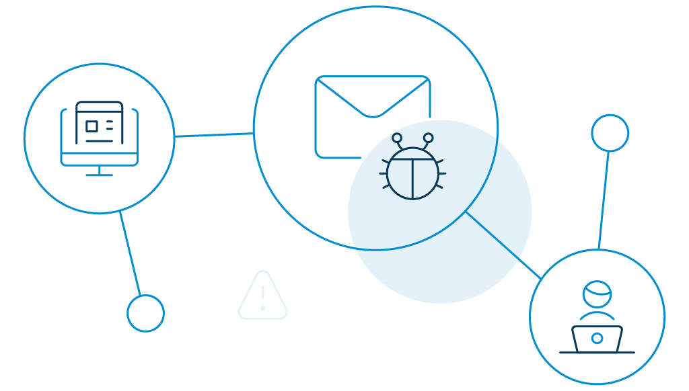

A website is incomplete without a contact form. Depending on the company’s requirements, there are several implications where they may be added. For example, they may be included as a permanent element or used as a sudden appearing pop-up on websites. 

It is no surprise that the contact form attracts a lot of bot attacks. Hackers not only create false traffic, resulting in damages to brand images, it also results in malicious attacks on websites. The objective of this blog is to help you to secure contact form. 

We will explore the various methods that can be used to prevent bots from submitting forms and not fall into a random audacious attack.

# What Is a Spambot?

A spambot is a malicious program or unethical activity specially designed to gather email addresses or information from contact forms. It is usually done by sending spam emails. 
As emails have a distinct structure, a bot creation process is easy for hackers. Hence, you need to be extra cautious while using contact forms for your website or important marketing campaigns. 

Here are some proven ways that will help your secure contact forms from spambots.

## 12 Best Ways to Stop Bots From Filling Out Forms

### 1. “Add Google reCAPTCHA.”

One of the most common ways to stop bots from filling up your form is to add CAPTCHA to the contact form. It offers an intelligent program that ensures that users who are filling out forms are actually humans. 
The process is simplified by Google with reCAPTCHA and can be used as a protective practice against bots. However, this is not a silver bullet but effective against basic bots. Also, you might be sacrificing some bit of [user experience for security](https://www.loginradius.com/blog/start-with-identity/2018/10/digital-transformation-safeguarding-customer-experience/)

### 2. “Secure contact forms using a double opt-in form.”

Double opt-in forms make the signup process more secure and help to create spam-free contact forms. For example, it will send a confirmation link to your email address when you enter the email address. Humans generally feel comfortable with the process, but bots skip this step. 

### 3. “Add a test question to your contact form.”

Add some [tricky questions](https://www.loginradius.com/blog/start-with-identity/2019/01/best-practices-choosing-good-security-questions/) to your form that are easy to understand by humans, but confuse the bots. However, make sure you put some common questions; otherwise, it may frustrate your potential subscribers.

### 4. “Add Honeypots.”

Honeypots are hidden fields that are added to the user registration form to prevent bots from submitting forms. Users cannot see these, but bots can detect them. In this way, if the information is provided for that hidden field, it alerts you that a spambot is trying to fill the form. This unseen field can be programmed using CSS or HTML.  

### 5. “Implement time-analysis.”

This is again a great way to identify spammers since humans usually will take some time to fill out all the fields of a form while bots can do it instantly. So, measuring the time taken to fill a form can be helpful when finalizing your contact list.

### 6. "Hide target request."

Since bots target sensitive information, these should not be made available from the browser side. These can be added from your server-side, to which no one will have access. 
Use the form as just a medium to collect the information. If the data is not taken through the browser, you can protect your data easily. You can also make your form more secure if you allow only one signup from one IP address.

### 7. "Form validation after geolocation of the IP address."

You can also control the location from which the contact forms are being filled. For example, if you have been witnessing a lot of spam activities from a particular location/country or IP address, you can permanently block such addresses or geolocations. 

### 8. Use a web application firewall.

By adding a web application firewall, it is possible to manage [severe attacks](https://www.loginradius.com/blog/start-with-identity/2019/10/cybersecurity-attacks-business/) and prevent bots from spamming your forms. 

### 9. Blacklist IPs and limited IP addresses.

If you notice some suspicious activities from a particular IP address, don’t hesitate to block it permanently. Another option is to set a limit for each IP. For example, you might allow only ten forms to be filled from each IP address.

### 10. Beware of Cross-Site Request Forgery (CSRF).

A CSRF or XSRF attack usually focuses on executing an operation in a web application on behalf of the user but without consent. To prevent such an event from happening, make sure that the request you receive is from the server and that it is a legitimate one. 

A popular approach to know that the request sent is valid is to use a CSRF token, which stores the value of the matching token on the server. You can also adopt the double submit cookie approach in which the server stores the matching token value in the form of a cookie. The server then checks this value with the hidden field value when it receives a request. 

### 11. Validate email addresses and phone numbers.

It can be fairly easy to determine whether the email submitted in the form is linked to a working inbox or not by using an email address [validation API](https://www.loginradius.com/blog/engineering/best-practice-guide-for-rest-api-security/). This will also tell you whether the email has engaged in any abusive behavior. 
Since bots will use invalid email IDs most of the time, verifying the email addresses can give a good layer of protection to your site against bots. 

### 12. Block copy and paste in your forms.
Another way to prevent contact form spam is to disable the right-click functionality. Your contact forms will only be secured from human spammers who copy and paste their details into your forms. You would also have the added advantage of keeping anyone from stealing content from anywhere on your platform.

## Stay Rest Assured with LoginRadius
LoginRadius offers all the options mentioned above to secure contact forms from spam or fake signups. The consumer identity and access provider also offers world-class security for consumers to ensure that their data is safe during login, registration, password setup, and any other data touchpoints. 
The [CIAM platform](https://www.loginradius.com/) is a powerhouse of open source SDKs, pre-designed and customizable login interfaces, and robust data security products such as MFA, RBA, and Advanced Password Policies.    

## Final Words
Spambots will not go anywhere so soon. Take your time and learn to implement these strategies to make things easier for you in the long-run. It demands a lot of effort and practice to implement these ideas, but the result is worth it. 

