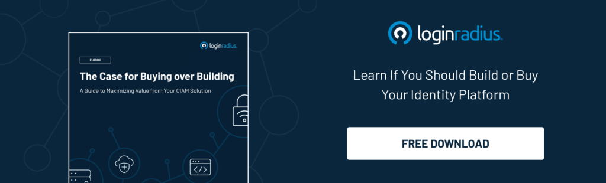

Customer Authentication and Identity platforms offer a seemingly, complex web of tools that touch every aspect of a customer-facing business and can have a significant impact on your bottom line. 

Most businesses with legacy systems are stuck between choosing to maintain an existing in-house system, investing in building a new in-house system, or working with a vendor. Making 

the wrong decision can be expensive, time-consuming, can put you at risk of a data breach, and may only keep you in regulatory compliance in the short-term. 

Working with an identity vendor who is an expert in the space is the safest and most economical approach to avoiding the pitfalls I mentioned above. 

A modern solution offers short-term wins and long-term value, highlighted by:

*   Reducing costs.
*   Boosting revenue.
*   Ensuring your data is protected.
*   Allowing your business to be more adaptable in a shifting technological and legal landscape. 

Mix those benefits in with a speedy implementation period, and your teams can get back to focusing on innovating and growing your business. 

This blog is a multi-part series where we will outline the value of working with LoginRadius over maintaining and building up your existing systems.

## Time, Effort, and Maintenance

Most businesses that hesitate to invest in a vendor solution are often unaware of how much their existing approach is costing them – and not just in money. 

To understand why a vendor approach is so economical, we must first outline the existing costs associated with maintaining an outdated and decentralized authentication and identity system.

At the end of this section, you should have a blueprint for understanding what your internally built system costs to run today. 

Use a chart like the one below to enter your costs. Remember, even rough estimated will very quickly outline the scale of these costs:

*   **Assigned staff**: Maintaining an authentication and identity offering is usually a full-time job for at least one developer. Larger businesses with more complex use-cases may require multiple developers to manage these systems. Enter the total salary of the staff members assigned to these functions. You may also use a percentage of an annual salary if a team member is not dedicating 100% of their time to this work. 
*   **Adding or fixing features**: In any given year, a business will undertake several projects related to their authentication or customer data management systems. This work can include maintaining integrations, building new integrations, maintaining authentication systems, adding new features, and [fixing broken features](https://www.loginradius.com/resource/fixing-broken-authentication-with-adaptive-mfa/). Enter the total salary of the staff members assigned to these functions. You may also use a percentage of an annual salary if a team member is not dedicating 100% of their time to this work.
*   **Customer service**: Dealing with authentication-related issues such as lost passwords take up most of a support desk’s time. Try to calculate a percentage of their salaries as it relates to these efforts.

<table>
  <tr>
   <td>
#
   </td>
   <td>Item
   </td>
   <td>Amount ($)
   </td>
  </tr>
  <tr>
   <td>1
   </td>
   <td>Assigned Staff Salary Totals
   </td>
   <td>
   </td>
  </tr>
  <tr>
   <td>2
   </td>
   <td>Adding or Fixing Features Totals
   </td>
   <td>
   </td>
  </tr>
  <tr>
   <td>3
   </td>
   <td>Customer Service Salary Totals
   </td>
   <td>
   </td>
  </tr>
  <tr>
   <td>4
   </td>
   <td>

Total

   </td>
   <td>
   </td>
  </tr>
</table>

The maintenance costs of in-house Authentication and Identity are pretty high even if we only define “maintenance” as keeping the existing system working properly. 

When businesses embark on a project to improve or update those systems, those costs skyrocket – entire teams of developers, project managers, and executives must turn their efforts towards these pushes. 

Customer service efforts make up a huge chunk of the hidden costs associated with legacy authentication systems. These teams see large swaths of their time drained by dealing with end-users trying to reset their passwords, recover their accounts, cancel memberships, revoke access to data, and more.

## Case Study

One of our news and media customers told us a story about a project they took on a couple of years before working with us. It started with a question: _Do we want to add Google as a social login option to our website? _

They launched a research team that was asked to determine whether their users would leverage that option enough to make a difference in conversion; these findings had to be presented to leadership, and then a decision had to be made by that group. Once that decision was, they assigned a project manager and a series of front-end and back-end developers to update their site and apps with the new login option. This involved developing the social login connectors, QA testing, staging environments, then a go-live team for their web and mobile offerings. This effort took over four months to complete. 

This same project would take LoginRadius customers no more than a couple of weeks. How?

Well, the connectors are already built. We have detailed step-by-step guides in our documentation. Our support is available 24/7/365 to help solve any issues, and our dashboard-driven deployment tools offer pre-built and customizable options from a UI/UX perspective. 

If the business decision is already made, you could easily add a [social login](https://www.loginradius.com/blog/start-with-identity/2021/02/social-login-infographic/) option to your website and mobile apps in the afternoon and go live that same night – we know this because we see our customers do it all the time!

**Stayed tuned for Part II of this series, where I will help you calculate lost revenue associated with authentication and system availability.**

