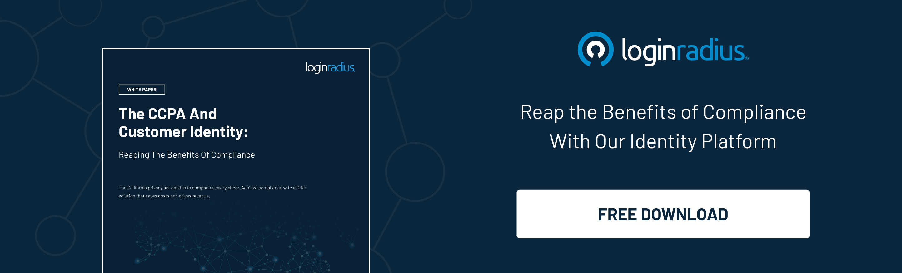

Every day, societies are becoming more digitized. Instead of speaking to a colleague, you’ll chat online. To hail a cab, just tap your phone screen. Need a doctor? There’s an app for that, too. All of this online activity gives businesses valuable consumer data (e.g., name, age, email addresses).

However, starting January 01, 2020, the way you collect, store, and share this data may land you in trouble. If you’re unsure how the **California Consumer Privacy Act (CCPA)** will impact your company, keep reading. This introduction to CCPA compliance focuses on the most common questions that businesses have today.

For more detailed information, including the major differences between GDPR and CCPA, [check out our infographic](https://www.loginradius.com/blog/identity/2019/09/ccpa-vs-gdpr-the-compliance-war/).

For now, let’s start with the basics.

## **What is the California Consumer Privacy Act?**

The CCPA’s goal is to give consumers more information and control over how their personal information is being used. It will apply to all businesses that handle or collect data from California residents.

What is residency based on? Basically, anyone who pays taxes to the State of California is a California consumer, whether they currently live in the Golden State or not_._ This California [residency law site](https://www.palmspringstaxandtrustlawyers.com/the-part-time-resident-tax-trap/) explains more:

_“Under California law, a person who visits the state for other than a temporary or transitory purpose is also a legal resident, subject to California taxation. Even visits can result in residency status. Examples of such visits include an indefinite stay for health reasons, extended stays (usually over six months), retirement, or employment that requires a prolonged or indefinite period to accomplish.”_

## **How do you comply with the California Consumer Privacy Act?**

Preparing for compliance can feel overwhelming. In fact, in a recent survey of American companies, nearly half had not begun implementing privacy policies ([TrustArc](https://www.trustarc.com/), 2019).

However, here are three ways you can get started now.

**Ensure that your decision-makers and key stakeholders know:**

*   What the CCPA is and who it concerns.
*   When it goes into effect: January 1st, 2020.
*   How CCPA rules affect your business practices.

**Document and organize customer information, so your company knows:**

*   Which personal information is being collected.
*   How personal information is being collected.
*   Where personal information is being stored.
*   Why personal information is being collected.
*   Where personal information is being shared.

This will help you set up an efficient system for information retrieval should a customer or auditor request that info. Enlisting a Data Protection Officer or a Data Protection Team to handle these requests is a good idea.

**Review and update your privacy policies.**

A GDPR Privacy Policy will meet CalOPPA/CCPA requirements, but a CalOPPA/CCPA policy might _not_ be GDPR-compliant. To be safe, be sure that your CCPA privacy policy is clearly defined and easily distinguishable from [GDPR regulations](https://www.loginradius.com/blog/2018/03/gdpr-will-affect-companies-use-data-target-customers/).

It’s also helpful to train your customer-facing employees on how privacy policies and CCPA compliance can [improve customer trust](https://www.loginradius.com/customer-trust/) and increase engagement.

## **CCPA 2.0: What You Need to Know About the New CPRA**

On November 3, 2020, the voters in California approved the Consumer Privacy Rights Act (on the ballot as [Proposition 24](https://ballotpedia.org/California_Proposition_24,_Consumer_Personal_Information_Law_and_Agency_Initiative_(2020)#California_Consumer_Privacy_Act_.28AB_375.29)) with 56.1% of the vote. This revised version of the CCPA will further strengthen the consumer privacy rights for California citizens. 

We are thrilled to announce the passage of [#Prop24](https://twitter.com/hashtag/Prop24?src=hash&ref_src=twsrc%5Etfw), the California Privacy Rights Act, with a decisive majority of Californians supporting the measure to strengthen consumer privacy rights. #California once again makes history and leads the nation!

— Yes on Prop 24 — [Californians for Consumer Privacy](https://twitter.com/caprivacyorg/status/1323998270369099776?ref_src=twsrc%5Etfw) (@caprivacyorg) November 4, 2020_

While some of the changes took effect immediately, the law would become effective on January 1, 2023 with the majority of the enforcement set for July 1 of that year. 

### CCPA 2.0: Key Aspects of the New CPRA

Most significant new additions include: 

*   **New type of personal information**: CPRA categorises a new kind of personal data - “sensitive personal information” that subsets elements like financial account number, social security number, and driver license number. The new law also includes (without limitation), a consumer’s racial or ethnic origin, religious beliefs, union membership, the content of email and text messages, consumers sex life and sexual orientation, and genetic information.
*   **New consumer rights**: California consumers will have the right to request to limit the use and disclosure of personal information. Consumers also will have the right to ask businesses to correct any inaccurate detail maintained by the business.
*   **Changes to the Notice at Collection**: Businesses will have to provide consumers a notice at collection. For example, the notice should come with a retention period for each category of  information, both personal and sensitive.
*   **Adds a data security requirement**: Businesses will have to implement security procedures and practices to protect consumer data from unauthorized access, destruction, use, modification, or disclosure. 
*   **Extension of the employee personal information and B2B exemptions**: CPRA extends the exemption for employee personal information and “B2B” personal information until January 1, 2023. 
*   **Protection for children’s data**: CPRA will impose fines on businesses for collecting and selling information of minors under 16 years. 
*   **Adds data retention requirement**: Businesses cannot retain consumers' personal or sensitive information for longer than reasonably necessary. 

### CCPA 2.0: Key Differences with the CCPA

<table>
  <tr>
   <td><strong>Parameter</strong>
   </td>
   <td><strong>CCPA</strong>
   </td>
   <td><strong>CPRA</strong>
   </td>
  </tr>
  <tr>
   <td>Consumer Rights
   </td>
   <td>
<ul>

<li>Right to Know/Access 

<li>Right to Delete 

<li>Right to Opt-out of Sale 

<li>Right to Non-Discrimination
</li>
</ul>
   </td>
   <td>All rights defined under the CCPA, plus: 
<ul>

<li>Right to Rectification 

<li>Right to Limit Use and Disclosure of Sensitive Personal Information 
</li>
</ul>
   </td>
  </tr>
  <tr>
   <td>Employee and B2B Exemption
   </td>
   <td>Expires on Jan 1, 2021 
   </td>
   <td>Expires on Jan 1, 2023
   </td>
  </tr>
  <tr>
   <td>Personal Information
   </td>
   <td>Information that identifies, relates to, describes, or could reasonably be linked, directly or indirectly, with a consumer or household. 
   </td>
   <td>Personal information, as well as “Sensitive Personal Information” which includes SSN, driver license numbers, biometric information, precise geolocation, and racial and ethnic origin etc. 
   </td>
  </tr>
  <tr>
   <td>Threshold Application
   </td>
   <td>It applies to businesses that collect personal information from California's consumers and meet any of the following:
<ul>

<li>A gross annual revenue of over $25 million.

<li>Buy, receive, or sell the personal information of 50,000 or more California consumers, households, or devices.

<li>Derive 50% or more of their annual revenue from selling California consumers’ personal information.
</li>
</ul>
   </td>
   <td>It applies to businesses that collect personal information from California's consumers and meet any of the following:
<ul>

<li>A gross annual revenue of over $25 million.

<li>Buy, receive, or sell the personal information of 100,000 or more California consumers, households, or devices.

<li>Derive 50% or more of their annual revenue from selling or sharing California consumers’ personal information. 
</li>
</ul>
   </td>
  </tr>
  <tr>
   <td>Enforcement
   </td>
   <td>
<ul>

<li>The Attorney General can pursue violations.

<li>Consumers have a private right of action for a breach. 

<li>Businesses will have a 30–day cure period before imposing fine.
</li>
</ul>
   </td>
   <td>
<ul>

<li>Consumers have a private right of action for a breach.

<li>Businesses will be fined immediately with no cure period. 
</li>
</ul>
   </td>
  </tr>
  <tr>
   <td>Use Limitation 
   </td>
   <td>N/A 
   </td>
   <td>Collection, retention, and use should be limited to what is necessary to provide goods or service. 
   </td>
  </tr>
</table>

## **How Businesses Should Prepare for the New CPRA**

The good news for companies is that the implementation of the CPRA will not begin until July 2023. So, organizations have some time to plan out their new data policies.

**Step up data deletion policies**

Under CPRA, businesses will have to delete personal data after it has served its purpose. So, here's what you can do.

Put an identity and access management (IAM) system in place to connect all personal data under centralized user profiles. With a single repository of consumer data, you can simplify compliance and abide more easily by the primary aspects of CPRA. They may include deleting personal data, making corrections, and offering reports to consumers upon request.

**Implement MFA for logins**

One way to improve the security of login credentials is by implementing multi-factor authentication (MFA). It puts a bar on automatic account access and enforces additional authentication layers such as a fingerprint or a one-time code in the event of an unusual login.

It is a simple effort to prevent broken authentication attacks, such as credential stuffing, in which exposed login credentials become the gateway for identity thieves. 

## **How does LoginRadius handle consent withdrawal?**

With the CCPA, your organization needs to prepare for consent withdrawal. The LoginRadius Identity Platform centralizes all your customers’ personal information. You can document and manage your [customers’ consent](https://www.loginradius.com/blog/2017/10/ciam-solves-gdpr-customer-consent/) including withdrawal.

Another core component of the CCPA is providing data access to auditors or customers, should they request it. With the LoginRadius Identity Platform, customer data is unified into one profile for easy access. You can also export it in an easy-to-read format.

Last but not least, LoginRadius provides [top-notch security](https://www.loginradius.com/security/) that monitors and protects your customer data. For example, our CIAM software can encourage your customers to use intelligent passwords, protect the data against brute force attacks from hackers, block access to suspicious IPs, and more.

### **Summary**

Following the old CCPA rules will _not automatically_ lead to CCPA 2.0 compliance; don’t wait to be sued to find out. Let LoginRadius help your business become globally compliant. Not only does our technology meet the new CPRA regulations, but we continuously update it to meet new international privacy laws.

