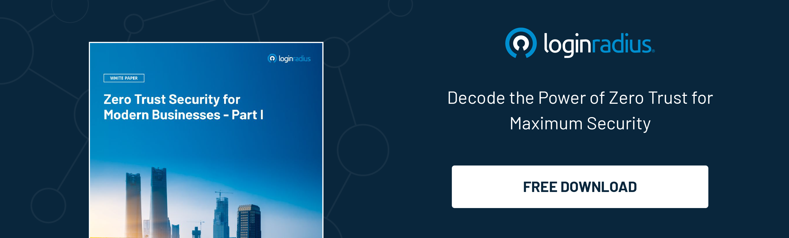

## Introduction

In today's digital age, where cybersecurity threats are omnipresent, adopting a zero-trust approach has become imperative for organizations looking to fortify their defenses. 

Zero-trust platforms for vendors play a pivotal role in implementing this security model, but selecting the right provider can be a daunting task since you have to ensure that the solution not only meets your security requirements but eventually meets compliance. 

Let’s explore the intricacies of choosing the best zero-trust platform provider, equipping you with the knowledge needed to make an informed decision.

## Understanding Zero-Trust Platforms for Vendors

[Zero-trust security](https://www.loginradius.com/blog/identity/beginners-guide-zero-trust-security/) operates on the principle of "never trust, always verify," requiring continuous authentication and authorization for all users and devices attempting to access resources, regardless of location or network environment. 

Zero-trust platforms for vendors extend this approach to third-party relationships, ensuring that external entities are subject to the same stringent security measures as internal users.

## Key Considerations When Choosing a Zero Trust Provider

### 1. Comprehensive Security Features

Zero-trust platforms should offer a robust suite of security features. These features must include [multi-factor authentication](https://www.loginradius.com/multi-factor-authentication/) (MFA) to verify user identities, granular access controls to limit privileges based on roles and permissions, and real-time threat detection and response capabilities to identify and mitigate suspicious activities. 

Apart from this, continuous monitoring and auditing to maintain visibility into network traffic and user behavior are also added advantages when considering a zero-trust platform. 

### 2. Scalability and Flexibility

The chosen provider should offer scalable solutions to accommodate your organization's evolving needs.

Consider factors such as support for dynamic workloads and fluctuating user populations, integration with cloud services and hybrid environments, and flexibility to adapt to changing business requirements without sacrificing security or performance.

### 3. Integration Capabilities

Seamless integration with existing IT infrastructure is essential for maximizing the effectiveness of a zero-trust implementation. 

Evaluate the provider's compatibility with identity management systems, such as Active Directory or LDAP, support for industry-standard protocols and APIs for custom integrations, and ability to integrate with third-party security tools and services for enhanced threat intelligence and incident response.

### 4. Compliance and Regulatory Alignment

Compliance with industry regulations and data protection laws is paramount for organizations across various sectors. 

Ensure that the provider adheres to relevant compliance standards, such as [GDPR](https://www.loginradius.com/gdpr-and-privacy/), HIPAA, or PCI DSS, offers documentation and assurances regarding data sovereignty and privacy protections, and provides regular updates and compliance reports to support audit requirements and regulatory scrutiny.

## Why is the LoginRadius CIAM the Best Zero Trust Vendor?

LoginRadius Customer IAM stands out as the optimum choice for implementing zero-trust security. 

With its advanced authentication capabilities, granular access controls, and seamless integration with existing infrastructure, [LoginRadius CIAM](https://www.loginradius.com/blog/identity/transform-business-with-loginradius-ciam/) empowers organizations to enforce a zero-trust model effectively. 

Additionally, its compliance certifications and proactive approach to security make it a trusted partner for organizations across industries.

## Conclusion

Selecting the best zero-trust platform provider is a critical decision that requires careful consideration of various factors, including security features, scalability, integration capabilities, compliance, and vendor reputation.

By prioritizing these considerations and evaluating providers based on their ability to meet your organization's specific needs, you can make an informed choice that strengthens your security posture and mitigates cyber risks. Remember, in the realm of cybersecurity, vigilance, and proactive measures are key to staying ahead of evolving threats.

