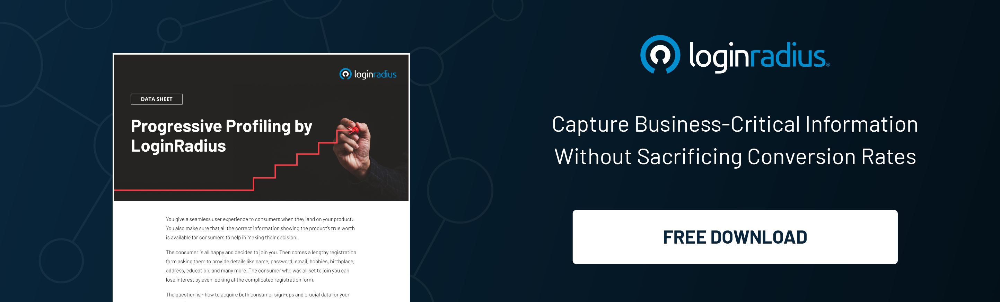

## Introduction

In an era where data privacy is paramount, Customer Identity and Access Management (CIAM) systems must evolve to meet the stringent demands of [global privacy regulations](https://www.loginradius.com/gdpr-and-privacy/) and increasingly privacy-conscious consumers. 

Adapting your CIAM strategy is no longer optional; it’s a necessity. Here are six key areas to focus on to ensure your CIAM solution wins over privacy-concerned customers and remains compliant with international standards.

## How to Win Privacy-Concerned Customers? 6 Key Areas

### 1. Compliance with Global Regulations

Compliance with global regulations is a cornerstone of any CIAM strategy. Here's how to ensure your CIAM system stays compliant:

* **User Consent Mechanisms**: Implement [robust consent management](https://www.loginradius.com/consent-preference-management/) systems that allow users to grant and withdraw consent for data processing activities easily. This ensures compliance with GDPR's consent requirements.

* **Data Access Requests**: Develop automated processes to efficiently handle data subject access requests (DSARs). Users should be able to easily request access to their data, receive it in a readable format, and understand how it is used.

* **International Data Transfers**: Ensure your CIAM system adheres to international data transfer regulations such as the EU-U.S. Data Privacy Framework or Standard Contractual Clauses (SCCs). This is vital for organizations operating across borders.

### 2. Data Minimization and Purpose Limitation

Data minimization and purpose limitation are essential for protecting user privacy and reducing risk:

* **Minimal Data Collection**: Design forms and data collection processes that ask only for necessary information. Regularly audit your data collection practices to ensure they align with the principle of data minimization.

* **Purpose Specification**: Clearly define and document the specific purposes for which data is collected. Avoid using collected data for purposes beyond what was originally disclosed to users.

* **Retention Policies**: Implement strict data retention policies that specify how long data will be kept and when it will be securely deleted. This helps to avoid unnecessary data accumulation and potential breaches.

### 3. Enhanced Security Measures

Strengthening security measures within your CIAM system helps protect sensitive user data:

* **Multi-Factor Authentication (MFA)**: [Incorporate MFA](https://www.loginradius.com/multi-factor-authentication/) to require users to provide two or more verification factors. This significantly reduces the risk of unauthorized access.

* **Encryption Standards**: Use strong encryption standards such as AES-256 for data at rest and TLS 1.2 or higher for data in transit. Regularly update encryption protocols to protect against new vulnerabilities.

* **Security Audits and Penetration Testing**: Conduct regular security audits and penetration tests to identify and mitigate vulnerabilities. This proactive approach helps to fortify your system against potential attacks.

### 4. User-Centric Privacy Controls

Empowering users with control over their personal data is crucial for building trust:

* **Privacy Dashboards**: Develop intuitive privacy dashboards that allow users to easily manage their data preferences, review consents, and exercise their data rights.

* **Transparent Privacy Policies**: Write privacy policies in clear, straightforward language. Avoid legal jargon and provide examples to help users understand their rights and how their data is used.

* **User Education**: Offer educational resources such as tutorials, guides, and webinars to help users understand data privacy concepts and how to protect their information.

### 5. Interoperability and Scalability

A scalable and interoperable CIAM system can support global operations and diverse user needs:

* **Identity Provider Integration**: Ensure your CIAM system can integrate with multiple identity providers (e.g., Google, Facebook, Apple) to offer users flexibility in how they authenticate.

* **Federated Identity Management**: Support [federated identity management](https://www.loginradius.com/blog/identity/what-is-federated-identity-management/) to allow users to use a single set of credentials across multiple applications and services, simplifying their experience.

* **Elastic Scalability**: Design your CIAM infrastructure to scale elastically, handling spikes in user activity without compromising performance or security. This is especially important during high-traffic events like sales or product launches.

### 6. Customer Education and Transparency

Transparency and education foster trust and loyalty among privacy-conscious customers:

* **Regular Updates**: Communicate clearly and concisely to keep users informed about privacy policy and policy changes. Use multiple channels (e.g., email, and in-app notifications) to reach a broad audience.

* **Transparent Data Practices**: Clearly outline how data is collected, used, shared, and stored. Provide examples and scenarios to help users understand these practices in context.

* **Educational Initiatives**: Launch initiatives such as data privacy awareness campaigns, interactive webinars, and informative blog posts to educate users about data privacy and security. This not only builds trust but also positions your organization as a leader in data protection.

## Conclusion

Adapting your CIAM system to meet global privacy needs is a multifaceted challenge that requires a strategic approach. By[ focusing on compliance](https://www.loginradius.com/customer-privacy/), data minimization, security, user-centric controls, interoperability, and transparency, you can rely on a CIAM solution that meets regulatory requirements and earns the trust and loyalty of privacy-concerned customers. 

Enters LoginRadius CIAM, a game-changer identity management solution capable of delivering flawless user experience and security features to please modern privacy-concerned consumers. 

With features like consent management, MFA, RBA, and progressive profiling, LoginRadius is undeniably the ultimate choice for building lasting customer relationships.

Investing in these key areas will ensure your organization is well-positioned to thrive in a market where data privacy is a critical differentiator. Implementing these strategies will help you maintain a competitive edge while fostering a strong, trust-based relationship with your customers.

