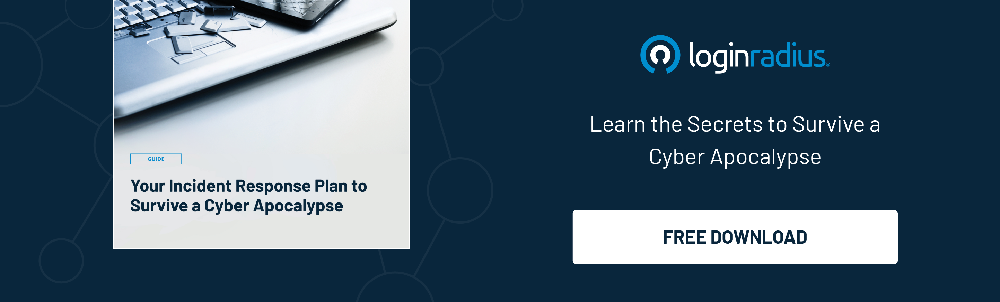

## Introduction

In an era where businesses are increasingly relying on cloud computing to drive innovation and agility, the importance of robust cloud security governance cannot be overstated. 

As organizations migrate their data and applications to the cloud, they face a myriad of security challenges, from data breaches to compliance violations.

Let’s explore the critical role of [cloud security governance](https://www.loginradius.com/data-governance/) in safeguarding digital assets in the ever-expanding digital frontier.

## Understanding Cloud Security Governance

At its core, cloud security governance refers to the set of policies, procedures, and controls implemented to ensure the security, privacy, and compliance of data and applications stored in the cloud. 

Cloud security governance is a holistic approach to managing security risks, covering everything from access control and data encryption to incident response and regulatory compliance. It provides organizations with the framework needed to establish accountability, enforce security policies, and mitigate the ever-evolving threat landscape.

## Navigating the Challenges

One of the primary challenges organizations face when it comes to cloud security governance is the complexity of the cloud environment itself. With multiple cloud service providers, disparate data storage locations, and varying levels of access control, managing [data security](https://www.loginradius.com/security/) across the entire cloud ecosystem can be daunting. 

Additionally, the shared responsibility model of cloud computing means that organizations must collaborate with their cloud providers to ensure that security responsibilities are clearly defined and upheld.

## Implementing Best Practices

Organizations must implement best practices for cloud security governance to protect assets in the digital frontier effectively. This includes conducting regular risk assessments to identify potential vulnerabilities, implementing robust access controls to prevent unauthorized access, and encrypting sensitive data, both in transit and at rest. 

Furthermore, organizations should establish clear incident response plans to address security breaches swiftly and minimize their impact on operations.

## The Future of Cloud Security Governance

As the digital landscape continues to evolve, so will the cloud security governance field. Emerging technologies such as artificial intelligence and machine learning promise to enhance security capabilities, enabling organizations to detect and respond to threats in real time. 

Additionally, regulatory requirements around data privacy and security are likely to become more stringent, emphasizing the need for comprehensive cloud security governance frameworks.

## Leveraging Automation and Monitoring

In the pursuit of robust cloud security governance, organizations can leverage automation and monitoring tools to enhance their data security posture. 

Automated security measures, such as intrusion detection systems and continuous vulnerability scanning, can help identify and mitigate threats in real time, reducing the burden on security teams and [minimizing the risk of data breaches](https://www.loginradius.com/blog/identity/how-to-handle-data-breaches/). 

Furthermore, comprehensive monitoring of cloud environments allows organizations to track access patterns, detect suspicious activity, and ensure compliance with security policies and regulations.

## Fostering a Culture of Security Awareness

Effective cloud security governance ultimately extends beyond technical measures to encompass a culture of data security awareness throughout the organization. Employees at all levels must be educated about the importance of cybersecurity best practices, from creating strong passwords to recognizing phishing attempts. 

By fostering a culture of security awareness, organizations can empower employees to become active participants in safeguarding sensitive data and mitigating security risks, further strengthening their overall security posture.

## Conclusion

In today's digital frontier, protecting assets in the cloud is paramount for organizations across industries. By prioritizing cloud security governance, organizations can establish a strong foundation for protecting sensitive data, maintaining regulatory compliance, and mitigating security risks. 

As technology continues to evolve and threats evolve, organizations must remain vigilant, continuously adapting and enhancing their cloud security governance practices to stay one step ahead of cyber adversaries.

