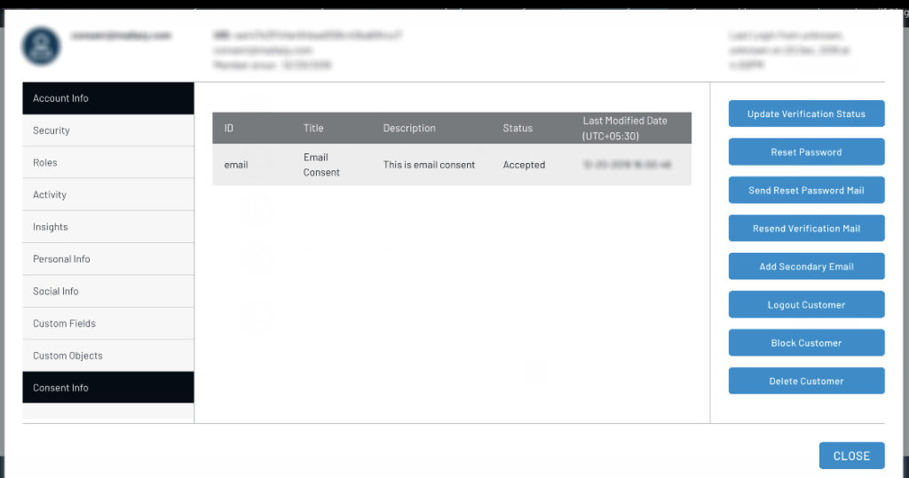
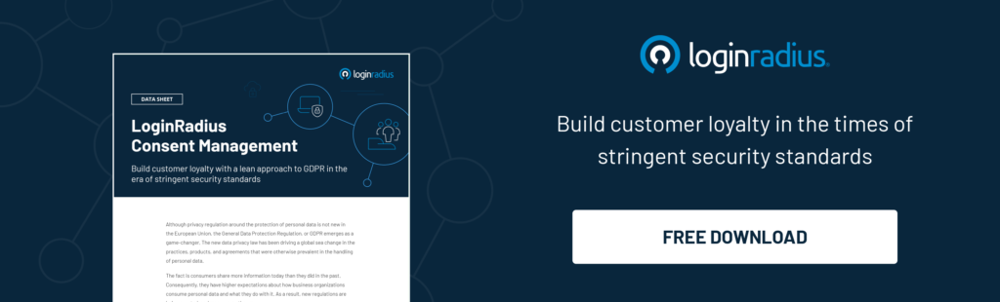

When the foundation of the General Data Protection Regulation (GDPR) was officially laid out, it prompted a rising need for organizations running on [Customer Identity & Access Management](https://www.loginradius.com/blog/2019/06/customer-identity-and-access-management/) (CIAM) solutions to re-consider their security arrangements. 

To complement, LoginRadius introduces its Consent Management feature that offers a secure platform to support the European Union's [GDPR compliance capabilities](https://www.loginradius.com/gdpr-and-privacy/).

## Intend Behind The Launch

Customer data is at the epicenter of brand engagements today. With customer expectations dramatically shifting over the last couple of years, individuals demand customization and more control while interacting with brands online. 

GDPR exposed the world to a whole lot of data security concerns ranging from how to collect, store, get consent, and use personal information. The aim was to provide mutual benefits for companies and end-users by building stronger trust relationships.

LoginRadius Consent Management will help companies and their security professionals understand the core mechanism of GDPR requirements and improve customer experience in the process. 

## Key Features of the LoginRadius Consent Management to Meet the EU's GDPR 

- It offers scoped access, encryption of data in transit and at rest, data backup, and a tested BCDR plan audited by independent third parties regularly. 
- Our certifications include ISO 27001 and 27018, Service Organization Controls (SOC) 2 Type II, ISO 27001:2013, and EU-US Privacy Shield framework. 
- It allows the flexibility to perform every action of the consent lifecycle with ease, including:
    - Creating, updating, and revocating custom consent forms. 
    - Scheduling consents forms and activating them at a future timestamp.
    - Cloning consent form to create and replicate data.
    - Offering user-friendly event-based experience for new and existing users.
- Our platform enables easy deployment of consent forms via sequential steps with minimal custom code using our Identity Experience Framework and JavaScript Library.
- Customers own the right to grant consent, reject, access, withdraw, and modify data, along with portability and erasure in a transparent, freely given, clear, specific, informed, and unambiguous manner. 
- It offers a single API for viewing and managing customer data across all systems, with a unified rich user profile. 
- Our consent repository is designed as a secure database and a single source of truth for all data processing based on customers’ consent.
- It supports language localization for better and personalized communication.

## A Final Word

LoginRadius Consent Management is an effort from the cloud-based CIAM solution provider to accelerate the path to compliance. Rest assured, companies can steer clear of GDPR-related fines that can otherwise be devastating even for the world's biggest companies. 

In addition to the GDPR, the LoginRadius Platform is also compliant with other international data privacy [standards like the CCPA](https://www.loginradius.com/blog/2020/03/how-loginradius-helps-enterprises-stay-ccpa-compliant-in-2020/), NIST, and HIPPA.

