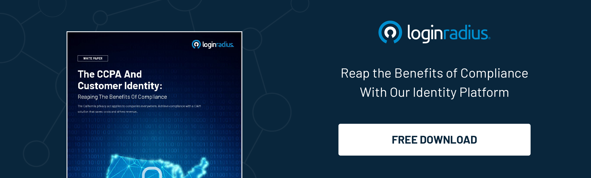
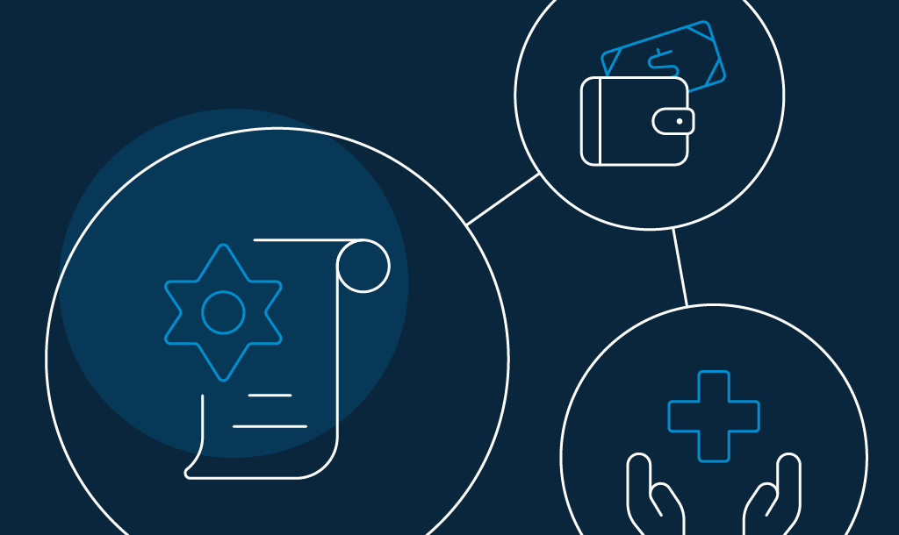
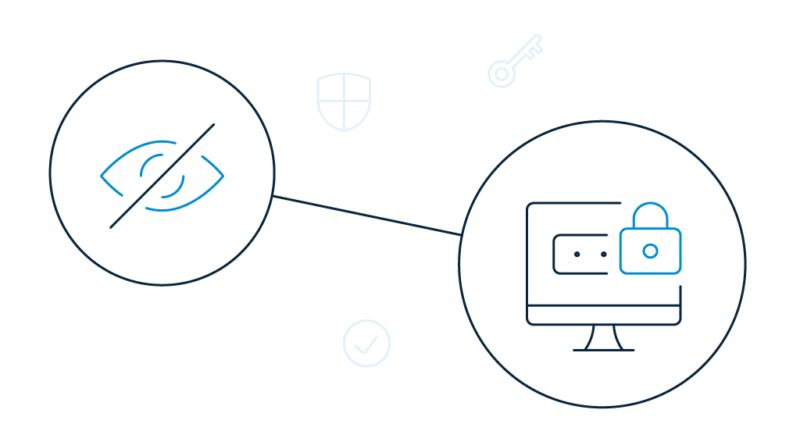

Authenticity, accountability, and excellent customer experience are the building blocks that sustain customer loyalty in the long run. Businesses need to be vocal about how responsible they are when it comes to consumer data privacy and security.

Needless-to-say, brands that put consumers in charge of how their data is collected and used can reduce customer churn by a considerable margin.

Following the popularity of the EU's General Data Protection Regulation (GDPR) that went live in May 2018, other countries worldwide have been catching up and taking action.

2020 started in the right direction with the [California Consumer Privacy Act (CCPA)](https://www.loginradius.com/blog/2019/05/ccpa-introduction/). This year we should expect even more stringent legislation concerning data protection rights for consumers.

Next in line is the [privacy law of Maine](http://www.mainelegislature.org/legis/bills/getPDF.asp?paper=SP0275&item=9&snum=129), which is scheduled to come into force in July 2020. The legislation would mandate broadband internet service providers (ISPs) to receive explicit, affirmative consent from a customer before accessing their personal data, including their browsing history.

_A question arises._

## What Does the Latest Data Privacy Inclusions Say About Consumers

There is a common belief among consumers that today's data protection is more complicated than it was in the past. Here are a few statistics that highlight the statement.

- 84% of [Cisco Consumer Privacy Survey](https://www.cisco.com/c/dam/global/en_uk/products/collateral/security/cybersecurity-series-2019-cps.pdf) respondents showed that they care about the privacy of their data, as well as other users' data, and want more control over how their data is being used. 80% of this group also said they were willing to act to protect it.
- 48% of consumer data privacy respondents suggested that they had already changed organizations or providers because of their data policies or data sharing activities, in the same report.
- According to the [Pew Research Center](https://www.pewresearch.org/internet/2019/11/15/americans-and-privacy-concerned-confused-and-feeling-lack-of-control-over-their-personal-information/), 79% of respondents said they are very or somewhat worried about how companies use the data they collect. In contrast, 64 percent said they have the same degree of concern about the collection of government data.
- 81% of respondents feel they have no control over the collected data in the same report. 
- According to another [research by Salesforce](https://www.salesforce.com/company/news-press/stories/2019/06/061219-g/), 46% of respondents feel they have completely lost control over their own data.
- A ground-breaking reality is that today consumers trust companies far less than they used to in the past. 79% of Americans are not sure how companies will respond when it comes to handling and protecting their personal information.
- Approximately seven-in-ten or more say they are either not too confident or not at all that companies will take responsibility when their data is compromised or misused, states the Pew Research Center.

## Biggest Data Privacy Pain Points of Consumers

This goes without saying that consumer data privacy is broadly transforming businesses today, and it is the responsibility of companies to manage the information they collect. Consumers are becoming more and more conscious about what kinds of data they share — and with whom.

Stakes are high for companies that handle data. Even consumers who aren't directly affected pay attention to the way such companies [respond to the data breach](https://www.loginradius.com/blog/2020/05/cyber-threats-business-risk-covid-19/). They are majorly concerned about the following pain points.

### **Misuse of sensitive data**

Data breaches have a greater reputational and financial consequence when sensitive personal data is involved. This contains information relating to political opinion, ethnic or racial origin, religious beliefs, genetic data, and biometric data.

Misuse of sensitive data can cause far more harm than the names, addresses, and financial information.

### **Trading of personal data**

The controversial corner of the web, called the "[dark web](https://en.wikipedia.org/wiki/Dark_web)," is widely known for trading stolen data, which can only be accessed via specific browsers. Hackers may be searching simply for a way into the networks of customers. 

They can attack computers/phones by imitating popular brands and stealing personal information without people even realizing it!

### **Data breach due to human error**

There is a well-documented history of human error, causing data breaches. Sadly, it is often people who allow access to encrypted channels and sensitive information for attackers. An attacker can undoubtedly take advantage of zero-day vulnerabilities to break into a network, but in most cases, their performance requires capitalizing human error.

According to Verizon's [2019 Data Breach Investigations Report](https://enterprise.verizon.com/resources/reports/2019-data-breach-investigations-report.pdf) (DBIR), 21% of breaches were a result of casual events like misdelivery, loss, and other kinds of human-initiated errors.

## Impact of Consumer Data Privacy on Businesses

Today, consumers are more mindful of the effect data privacy has on their personal lives than ever before. But how do companies respond to this change in consumer thinking — and more relevantly, how does it impact the way they do business?

New consumer data privacy regulations have been affecting every aspect of a business. Organizations must manage consumer interactions with privacy demands, develop new organizational positions to manage regulatory interactions, and educate employees on the current regulations.

In general, consumer data privacy laws have three different impacts on every organization.

- **Operational Impact** – What are the new ways to conduct business to comply with new privacy laws?
- **Technology Impact** – What are the new capabilities to enable compliance and minimize risk to reputation?
- **Organizational Impact** – Are there any new roles that need to be created to enable data privacy?

The laws regulating data privacy are in the preliminary stages, with more revisions and iterations to come. The new compliance requirements offer organizations the opportunity to evaluate other data opportunities and build more robust data management strategies.

## Impact of Data Privacy on Consumers

Consumers are starting to realize that data is the currency that allows free or near-free services, and they are carefully thinking about the drawbacks of sharing personal data.

Data regulations like [GDPR and CCPA](https://www.loginradius.com/blog/2019/09/ccpa-vs-gdpr-the-compliance-war/) surfaced and were enacted because companies were not as cautious as they needed to be when it came to consumer data security. 

Here's how data regulations are leveling-up their customer experience game:

- **Trust and transparency**: When consumers understand the specifics of who, what, where, when, and why data collection strategies, it's much simpler to have them on board and create the trust for brand loyalty.
- **First-party relationships**: Consumers are the gatekeepers at this stage in the evolution of marketing. It takes transparency, strong tactics, and reliable marketing tools for brands to obtain customer consent.
- **Data review rights**: Speaking of more vibrant and more dynamic customer experience, brands are inclining towards implementing data privacy - improving the consumer relationship through the purchaser's journey on multiple levels.

Consumers have the authority to set a brand apart from its competitors. So, when they see that efforts are made to keep their personal information safe and secure, they appreciate it.

## List of Popular Data Privacy Laws and Acts Around the World

#### **The European Union's Data Privacy Laws**

- **GDPR 2018**: A regulation requiring companies to protect EU citizens' personal data and privacy for transactions conducted within the EU member states.

#### **The US Data Privacy Laws**

- **COPAA 2000**: A regulation imposing requirements on website operators or online services that collected children's personal data under the age of 13.
- **CCPA 2020**: A law allowing users to request a copy of their data, delete it when they no longer want companies to have it, and mandate that companies do not sell their data to third parties.
- **US Privacy Act of 1974**: A law imposing restrictions on data held by government agencies. 

#### **Data Privacy in Healthcare**

- **HIPAA 1996:** A law protecting patients' sensitive healthcare information from being disclosed without consent.

#### **Data Privacy for Financial Institutions**

- **GLBA 1999**: A law protecting financial nonpublic personal information and requiring financial institutions to explain how they share personal information of customers.

#### **Other Data Privacy Laws**

- **Privacy rule 2000**: A law fortifying HIPPA and protecting the private healthcare information of the public. 
- **SOX 2002**: A law protecting individuals from unconstitutional practices by corporations. 
- **FISMA 2002**: A comprehensive framework protecting government data, operations and assets from unlawful use
- **ISO 27001 2013**: A regulatory framework imposing security on any kind of digital information.

## Proactive Steps for Companies to Prevent Privacy Hack

[Cyber-attacks have become](https://www.loginradius.com/blog/2019/10/cybersecurity-attacks-business/) a harsh reality for virtually every consumer and organization today. It doesn't matter anymore who the victim is, or what is the size of the organization that has fallen prey, the looming threat metrics about hackers' intention to steal data is real.

What actions can companies take to prevent hackers and protect consumer assets?

### **Take data mapping seriously**

Companies need to know what customer data they need to get the job done. Because it so happens that companies do not use the data they collect from customers - not for analytics or even to address any future need. 

It is only reasonable for companies not to collect any unnecessary data. No wonder, a lot of companies are considering re-writing [their security policies](https://www.loginradius.com/security/). 

### **Timely risk assessment**

Stay up-to-date on new risks and vulnerabilities in the data storage environment. Carry out regular assessments of all the significant aspects of the workplace environment - from remote access for employees to data storage to security policies. Make sure all procedures are adequate and current. 

### **Periodic data security training**

Train your team according to industry-approved security practices. Make them understand how crucial is consumer data privacy and security to your business and what necessary steps can prevent breaches. Conduct periodical awareness training for the entire organization instead of confining to a particular group. 

### **Invest in data compliance**

As we move into the fourth industrial age, investing in consumer data privacy and compliance has become a top business priority. It is high time, organizations understand the value of data itself. This is where [regulations like the GDPR](https://www.loginradius.com/blog/2020/05/consent-management/) and CCPA comes into play. 

### **Optimal infrastructure**

Organizations are working to build technology environments that can easily handle the growing amounts of data collected and engage in technical developments. A good practice is to store data based on the data type or classification. Reduced system footprints decrease the risk of breaches.

## How LoginRadius Keeps Your Customer Data Private and Secure

One crucial aspect of an organization is the protection of the confidentiality and integrity of consumer data. LoginRadius provides layered security by limiting and monitoring access to consumer's data. The platform offers seamless security with [features like data management](https://www.loginradius.com/data-governance/) and real-time fraud analysis to improve customer experience and detect fraud attempts at the entrance.

The [CIAM solution ensures](https://www.loginradius.com/blog/2019/06/customer-identity-and-access-management/) that fewer employees can access customer data and handle it. This further reduces the chance of accidental data leaks and secures consumer data privacy. Some of the global standards it adheres to include the GDPR in the EU and the [CCPA in California](https://www.loginradius.com/blog/2020/03/how-loginradius-helps-enterprises-stay-ccpa-compliant-in-2020/).

The LoginRadius is an identity management system that continues to support [global regulatory compliance](https://www.loginradius.com/compliances/) in the fight against data breaches, which are essential for delivering zero friction customer experience. A few of the common ones include:

- **PCI DSS**\-**PCI SSC** administered standard for payment transactions.
- **ISO 27001:2013** – Information security management system.
- **ISO 27017:2015** – Information security for cloud services.
- **ISO/IEC 27018:2019** – PII Protection.
- **US Privacy Shield** - Complaint resolution for EEA citizens.
- **NIST Cybersecurity Framework** – Standardized security framework to manage and reduce cybersecurity risk.
- **ISAE 3000** – International attestation standard for assurance over non-financial information.
- **AICPA SOC 2 (Type II)** – System-level controls for Trust Services Criteria – security, availability, process integrity, confidentiality, and privacy.

## Conclusion

Your consumer data privacy and security plan should comply with the rapid development of technology and the increasing cyber-attacks. Consider investing in compliance with the latest regulations to future-proof your consumer data protection plan.

