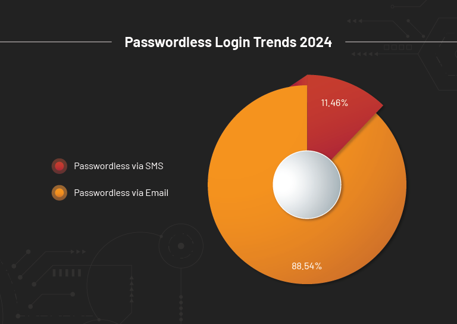
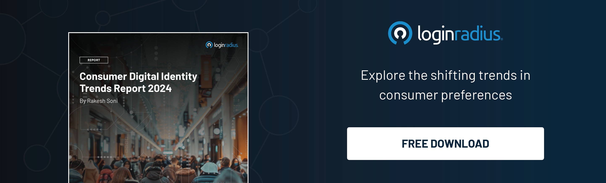

## Introduction

We are excited to present our annual [Consumer Digital Identity Trends Report 2024](https://www.loginradius.com/resource/2024-consumer-digital-identity-trends-report/), the ultimate guide for navigating the complex and ever-evolving landscape of digital consumer identity.

By surveying over 500 brands and an impressive 1.17 billion users from the LoginRadius Identity Platform, we provide an in-depth analysis of the consumer data market annually. 

This year too, the report offers insights and industry-standard performance benchmarks, covering areas such as consumer behavior, authentication methods, identity verification, and IT requirements. 

## Why Passwordless Authentication Is the Secret to Keeping Your Customers Happy?

Our research examined consumer comfort with [passwordless login](https://www.loginradius.com/passwordless-login/) methods and compared preferences for email versus phone number authentication. We discovered that 88.54% of users favor logging in with their email address, while 11.46% prefer using their phone number.

Our analysis shows a clear preference for email-based passwordless login, which has grown since last year. Additionally, the use of Passkeys for passwordless authentication is also on the rise.

## Key Highlights of the Consumer Identity Report 2024

As one of the top providers of Customer Identity and Access Management solutions, we've leveraged our global reach to gather and analyze this data. Over the past year, our in-depth analysis of our customer base has uncovered some exciting insights, including but not limited to:

* Passwordless authentication is rising, with 88.54% of users preferring to log in with their email address and 11.46% opting for their phone number. 

* Among consumers using [multi-factor authentication](https://www.loginradius.com/multi-factor-authentication/) (MFA), 43.86% prefer authenticator apps, while 37.11% of companies offer MFA through email codes.

* The passwordless login has the highest return rate of 42.43%. 

 

## Looking Ahead: Gaining a Competitive Edge Through Strategic Customer Identity Management

In today’s competitive market, a strategic approach to customer identity management can offer significant advantages.

The LoginRadius Consumer Identity Trend Report 2024 underscores the need to view CIAM as a vital business function rather than just an operational task. Adopting this perspective can lead to greater efficiency, reduced customer acquisition and support costs, and enhanced customer retention.

These insights are crucial for those aiming to elevate their customer experience and improve their bottom line.

[Download your free copy](https://www.loginradius.com/resource/2024-consumer-digital-identity-trends-report/) of the report today and stay ahead in the dynamic field of customer identity management.

