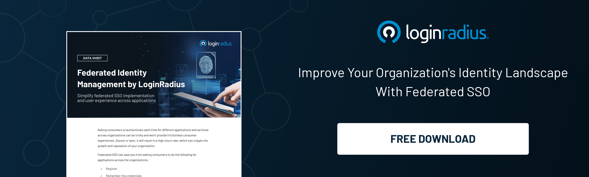

## Introduction

Managing access to sensitive information and resources has become a daunting challenge for organizations of all scales in a world where we are all digitally interconnected. The rapid growth of cloud-based applications, remote work culture, and the increasing threat of cyberattacks demand a broader and safer Identity and Access Management (IAM) strategy. 

And to overcome the challenges and pain points related to identity and access management, the converged identity platform can be a transformative solution. This article will help you understand how the converged identity platforms streamline access management across organizations. 

## What is a Converged Identity Platform (CIP)?

A Converged Identity Platform (CIP) is a highly advanced and combined system that integrates various Identity and Access Management (IAM) functions into a unified solution. The platform brings together essential IAM capabilities, like user authentication, user provisioning, authorization, and identity governance, under one digital application. A Converged Identity Platform's primary purpose is to facilitate managing user identities, access controls, and data security policies across businesses.

Traditional IAM solutions usually rely on separate systems for different functions, which leads to complexities, repetition, and security issues. Converged Identity Platforms handle these challenges by centralizing IAM operations, simplifying access management, and improving overall security.

## How Does CIP Streamline Access to a System?

A Converged Identity Platform (CIP) simplifies access to a system by centralizing and streamlining the process of user authentication and authorization. It combines various Identity and Access Management (IAM) functionalities into a cohesive ecosystem, allowing efficient organizational access management.

Mentioned below are approaches that CIP utilizes to streamline access management:

1. **Single Sign-On (SSO)**: One of the critical elements of a CIP is Single Sign-On. [With SSO, users only need to verify themselves once](https://www.loginradius.com/single-sign-on/) to access multiple platforms and systems within the organization. After the first login, the CIP safely stores login credentials and automatically uses them to authenticate the user for other applications. This process eradicates the need to remember multiple combinations of usernames & passwords, reducing the chances of password-related issues and enhancing overall user productivity.

2. **Focused Authentication**: CIP concentrates on user authentication, ensuring all user credentials are verified against a unified authentication service. This concentrated approach improves security by consolidating authentication policies lowering the risk of unauthorized access, misconfigurations, and system vulnerabilities.

3. **Multi-Factor Authentication (MFA)**: CIP typically supports Multi-Factor Authentication, requiring users to provide additional verification factors beyond their passwords. MFA can include passwords the user knows, a one-time code on their registered mobile number, or biometric methods like fingerprint or facial recognition. [MFA acts as added security](https://www.loginradius.com/multi-factor-authentication/), making it a challenging experience for unauthorized users to acquire access even if they can decode passwords.

4. **User Provisioning:** CIP automates user provisioning and deprovisioning methods. It simplifies the onboarding and offboarding of users in an organization. When a new employee joins the organization, the CIP can automatically create their official user account, allocate appropriate access privileges, and provide them with the required applications and resources. In the same way, when an employee leaves the organization, the CIP can withdraw access rights across all systems in one go.

5. **Identity Federation**: CIP supports identity federation. This process allows the users to access resources across various domains and organizations using their home organization's credentials. This capability reduces the need for separate user accounts and passwords for each platform, making access management more efficient, easy, and less time-consuming. 

6. **Role-Based Access Control (RBAC)**: CIP often includes Role-Based Access Control, enabling managers to assign access permissions based on users' tasks or job functions. RBAC facilitates access management by grouping users into predefined roles and giving them appropriate access privileges.

7. **Centralized Auditing**: CIP offers centralized reporting and auditing capabilities, enabling administrators to observe user activities, track access controls, and analyze suspicious or unauthorized behavior. These logs assist in maintaining compliance with regulations and recognizing potential security breaches.

With the abovementioned elements, a Converged Identity Platform significantly lowers the administrative burden of managing access controls. It ensures that users have safe and hassle-free access to the platforms and resources they need to perform efficiently.

## Conclusion

In this rapidly evolving digital world, where security breaches and cyber attacks continue challenging an organization's information security, Converged Identity Platforms (CIPs) emerge as a unique resolution for efficient and protected access management. 

By integrating various Identity and Access Management (IAM) functionalities into a single ecosystem, CIPs facilitate identity management, authentication, and authorization complications. It offers a convenient user experience. 

