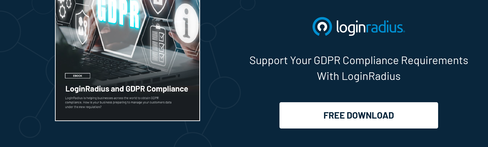

## Introduction

Nowadays the security landscape demands businesses worldwide to prioritize data privacy and protection. With regulations like GDPR and CCPA in place, organizations must ensure they are compliant with these laws to avoid hefty penalties.

One critical aspect of compliance is cookie management, which plays a significant role in supporting GDPR and CCPA requirements. From obtaining user consent to managing third-party cookies, cookie management tools offer numerous benefits for businesses, including avoiding non-compliance penalties, [building trust with customers](https://www.loginradius.com/customer-security/), and improving user experience.

Discover the main principles of GDPR and CCPA, the purpose of cookie management, how it supports compliance, the different types of cookie management tools available, and tips for choosing the right tool for your business. Learn more about how cookie management can help your business stay compliant with data privacy regulations. 

**Key takeaways:**

* Cookie management is essential for meeting GDPR and CCPA compliance requirements by providing transparency and control over data collection and usage

* Using cookie management tools such as CMPs and cookie consent banners can help businesses avoid penalties, build trust with customers, and improve user experience

* When choosing a cookie management tool, businesses should consider factors such as ease of implementation, customizable options, and compatibility with their website

## What is GDPR and CCPA?

[GDPR and CCPA](https://www.loginradius.com/blog/identity/ccpa-vs-gdpr-the-compliance-war/) are two significant privacy laws that govern how personal data of individuals is collected, stored, and processed; GDPR (General Data Protection Regulation) is applicable in the European Union (EU), while CCPA (California Consumer Privacy Act) applies to residents of California, aiming to enhance privacy rights and data protection for individuals by setting stringent regulations for businesses and organizations. 

## What are the main principles of GDPR and CCPA?

The main principles of GDPR and CCPA include transparency, user control over personal data, and data security measures to ensure compliance with privacy regulations. 

These core principles emphasize the right to access, allowing individuals to request information about their personal data held by organizations.

Additionally, the right to correction ensures that individuals can rectify discrepancies in their data, contributing to data accuracy.

Lastly, the right to deletion allows individuals to request the removal of their personal data under specific circumstances, promoting their control over their information.

## What is cookie management?

Cookie management refers to the process of managing cookies on a website to ensure compliance with privacy laws by gaining user consent through tools like consent management platforms (CMPs), which help in monitoring and controlling data collection activities. 

## What is the purpose of cookie management for GDPR and CCPA compliance?

The purpose of cookie management for GDPR and CCPA compliance is to facilitate the lawful collection of user data by ensuring that users are informed about and approve the use of cookies through cookie consent notices.

Effective cookie management goes beyond just collecting consent; it involves implementing robust mechanisms for users to manage their cookie preferences and providing clear and easily accessible information about the types of cookies being used. This includes offering options for users to opt-in or opt-out of specific cookie categories, such as essential, functional, and advertising cookies.

By prioritizing user notifications and actively seeking consent, organizations can build trust with their audience and demonstrate their commitment to data privacy. This approach not only helps in compliance with GDPR and CCPA requirements but also fosters a positive user experience by giving the power to individuals to make informed choices about their online privacy.

## How does cookie management support GDPR and CCPA compliance?

Cookie management supports GDPR and CCPA compliance by ensuring that user consent is obtained and recorded, providing transparency and control over data collection, and maintaining high standards of [data security](https://www.loginradius.com/security/), especially when managing third-party cookies. 

### Obtaining user consent

Obtaining user consent is typically achieved through consent collection mechanisms like cookie banners and CMPs that seek explicit permission from users before any data collection. 

Cookie banners are one of the most commonly used tools for notifying visitors about the website's use of cookies and receiving their permission. These banners typically appear on the homepage or landing page of a website, clearly outlining what data will be collected and for what purposes.

CMPs (consent management platforms) are more advanced tools that provide a systematic approach to managing [user consent preferences](https://www.loginradius.com/consent-preference-management/). They offer features such as granular consent options, user-friendly interfaces, and the ability to customize consent notices according to specific legal requirements.

### Providing transparency and control

Providing transparency and control to users involves informing them about data collection practices and offering options to manage their consent preferences and cookie settings. 

By ensuring users are aware of the types of data being collected, the purposes for which it is used, and the entities with whom it may be shared, organizations can build trust and credibility.

This level of transparency not only benefits users by respecting their autonomy but also cultivates a positive relationship between companies and consumers.

### Ensuring data security

To protect personal data from breaches and unauthorized access, robust security measures are required. 

One of the key steps in enhancing data security is encryption, which involves converting sensitive information into a coded format that can only be decoded with the correct key. 

Another important measure is implementing access controls, which restrict who can view or edit specific data, reducing the risk of unauthorized access.

Regular data backups are also critical for safeguarding personal information. By creating duplicate copies of data at regular intervals, organizations can quickly recover lost or corrupted data in case of a breach.

Conducting regular security audits and assessments helps identify vulnerabilities and weaknesses in data security systems, allowing for timely rectification and strengthening of defenses.

### Managing third-party cookies

One of the challenges in managing third-party cookies is the complexity of identifying and categorizing the various types of cookies utilized by external services. This involves understanding the purpose of each cookie, whether it is for tracking, analytics, advertising, or other functionalities. Without proper categorization, it becomes difficult to effectively communicate to users the nature of cookies being used and obtain informed consent.

Maintaining accurate records of user consent regarding the acceptance or rejection of cookies is also essential. This requires establishing robust systems to track and store consent preferences, ensuring that users' choices are respected across different browsing sessions.

Compliance with data protection regulations is another significant aspect of managing third-party cookies. Organizations must stay up to date with evolving [data privacy laws](https://www.loginradius.com/compliances/) such as the GDPR and CCPA, implementing measures to safeguard user data and uphold transparency in cookie usage.

## What are the different types of cookie management tools?

There are various types of cookie management tools available to help businesses comply with privacy regulations, including consent management platforms (CMPs), cookie banners, cookie scanners, and cookie policy generators, each serving distinct functions in managing data collection and user consent. 

### Consent management platforms (CMPs)

CMPs are tools designed to streamline user consent collection and management, [ensuring compliance with data privacy](https://www.dataguard.co.uk/blog/what-is-data-security-compliance/) regulations by providing a centralized solution for handling consent preferences.

They offer a range of features such as granular consent controls, customizable consent banners, and detailed consent reporting.

With the ability to update consent preferences in real-time, CMPs ensure that users have the flexibility to adjust their settings as needed.

### Cookie consent banners

Cookie consent banners are visible notifications on websites that inform users about the use of cookies and seek their consent to comply with privacy regulations.

These banners ensure that websites are transparent about their data collection practices and [give users control over their online privacy](https://www.loginradius.com/customer-privacy/). By displaying cookie consent banners, websites demonstrate their commitment to following laws such as the GDPR and CCPA, which require that users are informed about the cookies being used and have the option to opt out. 

### Cookie Scanners

Cookie scanners automatically detect and categorize cookies used on a website, including third-party cookies, to provide comprehensive data collection insights. 

These scanners work by scanning the website's code and identifying the various cookies present. They can distinguish between essential cookies, which are necessary for the website to function, and tracking cookies, which gather data for marketing and analytics purposes.

### Cookie policy generators

Cookie policy generators help businesses create detailed and compliant cookie policies that inform users about the types of cookies used, their purposes, and how user data is handled.

These tools simplify the process of drafting a comprehensive policy by providing templates and guidelines tailored to specific business needs. By outlining cookie practices in a user-friendly manner, they ensure that companies meet legal requirements 

## How to choose the right cookie management tool for your business?

Choosing the right cookie management tool for your business involves assessing factors such as the specific needs of your website, the level of data security required, user experience considerations, scalability, and the quality of support and implementation services provided. 

When evaluating cookie management tools, you need to first define your website's unique requirements. Consider factors like the volume of traffic your site receives, the types of data you collect, and the essential tracking functionalities you need. [Scalability](https://www.loginradius.com/scalability/) is another critical aspect to keep in mind—ensure that the tool can grow alongside your business without compromising performance.

Data security is a top priority when it comes to managing cookies. Look for tools that offer robust security features such as encryption, secure data storage, and compliance with relevant regulations like GDPR and CCPA.

In addition, user experience is central to ensuring smooth interactions with your website. Choose a tool that prioritizes user-friendly interfaces and customization options, allowing you to tailor cookie consent banners and settings to align with your brand's aesthetics.

## Conclusion

GDPR and CCPA compliance through effective cookie management is critical for businesses to avoid penalties, build customer trust, and enhance user experience, ensuring that privacy laws are adhered to, and data security is maintained. 

By prioritizing cookie management, companies can demonstrate their commitment to safeguarding user data and respecting privacy preferences, ultimately leading to enhanced customer loyalty and satisfaction. A transparent cookie policy helps foster trust and maintain a positive reputation in the eyes of consumers and regulatory authorities alike.

Proper cookie management practices not only align businesses with legal requirements but also contribute to improved cybersecurity measures, reducing the risks of data breaches and unauthorized access. It is essential for organizations to regularly review and update their cookie practices to adapt to changing regulations and technologies in order to stay compliant and protect user privacy effectively.

## Frequently Asked Questions (FAQs)

**1. What are cookies and why are they important for GDPR and CCPA compliance?**

Cookies are small text files that are placed on a user's device when they visit a website. They are important for GDPR and CCPA compliance because they can store personal data, such as IP addresses, browsing history, and login information, which must be protected under these laws.

**2. How does cookie management support GDPR compliance?**

Cookie management helps website owners comply with GDPR by giving users control over the use of their personal data. This includes obtaining consent for the use of cookies and providing options for users to manage their cookies preferences.

**3. How can cookie management assist with CCPA compliance?**

Cookie management helps website owners comply with CCPA by giving users the right to opt-out of the sale of their personal data. This includes providing a clear and accessible opt-out mechanism for cookies that collect personal data for advertising or other purposes.

**4. Do all websites need cookie management for GDPR and CCPA compliance?**

Yes, all websites that collect personal data, including through the use of cookies, must comply with regulations. This means implementing cookie management tools and processes to ensure transparency and user control over the use of their data.

**5. What are the consequences of not having proper cookie management for GDPR and CCPA compliance?**

Non-compliance with GDPR and CCPA regulations can result in hefty fines and penalties, as well as damage to a company's reputation. Proper cookie management is essential for protecting user data and avoiding legal consequences.

