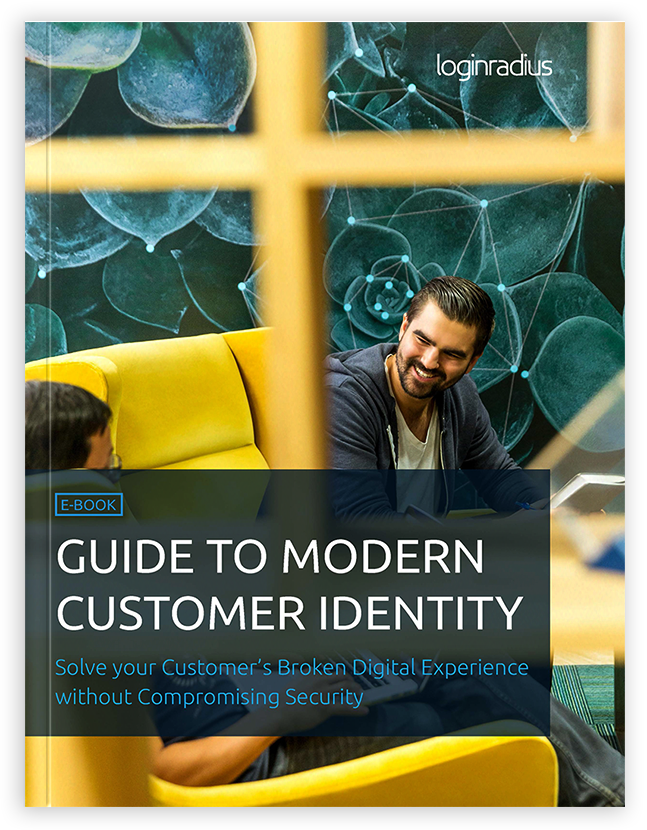

Everywhere you look, companies are adopting digital transformations in the hopes of changing their business models and competing in the reality of the new market.

What’s interesting in this new trend, is that the change is being driven by the customer.

Today, customers expect relevant content that is based on their interests and habits. In order to deliver this connected customer experience, companies are having to embrace these digital transformations.

## Understanding the Modern Customer

Digital technology has transformed [customers expectations](https://www.loginradius.com/resource/guide-to-modern-customer-identity/).

It’s a big statement, but mobile devices, apps, machine learning, automation and more allow customers to get what they want, when they want it.

These new digital technologies have caused a shift in customer expectations, which has resulted in a new modern consumer - they are constantly connected, app-natives, and are very aware of what they can do with technology. 

Because of the opportunities that are available with modern technologies, customers are now judging companies on their digital customer experience first. Businesses are now having to rethink how they interact with their users, and are turning to these digital initiatives to help them transform how they engage their customers.

## Getting Started with a Digital Transformation

With a digital transformation, organizations are able to understand the modern customer, engage them, and deliver on the expected multi-channel experience. Here’s a few ways to get your business started with a digital transformation.

#### 1\. A Flexible, Cloud-Based Solution

Having the right technology to support your digital initiatives it essential. Many companies are recognizing this, and seeing the advantages to having a customer identity solution at the foundation of their digital transformation.

With identity at the core, boosting your customers digital experience, gaining user insight, and improving security will be a sitch. What’s more, new solutions are cloud-based, which enables you to easily meet the demands of your customers.

For example, with a customer identity solution, you can gather [first-party customer data](https://www.loginradius.com/data-management-and-governance/) and have it flow seamless with third-party solutions (i.e. CRM, DPM) in real-time. The data’s security is managed for you in centralized databases, which also enables you to build unified customer profiles. This will give you a full 360-degree view of your customer. You will be able to gain insights about how, when and why your customers do business with you, so you can provide a better digital experience.

#### 2\. Personalizing your Customers Digital Experience

Modern customers that use your digital properties are looking for relevant content that is based on their interests and habits. They no longer have patients for ads that are not directly targeted towards them. This is why gathering customer data is so important in today’s market. With it, you can personalize the digital experience and paid advertisement towards the individual user.

A customer identity solution allows you to track your users entire digital journey, seamlessly integrate that data with your current marketing digital tools, and then analyze the information in real-time. 

You’ll be able to make your advertising more effective as it will improve targeting and make the customer experience more valuable by personalizing it.

But unfortunately, utilizing your customers data and personalizing the digital experience isn’t quite enough. To truly bring value to your current [marketing stack](https://www.loginradius.com/), and engage your customers, you need to offer your users a connected multi-channel experience.

#### 3\. Providing a Seamless Multi-channel Experience

Today’s customers are not tied down to a single channel. They browse in-store, shop online, share feedback through mobile apps and ask questions to your support team on social media.

To truly create a seamless [multi-channel experience](https://www.loginradius.com/connected-customer-experience/) for your users, your customers need to be able to access any of your digital properties without having to re-authenticating every time.

A customer identity solution can help you enable [Single-Sign On (SSO)](https://www.loginradius.com/single-sign-on-overview/), which allows your customers to create and use a single identity across your digital properties. The same identity can be used to log into multiple web and mobile properties so your customers won’t have to register separately for each.

Tying all these interactions together allows you to create a [single profile](https://www.loginradius.com/unify-customer-profiles/) for each of your customers. This will help you eliminate identity silos, and enable you to get a single view of your customers. Building user insight, segmenting, targeting, and optimizing offers for specific customers will be a breeze.

## The Next Steps

Accomplishing these three steps is a great start at improving your customers digital experience. If you get identity right from the start, you will really be able to enjoy the benefits of a digital transformation in terms of scalability, availability, and flexibility.

(https://www.loginradius.com/resource/customer-identity-the-core-of-digital-transformation/)

By utilizing a customer identity solution, you will be able to build a great foundation to your digital transformation.

But these three steps are just the start. We’ve created a free ebook where you can learn about all the benefits a customer identity solution can have for your business. Not only will you learn how to improve customer engagement and boost the value of your existing digital tools, but you will also be able to secure your customers identity to build trust, and leverage identity for growth.

You can check out the [ebook here](https://www.loginradius.com/resource/guide-to-modern-customer-identity/).
