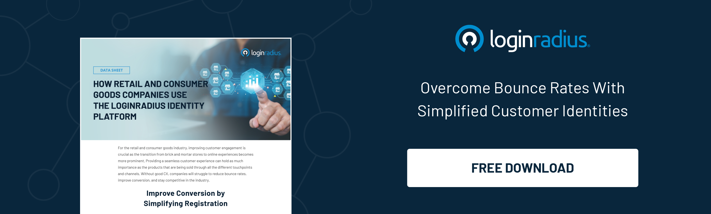

Customer identification is becoming a steep climb for retail businesses since customers are no longer forced to consider from among a few options. Today, they have hundreds of options available, both online and offline.

Not only has the number of retail outlets expanded exponentially in the last couple of years but so has the medium of purchase and information sources to customers. 

Today, shoppers want to shop seamlessly over multiple platforms, channels, and devices. After all, the more, the merrier.

They could be at a physical store, fall in love with a particular pair of shoes – but the right fit isn’t available. They will pull out their smartphone to check out the same pair online. If they find it, they hit “buy.” Conversely, shoppers may love something on the virtual store and look around for the same item on the brand’s local store before purchasing.

Well, that’s the kind of omnichannel experience your shoppers are looking for. They want an interconnected dimension where every possible touchpoint is twined perfectly.

Meeting this kind of expectation of consumers these days isn’t a piece of cake for retailers as the modern consumer demands digital experiences at every touchpoint before making a purchase. 

Let’s have a quick look at some of the lingering [challenges of today’s retailers](https://www.loginradius.com/blog/fuel/how-ciam-can-resolve-retail-industry-challenges/) and understand how to stay ahead of the curve by leveraging a cutting-edge identity and access management solution. 

## What’s Identity Management in the Retail and E-commerce industry

Identity management in the retail and e-commerce industry is a seamless, secure, and scalable solution to identify and protect customer data and ensure that they can easily access any information they need.

Traditionally, identity management solutions have been only about employee-centric internal security. They were designed to manage the identities of a limited number of users.

Fast forward to today’s scenario – the idea of putting customer identity right in the middle of the retailer's business model is gradually picking up and turning heads. CIAM (consumer identity and access management) generates automated customer profiles across multiple channels.

As a result, customers enjoy on-time delivery of digital (and physical) goods and services, along with a few add-ons like:

* Ensuring security compliance.
* Eliminating duplicate identity data.
* Reducing application-related complexities.
* Simplifying the customer registration process.
* Developing a more extensive database using first-party social data.
* Creating a unified customer profile.
* Collecting more customer purchase and interaction data.
* Storing customer data in a secure cloud directory.

These are opportunities ready to be grabbed. But are retailers ready to fuse identity management into their workflow? If not, it is high time that they should. 

Let’s learn about the challenges faced by retailers and e-commerce businesses. 

### #1. Multichannel Buying Channels

Modern consumers always expect a multichannel experience where they’re catered with the services across different touchpoints. 

Moreover, consumers are creating a balance between offline and online shopping and are spending a good time researching to buy a particular product at the best price. 

Now the ball would certainly be in the court of the retailers and e-commerce owners who offer seamless experience right from the beginning. 

This means the consumer, if onboarded rightly, would certainly finalize a purchase if they are served with the right product at the right time and the right place. 

The ease of personalization helps significantly increase a customer’s lifetime with your brand regardless of the device or platform to connect to. 

Therefore, online vendors must come up with easier ways for their shoppers to locate their favorite products. Make them feel like they understand their pain points, and it is their responsibility to solve the consumers’ issues.

The online format will involve showcasing product recommendations based on previous purchases or curating a personalized homepage.

[With LoginRadius](https://www.loginradius.com/industry-retail-and-ecommerce/), you get to center around your shoppers’ behavior and gain traction for your excellent products. More so, you get to predict all upcoming success metrics, pull in more money, and remain competitive.

### #2. An Outstanding and Flawless User Experience

Answer this question. What will turn casual visitors into loyal consumers?

As a retailer, you need to understand the demographics of your consumers and figure out their preferences. Adding a consumer identity and access management (CIAM) solution to your business should do the trick. 

Speaking of which, the LoginRadius identity solution provides a centralized, available, and secure identification and management of customers' data to retailers. 

Among its solutions include the real-time ability for visitors to self-register for services, login and authenticate, and enjoy a single-source view.

Retailers can manage customer profiles and provide a [personalized omnichannel experience](https://www.loginradius.com/blog/growth/omnichannel-customer-experience/) with consent and other preferences.

### #3. Security 

Poor security and inadequate data management are the most overlooked aspects that hamper sales and tarnish brand reputation. 

Online retailers that cannot protect consumer identity and personal information are prone to losing loyal consumers and would undoubtedly fail to attract potential customers. 

Adding stringent layers of security is a must for any retailer seeking substantial growth in the ever-expanding competitive business landscape. 

Whether it’s multi-factor authentication (MFA) or risk-based authentication (RBA), enterprises need to quickly put their best foot forward in adopting advanced security measures to safeguard consumer information to prevent financial and reputational losses. 

### #4. Engagement and Loyalty 

Getting a customer that makes frequent purchases is a tough nut to crack; however, engaging customers to keep coming back is even more complicated when it comes to the challenges of customer identification in retail. 

Building trust over consumers is quite daunting but can do wonders for a brand if done correctly by leveraging perfect harmony of personalization and a seamless user experience. 

LoginRadius simplifies the shopper registration process through a seamless experience with social sign-in and single sign-on. 

* **Social Sign-In**: Customers tend to remember the credentials of their frequently used network. As such, social sign-in is the method of one-click authentication with a social media account. It reduces the hassles of the registration process and helps a great deal in converting a random user to a value-added customer. 
* **Single Sign-On**: It means a customer can access multiple accounts with a single set of credentials. It offers ease of authentication and reduces the risk of minimizing poor password habits.

When consumers are offered friction-less onboarding coupled with quick login options, they eventually build trust in a brand and become frequent visitors, which later turn into buyers. 

## Final Thoughts 

E-commerce and retail giants are leveraging the perfect symphony of user experience coupled with the highest level of security through a [consumer identity and access management](https://www.loginradius.com) (CIAM) solution.  

Brands seeking substantial growth in the ever-challenging retail ecosystem need to understand the importance of cutting-edge technology that paves the path for a rich consumer experience that drives sales and ensures customers’ loyalty. 

