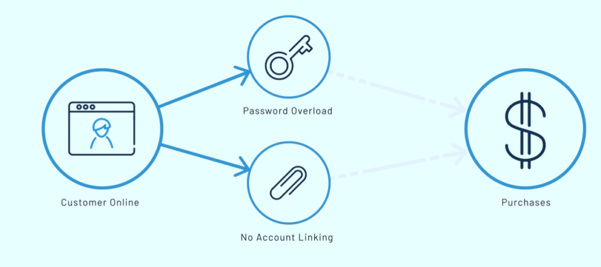
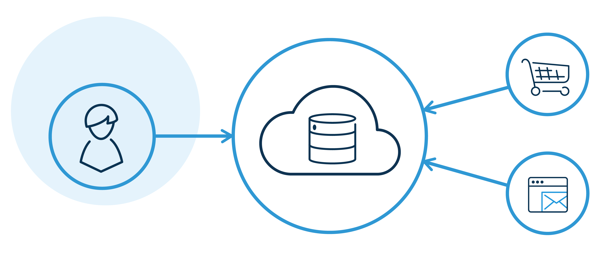
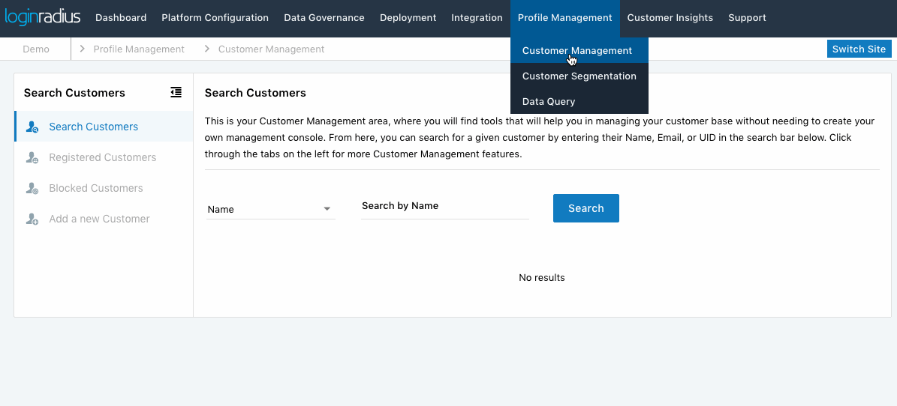
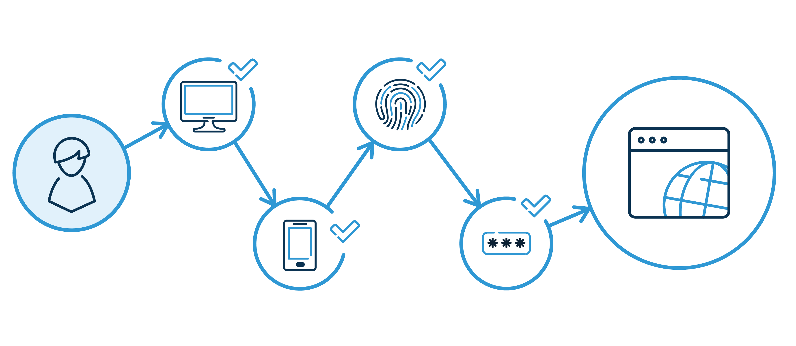
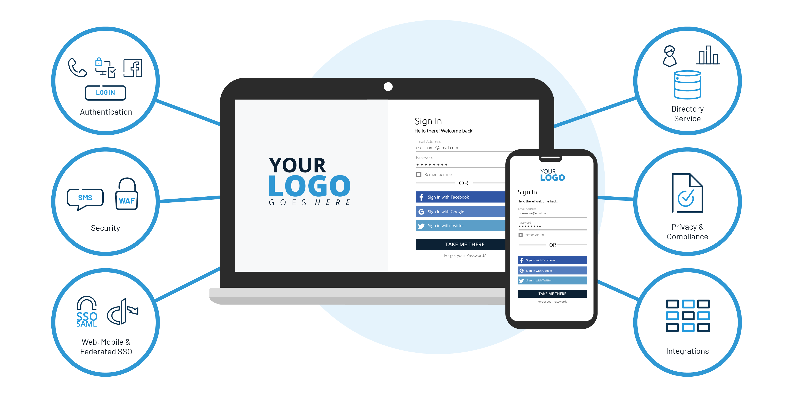
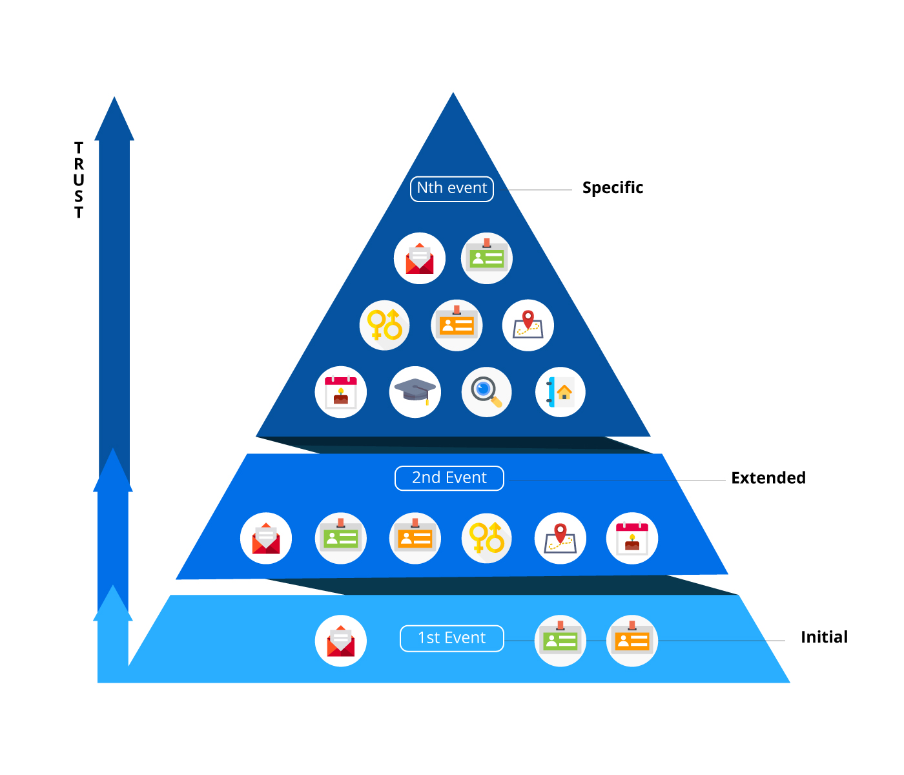

## Introduction

Customer identity and access management (CIAM) is taking over the customer login experience. There’s more at stake than just registration and authentication. In this article, we have explained how CIAM can help your business face the future head-on.

CIAM simplifies every business task that deals with your customers on an individual basis, including those that haven’t registered on your site yet. With a single data hub for all identities, CIAM seamlessly links authentication, [customer management](https://www.loginradius.com/customer-management/), sales, marketing, business intelligence, and services.

Companies that focus on providing an excellent digital experience to their customers should also focus on offering customers personalizing services. To accomplish this, businesses need to build a 360-degree view of the customer profile based on interactions with the company.

**_“If your business isn’t using CIAM, you stand every chance of lagging behind businesses that are making the most of the technology and the customer data it collects.”_** 

At the same time, companies need to ensure the [safety of these data to secure customer trust](https://www.loginradius.com/blog/2020/06/consumer-data-privacy-security/). This twin objective of enabling excellent customer experience and reliable security systems can be met by implementing a Customer Identity and Access Management (CIAM) system.

A CIAM solution usually offers a combination of features including customer registration, self-service account management, consent and preferences management, [single sign-on (SSO)](https://www.loginradius.com/blog/2019/05/what-is-single-sign-on/), multi-factor authentication (MFA), access management, directory services, and [data access governance](https://www.loginradius.com/data-governance/).

At the extreme scale and performance, a customer identity and access management solutions ensure a secure, seamless customer experience regardless of which channels (web, mobile, tablet, etc.) customers use to engage with an organization.

## What is Customer Identity and Access Management (CIAM)?

**Customer identity and access management** (CIAM) is a digital identity management software solution for businesses that combines login verification with customer data storage. CIAM aims to improve the customer's sign-up and login experience while securely managing customer identities. 

CIAM offers the luxury of a centralized customer database that links all other apps and services to provide a secure and seamless customer experience.

## A Recent Market Overview of  CIAM

Let’s start by outlining the scale of the issue. [Research suggests](https://www.superoffice.com/blog/customer-experience-statistics/) that B2B companies see customer experience as the most exciting business opportunity in 2020. Over [85% of buyers](https://www.superoffice.com/blog/customer-experience-statistics/) say they are willing to pay more for excellent customer experiences. Today, however, [only 1% of customers](https://www.forbes.com/sites/christinecrandell/2013/01/21/customer-experience-is-it-the-chicken-or-egg/#495344eb3557) think that companies can deliver a level of customer service that consistently meets their expectations.

It is clear that consumers want a better experience, but this can’t come at the expense of security. In a recent survey, [83% of US customers](https://businessinsights.bitdefender.com/businesses-can-lose-up-to-58-of-customers-after-a-data-breach-research-shows) said that they would stop buying from a company that had experienced a data breach–21% said they would never return. Overall, the survey showed you could lose [up to half your customers](https://businessinsights.bitdefender.com/businesses-can-lose-up-to-58-of-customers-after-a-data-breach-research-shows) if you’ve been hacked. 

## Importance of CIAM

A secure login experience is a minimum that today’s customers expect from a modern organization. It engenders trust and encourages your customers to come back to you time and again. Hence, the importance of the [CIAM platform](https://www.loginradius.com/blog/2019/06/perfect-ciam-platform/) chimes in.

### For Customers:

Every company wants to become a technology enterprise today. With the explosion of channels, devices, platforms, and touchpoints, customer needs are changing. And [secure experiences with](https://www.loginradius.com/security/) those interactions are of paramount importance. 

CIAM is a fundamental technology that serves increasingly complex consumer needs and enables businesses to deliver stable, seamless digital experiences.

### For Businesses:

Customer identity and access management have historically been a use case for consumers (B2C). Yet an organization's client may also be a company (B2B). The new way of doing business covers a plethora of markets and use cases as consumers demand more from companies they do business with.

From an enterprise point of view, a CIAM solution has several useful [features that can improve security](https://www.loginradius.com/authentication/), enhance customer data collation, and provide critical data to the marketing and sales departments.

## The Standard Benefits of CIAM

A fundamental customer identity and access management  (CIAM) system provide the following advantages for businesses and their customers.

### **1\. Streamlined Customer Experience**

A streamlined customer experience delivered by an organization reflects that it’s up-to-date and concerned about providing the easiest login possible.

By [providing a smooth login](https://theblog.adobe.com/everything-need-know-creating-smooth-login-experiences/) experience for your applications and services, you encourage customers to try out more of your digital offerings. The end result is a customer who is more embedded in your digital ecosystem, without extra effort.

**_“A streamlined customer experience delivered by an organization reflects that it’s up-to-date and concerned about providing the easiest login possible.”_**

For example, [implementing a single sign-on](https://www.loginradius.com/single-sign-on/) through a customer identity and access management system means a customer only needs one account for all of your digital touchpoints. Whether your customers are signing in from a browser or a mobile device, they’ll benefit from not having to sign in repeatedly to different services again and again—encouraging repeat use of your apps and services.

### **2\. Security for Data and Accounts**

A standard CIAM system provides essential security features that safeguard both data and account access. For example, [with risk-based authentication](https://www.csoonline.com/article/3271134/how-risk-based-authentication-has-become-an-essential-security-tool.html), each customer’s usage and login patterns are monitored, making it easy to spot unusual (and therefore potentially fraudulent) activity.

For use cases where you need an extra layer of security, you can enable [multi-factor authentication](https://www.loginradius.com/blog/2019/06/what-is-multi-factor-authentication/) (MFA), which verifies a customer’s identity by requiring a second step, such as entering an SMS code or clicking an email link.

Your secure login procedures reassure customers that they are safe using your services—something that’s essential with the number of public [data breaches reaching the news](https://www.loginradius.com/blog/2019/10/cybersecurity-attacks-business/).

### **3\. Scalability and Uptime**

With just one customer identity management system that’s fully managed for you, reliability is maximized, and the need for resources is kept to a minimum. A [centralized login system](https://en.wikipedia.org/wiki/Central_Authentication_Service) for all of your apps and services makes it easy to add new services as they come online. A cloud implementation can quickly scale up or down depending on your usage, and automated failover can cut downtime to virtually zero.

**_“As your digital ecosystem grows, a modern CIAM solution reduces the workload for your IT department and makes it easy to expand your business.”_**

### **4\. A Unified View of Each Customer**

By connecting the data gathered from all of your services and websites, you get a complete [overview of each customer](https://www.loginradius.com/customer-insights/). With a full picture of everything a customer has done since the first time they visited your site, you’ll have access to real-world data in startling detail.

You can use this data to monitor customer journeys across multiple apps and services, create marketing personas that reflect your customers, design new products or special offers, and direct your customers towards choices that will benefit the both of you.

When you understand your customers more deeply, you can reach them more easily and serve them better. All of this adds up to more revenue and a lower cost of acquisition and retention.

### **5\. Compliance With Privacy Regulations**

[Privacy compliance](https://www.loginradius.com/compliances/) is a critical aspect of any company handling customer data and an essential part of any online business. The EU’s GDPR and the recently rolled out [California’s CCPA](https://www.loginradius.com/blog/2020/03/how-loginradius-helps-enterprises-stay-ccpa-compliant-in-2020/) are just a few examples of privacy laws that have a global reach, affecting any data flowing into or out of the EU. Most Western countries have similar regulations or are enacting similar laws, and the rest of the world is rapidly catching up.

If you have an online business that you want to keep viable in 2020 or beyond, you must maintain compliance with these regulations. Here are some of the things you need to provide or be able to do to meet regulations:

- Provide customers with a detailed report of their data that you hold.
- Enable customers to access their data via self-service.
- Allow customers to control which of their data you keep or discard.
- Allow customers to delete data they do not want you to store.
- Provide regulators a report of your user data usage and retention policies.
- Show regulators the steps you take to keep customer data secure.
- Show that you minimize data retention and avoid using data unnecessarily.

CIAM can also be tailored to meet the regulatory requirements of different regions—essential for global business.

**_“A modern CIAM solution enables you to meet all of these privacy requirements and more while simplifying the process and reducing the costs associated.“_**

### **6\. Advanced Login Options**

In the world of CIAM, a business can gain an advantage by implementing new and advanced login options that are not yet widely adopted. These login methods further [improve customer experience](https://www.loginradius.com/customer-experience-solutions/), customer trust, or both.

**Passwordless Login** simplifies and streamlines the login process, while at the same time making it more protected. It also helps you present your company as a modern, secure organization that uses the latest technology to safeguard your customers. [Passwordless login](https://www.loginradius.com/blog/2019/10/passwordless-authentication-the-future-of-identity-and-security/) uses a customer’s email address or phone number to send them a one-time link that they click to log in.

**One-Touch Login** also allows customers to log in with a generated link sent to their email address or a one-time password sent to their phone. However, unlike Passwordless Login, the customer does not need to be an existing user in the system, and no credentials are submitted. In other words, the customer gets the benefits of secure access without the commitment of account creation.

**Smart Login** gives users a quick and secure login for the internet of things (IoT) and smart devices, which are increasingly becoming a vital part of today’s digital ecosystem. Smart login delegates the authentication process for smart TVs, gaming consoles, and other IoT devices to other devices that are easier and more secure for entering and managing passwords.

### **7\. Optimized Data Collection**

As customers become more savvy and cautious about handing over their data, businesses can leverage CIAM to collect information in more respectful ways. Here are a few unique ways:

[**Progressive Profiling**](https://www.loginradius.com/blog/2019/02/presenting-progressive-profiling-loginradius/) allows you to collect customer data over time, as and when needed. You can start by building a basic profile with the simplest login details (like name and email, or a social login request for just these details). You can then ask for more information as needed depending on which of your products customers use.

Progressive Profiling is a great way to leverage today’s limited social login data and a fantastic way to build trust as you build up a picture of your customer. You can also use progressive profiling to measure how much your customers trust you by offering the opportunity to add more information without making it compulsory.

**Social Login** can be a risk as it is a benefit in today’s digital environment when data leaks and account breaches plague major social providers. With the right precautions in place, [social login can still be a great way](https://www.loginradius.com/blog/2018/11/reconsidering-social-login-security-privacy-angle/) for your customers to access your services.

### **8\. Consent Management**

As part of international privacy regulations like the [GDPR and CCPA](https://www.loginradius.com/blog/2019/09/ccpa-vs-gdpr-the-compliance-war/), businesses need to be clear with customers about their consent to data collection and communication.

CIAM provides tools for [managing a customer’s consent](https://en.wikipedia.org/wiki/Consent_management) to give them an understanding and control over their consent. [Consent management involves](https://www.loginradius.com/blog/2020/05/consent-management/) requesting consent during registration and authentication and provides the ability to modify existing permissions and apply new consents retroactively.

## Stay Ahead of the Curve with CIAM

Today, we’re moving away from simple customer access to more complex data monitoring to gain a better understanding of each customer.

A customer identity access management solution can bridge the gap between your customers and the latest developments in identity and personal data protection—essential in today’s connected world. CIAM helps you take the next step in assuring your customers’ online safety while simplifying their online experience across new digital platforms.

## Conclusion

Many companies provide their customers with a [modern digital experience](https://www.loginradius.com/blog/2018/05/customer-experience-driving-digital-transformations/), thanks to a customer identity management system. If you want to give your customers the same advantages, the time to act is now.

A CIAM solution like LoginRadius can help you achieve this with customer account information, including data, consent, and activity, accessible from one dashboard.

## Frequently Asked Questions (FAQs)

**1. What is the difference between CIAM and IAM?**

A CIAM (consumer identity and access management) solution manages your services’ external consumer identities, whereas an IAM (workforce identity and access management) solution manages your organization's identities. [Read more](https://www.loginradius.com/blog/start-with-identity/iam-vs-ciam/).

**2. Why is CIAM important?**

CIAM enables businesses to enable quick, convenient, secure and unified access across multiple channels. Moreover, a CIAM solution allows you to use customer data, including [customer behavior](https://www.loginradius.com/customer-insights/), to understand your target audience better and tailor your service, products, and marketing. 

**3. How does CIAM protect customer data?**

A CIAM solution includes various authentication mechanisms like multi-factor authentication (MFA), [risk-based authentication (RBA)](https://www.loginradius.com/blog/start-with-identity/risk-based-authentication/), and more to ensure even if the primary layer of protection like passwords is compromised, access is restricted to a particular account. 

**4. How much does a CIAM cost?**

Typically, there are [different plans](https://www.loginradius.com/pricing/) for enterprises and developers. Businesses can choose monthly, quarterly, or yearly plans depending on the services and needs. 

**5. How do I get CIAM?**

You can contact the [LoginRadius sales](https://www.loginradius.com/contact-sales/) team to schedule a free personalized demo and learn how the leading cloud-based CIAM works for your business. 

