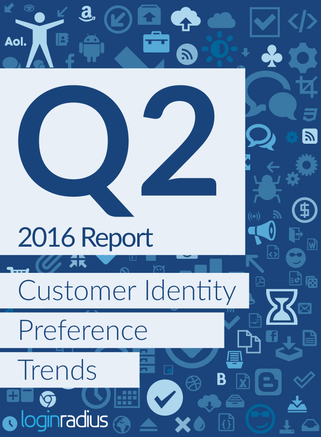
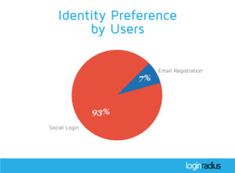
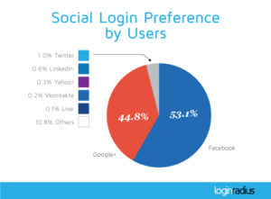
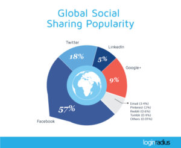

It’s that time of the quarter again when we get to some number crunching and put out our data for the world to analyze, think and act. It’s that time when you can think whether social login is still working and how many consumers actually use [social login against traditional email registration](https://www.loginradius.com/social-login/). It’s that time when you evaluate customer identity preferences to understand what’s best for you.

Why should you even worry about customer preferences? Because digital marketing starts with customer identity and ends with a great customer experience. Identity is how you connect to your customers and customer experience is how your customers feel about that connection over a period of time. Let’s think of some real world situations to elucidate this. If you have a prospective customer who is really fond of Twitter and wants to login to your website using his or her Twitter identity, but you don’t allow your end users to bring their Twitter identities, the customer is bound to be disappointed. A bad experience on the Web mostly ends in consumers bouncing off. That’s not exactly what you would want, right? 

But why should you care if you have world beating products and services? Well, the problem is that businesses are increasingly being transacted on the Web and the competition is too heavy. Heavy competition does exist in the real world too but consumers can easily switch companies on the Web, which is not the case in offline stores. That’s exactly why world beating products and service are not enough on the Web. Businesses need more than that. Businesses need Connected Customer Experience. Every tiny thing needs to be optimized to the tastes of your customers. Every tiny bump needs to be roadrolled for a seamless experience on your web and mobile applications.

Great businesses are built on great products and great service, and a great customer experience. Having the first two doesn't mean you automatically have the third.

Well, let’s get to the business end now. Like every quarter since about 13 quarters, the LoginRadius Analytics team has analyzed data from over 160,000 websites which are using [LoginRadius’ Customer Identity and Access Management (cIAM) platform](https://www.loginradius.com/). The analysis brings out what customers in different industries and regions prefer in terms of their social identities, choice of social networks and choice of devices to register and login to various business websites. You can access this in depth analysis in Loginradius’ Customer Identity Preferences Trends report for Q2 2016 which is now available for [free download](https://www.loginradius.com/resource/customer-identity-preference-trends-2016/). Before you download the report, let's get you a preview of what our data is saying this time.

If you are expecting majority of website customers to be bringing their own social identities, you are spot on. In Q2 2016, almost 93% consumers preferred social login over traditional email registration on websites.

If you are expecting Facebook to be the default choice of social identity for majority of the customers, you are right. But where you could be wrong is that majority is not very much. Only 53% customers logged in with their Facebook identities. So, who ate their share? Google, obviously. More and more people are preferring to use their Google identities to sign into websites for reasons that could be varied. The most apt, as per our understanding, is the ease of using Google identities and the fact that consumers don’t really have to worry much about their privacy while using Google identities to login on other websites. This is because most people don’t have a lot of [Personally Identifiable Information (PII)](https://en.wikipedia.org/wiki/Personally_identifiable_information) stored on their Google accounts, unlike Facebook. But, technically, this is still the minority view, though the difference between majority and minority is as thin as a straight line. Both of them together account for 98% social logins so the question of which network to provide for social login on your web or mobile applications is a no-brainer.

Social networks are not the only things that matter. People’s devices, too, play a role important enough not to be ignored. Once again in Q2 2016, majority of web browser based social login was from websites leading to the same inference as earlier that if you are targeting consumers on their mobile phones, get a mobile app for your business instead of optimizing your website for mobile.

As far as social sharing is concerned, it seems Facebook is scoring where it needs to. Though its usage as a social identity reduced in Q2 2016, content sharing on Facebook increased giving credence to the theory proposed here.

Some more critical insights you can obtain from the report are:

- In Q2 2016, males trumped females in social logging by 20%.
- About 18% of social logins were from Apple’s Safari Mobile browser.
- Just about 67% websites provide Facebook as a social login option on their website.

Read more detailed analysis and insights in LoginRadius’ Customer Identity Preference Trends report for Q2 2016. Go ahead, [download it now](https://www.loginradius.com/resource/customer-identity-preference-trends-2016/).

