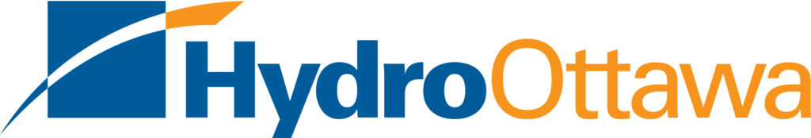
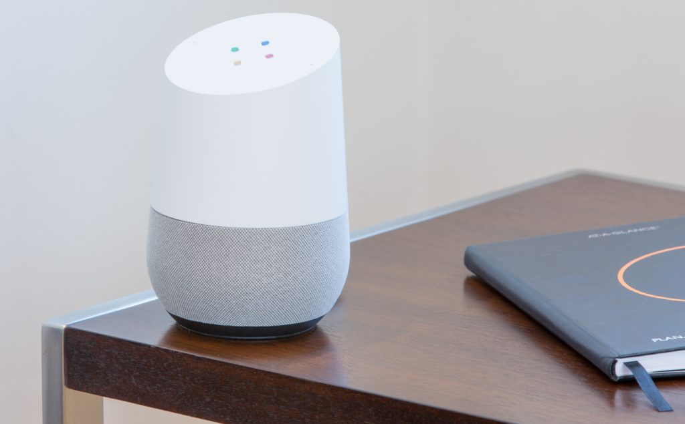

[Hydro Ottawa](https://hydroottawa.com/), the largest local electricity distribution company in eastern Ontario, is also a pioneer in the Canadian utility industry. It is the [first utility company in Canada to offer a voice assistant skill](https://obj.ca/article/hydro-ottawa/next-evolution-customer-care-okay-google-open-hydro-ottawa) through both Amazon Alexa and Google Home. By focusing on their customers’ needs, Hydro Ottawa has fully disrupted the Canadian utility industry for the better.

We're extremely excited to be able to play a part in this journey with Hydro Ottawa, and we’re thrilled that they were able to leverage the LoginRadius platform and OAuth capabilities to make this happen.

## Identity is Key

Hydro Ottawa has fully integrated the LoginRadius authentication tools with their internal system and platform. This connection provides a [seamless registration and login process](https://www.loginradius.com/standard-login/) for Hydro Ottawa customers. In doing so, Hydro Ottawa has been able to centralize their customer identity data to make sure that all systems are working off of the same data as they grow and expand their services.

## Disrupting the Utility Industry

By addressing the need for a unified customer database, Hydro Ottawa is able to leverage their identity architecture and the [OAuth 2.0](https://www.loginradius.com/federation/) capabilities from LoginRadius to build something that no other utility company and very few corporate companies have been able to accomplish—fully interactive home assistant skills for Amazon Alexa and Google Home.

By focusing on how to best serve and engage with their customers, Hydro Ottawa has developed a new way for their customers to interact with Hydro Ottawa and better understand their hydro activities. This includes everything from checking their account and billing status, to energy preservation tips based on their usage, to power outage statuses in their region.

Don't hesitate to [contact our product specialists](https://www.loginradius.com/contact-sales/) or [schedule a tailored demo](https://www.loginradius.com/schedule-demo/) if you'd like to see how LoginRadius can help you start your digital transformation journey and disrupt your industry!
