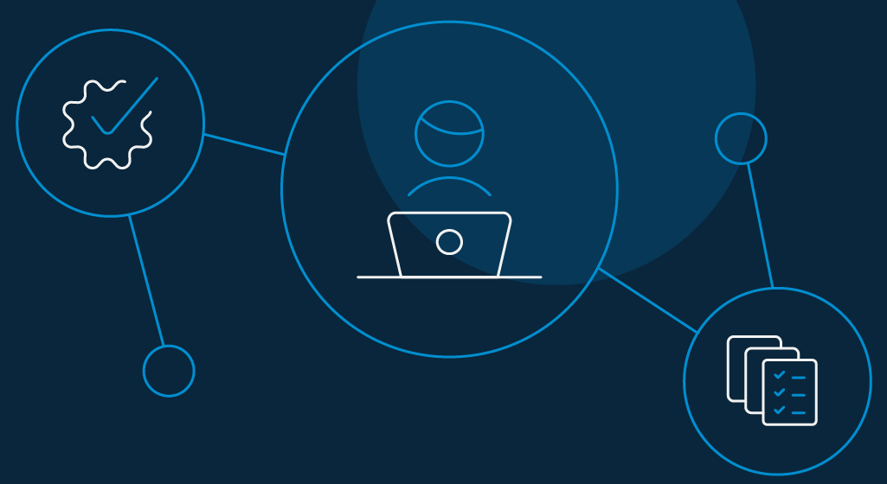
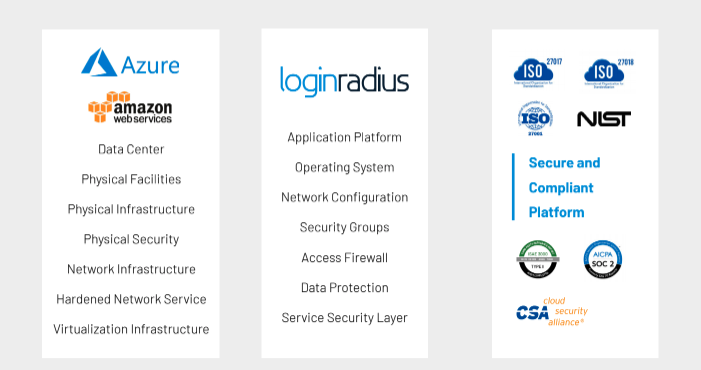

From virtual banking breaches to semi-open attacks, 2021 has been rough on IT security. 

Remember [LinkedIn's Massive Data Breach](https://restoreprivacy.com/linkedin-data-leak-700-million-users/) earlier this year? On June 22, a user on a famous hacker site announced that nearly 700 million people’s data is up for sale. The hacker shared a sample of 1 million LinkedIn members' email addresses, full names, phone numbers, addresses and geolocations.

With hackers banking on the COVID-19 pandemic, 2021 came with a whole new level of cybersecurity threats. [Data breaches like these](https://www.loginradius.com/blog/start-with-identity/cybersec-roundup-june-2021/) show the harsh reality of the world we live in. Seemingly, no one is immune. 

Global cybercrime costs are expected to top $6 trillion by the end of 2021. By 2025, the figure will be [$10.5 trillion](https://cybersecurityventures.com/hackerpocalypse-cybercrime-report-2016/).

Cybersecurity is at high stakes. By now, the list of data breach victims is filled with major corporations, government agencies, social media sites, restaurant chains, and every other industry you can think of. 

In this cyber security awareness month (October), let’s try to figure out, how did we get to this point of compromise and uncertainty? And how to prepare better for 2022.

The latest [Threat Horizon 2021](https://www.securityforum.org/research/threat-horizon-2021-the-digital-illusion-shatters/) points out the difficult cybersecurity challenges that influence senior business executives, security professionals, and other key organizational stakeholders. 

*   **Digital connectivity will expose hidden dangers** - Over-dependence on complex digital connectivity will amplify existing dangers and create new ones.
*   **The digital cold war will engulf business** - A digital cold war will unfold targeting intellectual property (IP) for economic and military dominance.
*   **Digital competitors will rip up the rulebook** - The existing regulatory frameworks and social norms will be less resilient and more vulnerable than ever.

Now that we’ve peeked into the minds of cybercriminals, let's assess the biggest cybersecurity attacks that we witnessed in 2021. 

<table>
  <tr>
   <td><strong>Compromised Company</strong>
   </td>
   <td><strong>Impact</strong>
   </td>
   <td><strong>Compromised Month</strong>
   </td>
  </tr>
  <tr>
   <td>Buffalo Public Schools 
   </td>
   <td>34,000 students' highly sensitive information was compromised
   </td>
   <td>March
   </td>
  </tr>
  <tr>
   <td>Acer
   </td>
   <td>Resulted in the highest ransom demand ever—$50 million
   </td>
   <td>March
   </td>
  </tr>
  <tr>
   <td>Quanta Computer
   </td>
   <td>Attempted to extort both Quanta and Apple
   </td>
   <td>April
   </td>
  </tr>
  <tr>
   <td>ExaGrid
   </td>
   <td>Paid approximately $2.6 million ransom against the original demand was over $7 million to reclaim access to encrypted data
   </td>
   <td>May
   </td>
  </tr>
  <tr>
   <td>Indiana State Department of Health
   </td>
   <td>750,000 Indiana residents data was compromised
   </td>
   <td>August
   </td>
  </tr>
  <tr>
   <td>T-Mobile US Inc
   </td>
   <td>Affected more than 53 million consumer data
   </td>
   <td>August
   </td>
  </tr>
  
  </tr>
</table>

This is not the end. Cybersecurity incidents take place in different business sectors and by various means every other day.

So, how do you prevent the threat landscape? 

You can start by noting down the most common types of cyberattacks that may harm consumers and enterprises in 2022.

## 9 Cybersecurity Attacks That Can Harm Your Business in 2022

### 1. Ransomware attack

Ransomware has been around since the late 80s and is a [billion-dollar cybercrime industry](https://digitalguardian.com/blog/history-ransomware-attacks-biggest-and-worst-ransomware-attacks-all-time). It works by holding a victim’s sensitive data for ransom after blocking them from access.

For instance, according to [itgovernance.co.uk](https://www.itgovernance.co.uk/blog/list-of-data-breaches-and-cyber-attacks-in-august-2021-61-million-records-breached), 61 million records were breached in the UK containing 84 incidents in August 2021 alone. 

**How to prevent**

*   Never open untrusted email attachments or click on unverified links.
*   Use mail server content scanning and filtering regularly.

### 2. Malware attack

Malware is an umbrella term for malicious programs like worms, computer viruses, Trojan horses, and spyware that steal, encrypt, delete, alter, and hijack user information. 

**How to prevent**

*   Keep your anti-virus software up-to-date.
*   Watch out for social engineering scams. 

### 3. Phishing attack

Did you know that up to [32% of data breaches](https://enterprise.verizon.com/resources/reports/dbir/) occur from phishing?

Phishing is a common form of social engineering and works like this: A hacker tricks users into downloading an infected attachment or clicking a malicious link through SMS or email. 

**How to prevent**

*   Don’t click login links; manually type in the main site’s URL, instead.
*   Double-check the email source and report bad emails.
*   Hover over links to inspect them; don’t just click them.

### 4. SQL injection

Using malicious codes, [SQL injection attacks](https://en.wikipedia.org/wiki/SQL_injection) servers that store critical data for websites. It’s especially harmful to servers that store personally identifiable information (PII) such as credit card numbers, usernames, and passwords. 

**How to prevent**

*   Validate all SQL data inputs against a whitelist.
*   Use only stored procedures and prepared statements.

### 5. DNS Poisoning

Also known as DNS spoofing, DNS cache poisoning is a kind of cybersecurity attack that exploits vulnerabilities in the domain name system (DNS). Hackers redirect Internet traffic away from legitimate servers towards fake ones that resemble their intended destinations. 

**How to prevent**

*   Ensure that you are using the most recent version of the DNS
*   Use Domain Name System Security Extensions (DNSSEC) to verify the data integrity and origin of the DNS. 

### 6. Password attack

Despite being well-known, people still fall prey to the oldest cyberattack—password attack. The reason it’s still so popular is due to its simplicity. Using standard hacking techniques, hackers [attain weak passwords](https://www.loginradius.com/blog/2019/12/worst-passwords-list-2019/) that unlock valuable online accounts.

**How to prevent**

*   Educate users on [good password hygiene](https://www.loginradius.com/blog/2018/05/infographic-poor-password-hygiene-letting-cybercriminals-clean/).
*   Implement brute force lockout policies.
*   Prohibit the use of easy passwords. 

### 7. MITM attack

A [man-in-the-middle attack](https://en.wikipedia.org/wiki/Man-in-the-middle_attack) occurs when a hacker intercepts communications between two legitimate hosts. Think of it as the cyber equivalent of eavesdropping on a private conversation. But in this case, the hacker can plant new requests that appear to originate from a legitimate source. 

**How to prevent**

*   Use SSL certificates (HTTPS) on your website.
*   Setup a VPN as an additional shield over Wi-Fi. 

### 8. Spyware attack

Spyware is a kind of malicious software that is installed without the knowledge of the end-user, usually on their computer. The program then invades the computer, steals sensitive data, and sells them off to advertisers, data companies, or external users.

**How to prevent**

*   Always research free software before downloading.
*   Beware of pop-up ads and always close them when they appear.
*   Turn on pop-up blocker for suspicious websites in your browser.

### 9. Shareware attack

Shareware is commercial software that is distributed to consumers for free. It is usually handed out as a complementary software to encourage users to pay for the parent software. Mostly, shareware is safe, but it can be risky at times. 

Cybercriminals may use it to distribute malware that could lead to malicious attacks. Organizations may put themselves at risk of unwanted exposure.

**How to prevent**

*   Constantly patch security holes so that no hackers can plug in their malware.
*   Always download applications from official websites and app developers.
*   Avoid clicking ads when possible, even in legitimate software. 

## A Cyberattack’s Impact on Business 

Often, a cyberattack damage is three-fold and can include: 

1. Financial damage 
2. Reputational damage 
3. Legal damage 

### Financial and reputational costs

Data breaches result in substantial financial loss and may include: 

*   Theft of financial info (e.g., credit card details, usernames, passwords).
*   Theft of sensitive corporate information or money.
*   Loss of customer trust, sales, and advocacy.
*   Loss of shareholder, investor, and client faith. 
*   Reduction in revenue and profit.
*   High costs of system, network, and device repair.

### Legal consequences

Many countries have established rules like HIPAA, GDPR, and [CCPA compliance](https://www.loginradius.com/blog/2019/05/ccpa-introduction/) to protect their citizens’ personal data. So, if your organization is compromised and you don't follow these regulations, consequences dictate that you’ll face serious fines and sanctions.

Can enterprises regain trust after a data breach?

Yes! companies can win back customer trust even after a data breach has occurred. 

There may not be one way to win all customers, but consumers are willing to forgive businesses that are responsive and transparent. 

Here’s what you can do if your customer data is ever compromised:

*   Start by being transparent about what happened. 
*   Communicate what you’re doing about the breach. 
*   Educate customers on the next steps to protect their data. 
*   Remind customers of your privacy policies. 

This, of course, is all about the aftermath of a breach. 

So, how can organizations prevent cybersecurity attacks from happening in the first place? 

## 10 Cybersecurity Tips to Prevent Cyber Attacks in 2022

1. Keep a clear understanding of the amount of data you have and what it is used for. 
2. Limit administrative capabilities and train employees to recognize phishing attacks.
3. Encrypt your business data, so it’s useless if it falls into the wrong hands.  
4. Conduct employee background checks to know exactly who's working for you.
5. Pass all your emails through a secure gateway to reduce mistakes. 
6. Update security software patches regularly.
7. Use multi-factor authentication to prevent [unauthorized access to your network](https://www.loginradius.com/multi-factor-authentication/).
8. Use strong passwords or eliminate passwords through [passwordless login](https://www.loginradius.com/blog/2019/10/passwordless-authentication-the-future-of-identity-and-security/).
9. Keep abreast of emerging risks and ever-evolving cybersecurity threats. 
10. Invest in cybersecurity insurance because no one is immune from cyberattacks.

No matter what state your security program is in now, these steps will help you build a stronger defense and mitigate damage.

## How Can LoginRadius Protect Enterprises From Cyberattacks

When it comes to bringing your business online, there are a lot of factors to consider. For instance, securing records and managing customer profiles require a lot of attention. That’s why having a strong [consumer identity and access management (CIAM) solution](https://www.loginradius.com/blog/2019/06/customer-identity-and-access-management/) in place is half the battle won. 

LoginRadius ensures a secure and seamless consumer experience and offers identity-centric security features including consumer registration, user account management, [single sign-on (SSO)](https://www.loginradius.com/blog/2019/05/what-is-single-sign-on/), access management, [multi-factor authentication](https://www.loginradius.com/blog/2019/06/what-is-multi-factor-authentication/) (MFA), [data access governance](https://www.loginradius.com/blog/2020/07/data-governance-best-practices/), compliance-ready features, and directory services. 

All of these features work together to help you mitigate cybersecurity attacks on your business. 

## Conclusion 

While it seems like a scary world out there, you can protect your [enterprise from cyberattacks](https://www.loginradius.com/blog/2020/05/cyber-threats-business-risk-covid-19/) with the right tools. A CIAM software provides these tools via centralized monitoring and advanced security features, so you can get back to growing your business. Let’s [join hands](https://www.loginradius.com/contact-sales) for a better 2022!

