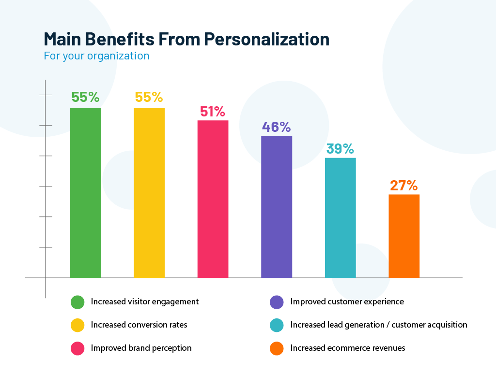

---
title: "Why Direct-to-Consumer (D2C) Businesses Must Take A Strategic Approach To CIAM?"
date: "2023-02-10"
coverImage: "d2c.jpg"
tags: ["direct to consumer", "authentication", "ciam"]
author: "Nicholas Woodward"
description: "The greatest value for direct-to-consumer companies comes from creating a valuable, seamless experience. In this blog we will discuss how CIAM allows D2C companies to improve the customer journey directly."
metatitle: "How Can D2C Brands Utilize CIAM for Long-Term Growth?"
metadescription: "Direct-to-Consumer businesses cut out the middlemen and serve their customers directly. Learn how a CIAM system can improve the D2C customer experience."
--- 

## Introduction

Direct-to-Consumer (D2C) businesses cut out the middlemen and serve their customers directly. This puts a greater emphasis on security and customer experience. That’s why the Customer Identity and Access Management (CIAM) system is essential for D2C companies. It allows Direct-to-Consumer (D2C) companies to record and [manage customer’s identity](https://www.loginradius.com/b2c-identity/). 

A company can then control the degree of access for each identity. It also allows companies to manage information concerning the customer’s identity. At the same time, CIAM also grants privacy and security to the customers. 

## Why Direct-to-Consumer (D2C) Businesses Need CIAM?

A CIAM system can improve several aspects of the D2C customer experience. It also helps the company in streamlining access management, privacy measures, and consumer security protocols. Below are some of the most impactful benefits of CIAM for D2C companies.

### 1. Security

CIAM software helps secure the information and identity of the customers. You can enlist several layers of security to reduce vulnerabilities. These may include digital signatures, passwords, [multi-factor authentication](https://www.loginradius.com/multi-factor-authentication/), and so on. 

Such security measures protect your customers against identity theft and account takeover attacks. CIAM makes it very difficult for cybercriminals to manipulate the system. But, it does so without compromising ease of use for your customers.

With CIAM, you can secure every aspect of customer experience, from order placement to micro-fulfillment. These measures are essential to ensure brand loyalty. [65% of customers](https://www.pymnts.com/healthcare/2022/health-financing-platform-payzen-raises-200m/) will not shop with a brand again after a case of data theft or fraud. A robust security system will help you gain and maintain the trust of your customers. 

### 2. Compliance Management

With CIAM software you can empower your customers. You can authorize your customers to decide which data points they wish to share. CIAM not only allows the customers to provide consent but also regulates it. CIAM platforms also allow customers to change their preferences anytime they want. 

A D2C brand also has to comply with data privacy laws. A CIAM system ensures that your access to customer data is in line with privacy laws. Different countries have their own [privacy regulations](https://www.loginradius.com/compliances/). 

This means that you would need different privacy settings for different regions. A CIAM platform can alter privacy settings based on the customer’s location. So regardless of the region, you can ensure that your D2C brand remains on the right side of the law.

### 3. Omnichannel Accessibility

Along with being secure, CIAM can also be adaptive. You can assign different criteria to allow access to your customers from different devices. A customer can use the same identity to access your product catalog on the website or mobile app.

A few D2C brands also have brick-and-mortar retail outlets. With CIAM, the store can access details about the customers to provide a better experience. The customer can also use their digital identity to purchase at the store. This will add their in-store purchase to the online order history.

A CIAM system will ensure that all the information concerning a customer remains associated with one user identity. On the user’s end, it ensures a consistent brand experience across all channels. The customers can also begin the purchase journey on one device and complete it on another.

### 4. Customer Insights

A CIAM software can generate a variety of [customer behavior insights](https://www.loginradius.com/customer-insights/). You can understand how a customer interacts with your website or app. These insights can help you with marketing strategies and customer service.

The CIAM can tell you about the purchase behavior of different customers. You can also club this data together to understand the behavior of different customer segments. A CIAM can also track the channels and devices that the customers use to interact with your brand. 

This information can help your marketing and advertising decisions. For instance, the CIAM data shows that the majority of your mobile customers prefer Product A. You can target ads for similar products towards mobile users to get better results.

You can also design marketing campaigns for different products based on the same customer insights. Consider the above example once again. You can track the [customer segment](https://blog.loginradius.com/growth/scale-business-with-loginradius-customer-segmentation/) that usually buys Product A. Then you can advertise Product A to a similar audience. Customer Insights from CIAM will help you make informed decisions for your Direct-to-Consumer (D2C) business. 

### 5. Personalization

CIAM helps you understand the behavior and preferences of the customer. Based on these customer insights you can [personalize their experience](https://blog.loginradius.com/growth/how-to-make-personalized-marketing-effective-with-consumer-identity/). You can alter several aspects of communication and interaction with a customer.

You can find such opportunities for personalization in marketing and sales. You can use data to suggest products according to the customer’s preferences. You can identify upselling and cross-selling opportunities. These insights can also help you design offers or packages for different customers.

**_Image: Major benefits of personalizing customer experiences  (Evergage)_**

For instance, if a person has bought a skirt from your D2C store. You can suggest tops and shoes that would look nice with that skirt. This way you can use customer insights in several different ways to ensure that your customers find products that are right for them.

### 6. Streamline The Purchase Journey

Online customers do not like complex sign-in or check-out processes. It is one of the biggest reasons for eCommerce cart abandonment and high bounce rates. An eCommerce platform with too many security measures usually creates a complex check-in process. On the other hand, customers also do not trust platforms without security measures either.

.png)

**_Image: Reasons for abandonment during check out (Baymard Institute)_**

Your customers get fast and easy [customer onboarding](https://blog.loginradius.com/growth/smooth-onboarding-positive-user-impression/) with CIAM. They don’t have to fill out long forms for each purchase. Your customers can use a single identity to check-in from different devices. You can also ensure a consistent purchase journey regardless of the check-in credentials.

The CIAM system focuses on the user’s identity. People use a variety of credentials to login. These include emails, passwords, social media profiles, or phone numbers. A CIAM can merge different credentials into one identity. So even if a person checks-in with their social media profile, they can still get the same experience as an email sign-in.

Additionally, CIAM also has privacy and security measures. So the customers feel secure about their payment information. These measures will help you increase conversion for your D2C brand.

## In Conclusion

A CIAM system works well for the customers as well as the sellers. It grants control to the customers over their privacy and data. At the same time, it also grants control to the sellers over customers’ access to their platform.

Additionally, the CIAM also helps D2C brands control each interaction with their customers. It helps create an easy, secure, and personalized customer experience.

